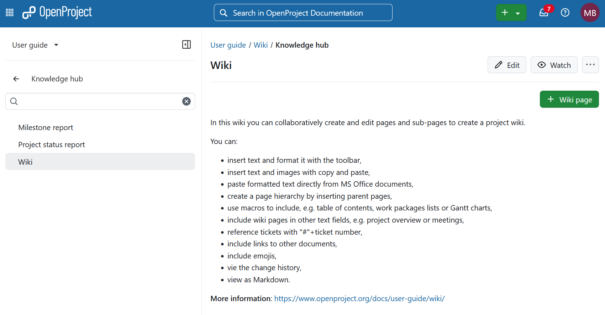
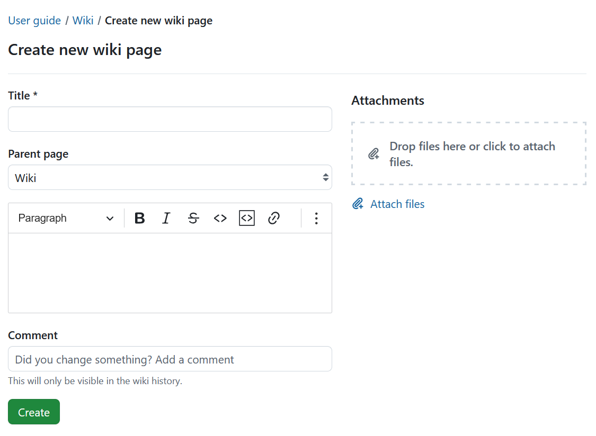
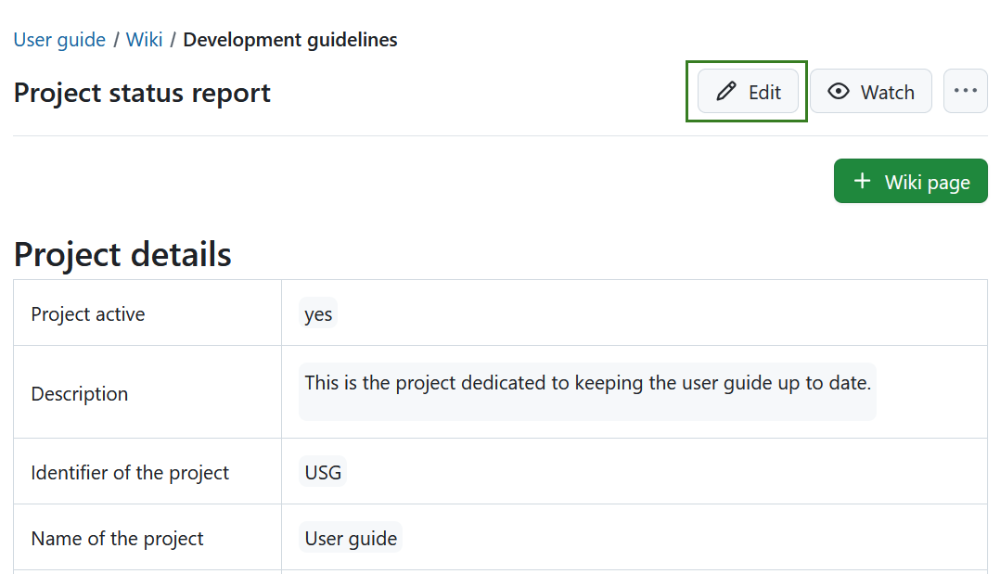
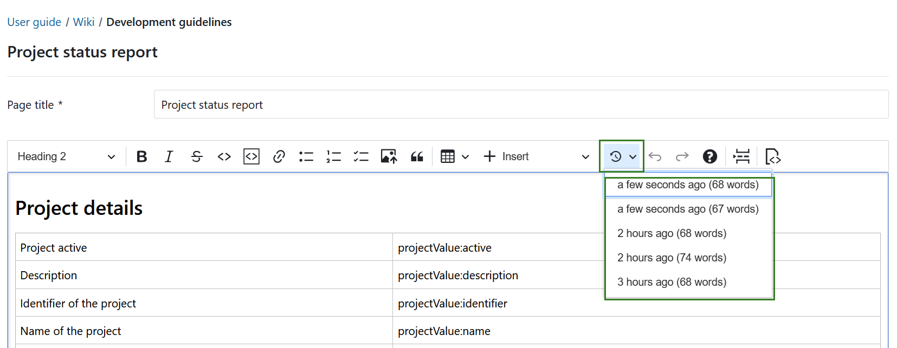
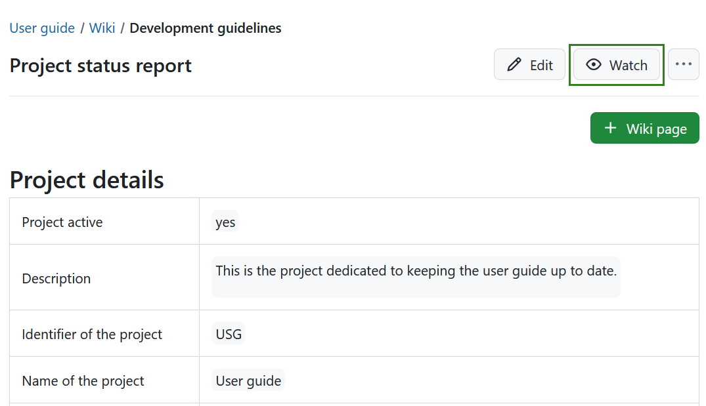
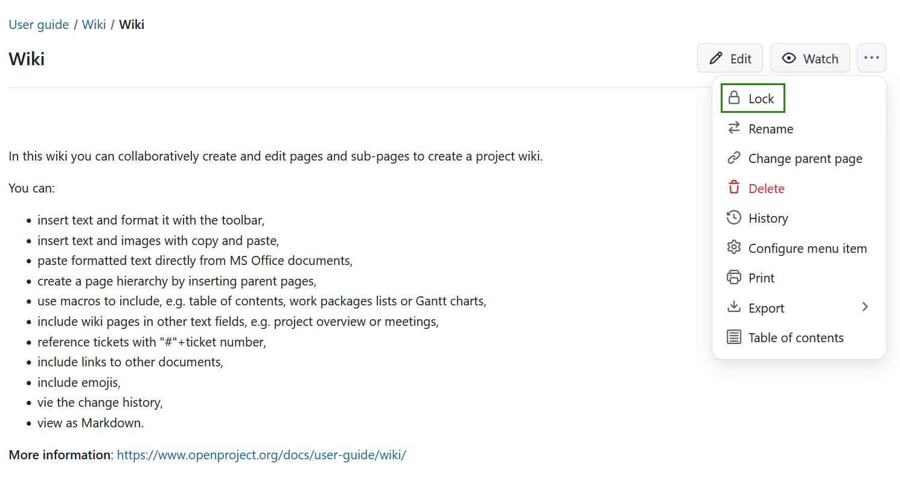
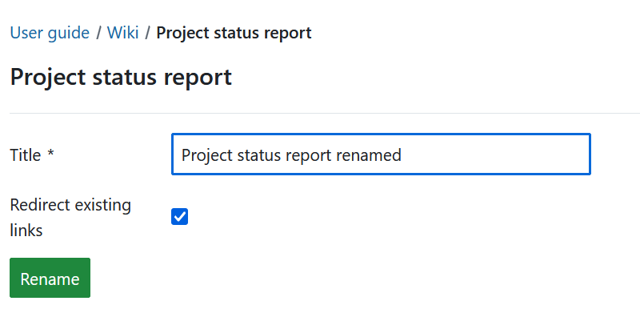
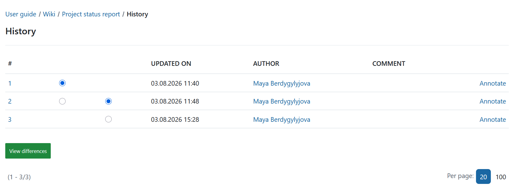
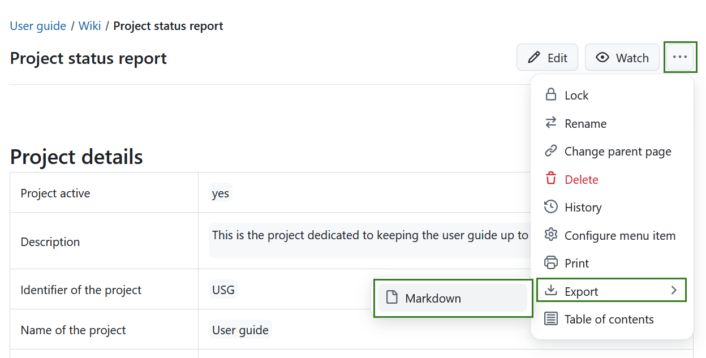

---
sidebar_navigation:
  title: Create and edit wiki pages
  priority: 799
description: Create and edit wiki pages in OpenProject.
keywords: create wiki, edit wiki
---

# Create and edit a wiki page

In OpenProject, you can create and edit wiki pages together with your team to document important project information. This page explains how to create, edit, organize, and manage wiki pages.

| Feature | Documentation |
|---------------------------------------------------------------|-----------------------------------------------|
| [Create a new wiki page](#create-a-new-wiki-page) | How to create a new wiki page. |
| [Edit a wiki page](#edit-a-wiki-page) | How to make changes to an existing wiki page. |
| [Rename a wiki page](#rename-a-wiki-page-title) | How to rename a wiki page. |
| [Create a wiki page structure](#change-the-page-hierarchy) | How to organize wiki pages in a hierarchy. |
| [Watch a wiki page](#watch-a-wiki-page) | How to watch a wiki page. |
| [Lock a wiki page](#lock-a-wiki-page) | How to lock and unlock a wiki page. |
| [Delete a wiki page](#delete-a-wiki-page) | How to delete a wiki page. |
| [Show wiki page history](#show-wiki-page-history) | How to view changes to a wiki page. |
| [Export a wiki page](#export-a-wiki-page) | How to export a wiki page. |

## Create a new wiki page

To create a new wiki page, open the **Wiki** module in your project and click **+ Wiki page** in the toolbar.

> [!TIP]
> If you do not see the **Wiki** module in your project menu, first [enable the project wiki](../../projects/project-settings/project-wiki).

The editor opens, allowing you to enter the page title and content.

1. Enter a page title.
2. Optionally, select a **Parent page**.
3. Add the page content. You can format the content using the editor toolbar. For more information, see the [WYSIWYG editor](../).
4. Add images by dragging and dropping them into the editor, pasting them from your clipboard, or using the image button in the toolbar. 
5. Optionally, enter a comment describing your changes.
6. Click **Create**.

## Edit a wiki page

To edit a wiki page, open the page and click **Edit**.

Make your changes in the editor and click **Save**.

> [!TIP]
> Changes are automatically saved locally while you edit. If you accidentally leave the page or cannot save due to a technical issue, you can restore the latest local version from the editor toolbar.

### Change the page hierarchy

You can organize your wiki by creating a hierarchy of pages and sub-pages.

When creating a new wiki page, optionally select a **Parent page**. If you create a new page from an existing wiki page using **+ Wiki page**, the current page is preselected as the parent.

To change the hierarchy later, edit the wiki page and select a different **Parent page**. To move a page to the top level, select **-- No parent page --**.

Child pages are displayed beneath their parent page in the wiki hierarchy. Pages on the same level are ordered alphabetically.

## Watch a wiki page

To receive notifications when a wiki page is updated, open the page and click **Watch**. Click **Unwatch** at any time to stop receiving notifications.

You will receive email notifications according to your notification settings whenever the page is updated.

## Lock a wiki page

To prevent other users from editing a wiki page, open the **More** menu and select **Lock**.

To allow editing again, open the **More** menu and select **Unlock**.

## Rename a wiki page title

To rename a wiki page, open the **More** menu and select **Rename**.

Enter the new page title. Optionally, select **Redirect existing links** so that links to the old page title continue to work.

Click **Rename**.

You can also rename a page by editing its title directly in **Edit** mode.

## Delete a wiki page

To delete a wiki page, open the page, click **More**, and select **Delete**.

Confirm the deletion in the dialog.

> [!WARNING]
> Deleted wiki pages cannot be easily restored.

## Show wiki page history

To view previous versions of a wiki page, open the **More** menu and select **History**.

The history shows who changed the page, when it was changed, and any comments that were added. Select two versions and click **View differences** to compare them.

> [!NOTE]
> Comparing consecutive versions provides the clearest overview of changes. Multiple edits made by the same user within five minutes are automatically merged into a single history entry to reduce clutter.

## Print a wiki page

To print a wiki page, open the **More** menu and select **Print**.

A printer-friendly version of the page is displayed.

## Export a wiki page

To export a wiki page, open the **More** menu, select **Export**, and then choose **Markdown**.

Alternatively, you can use your browser's print function to save the page as a PDF.