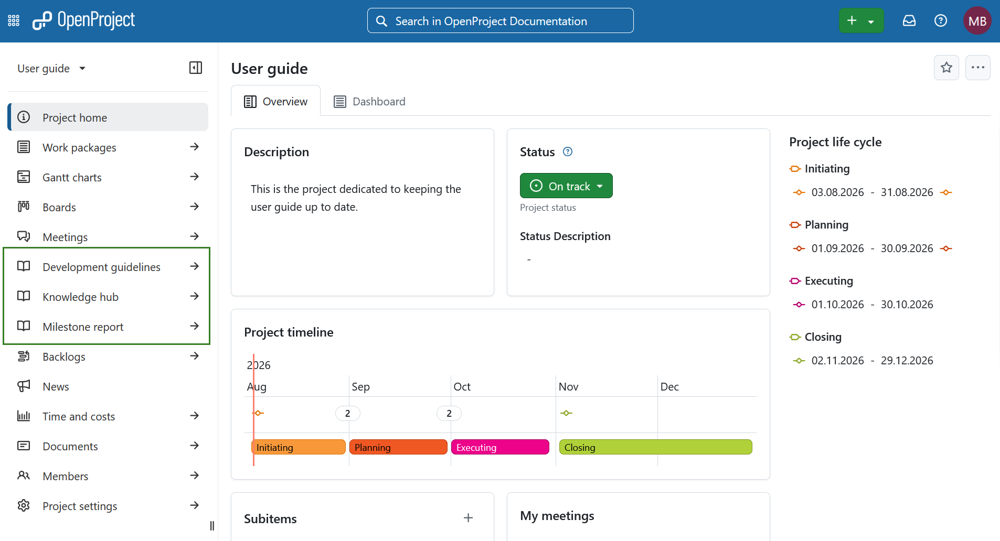
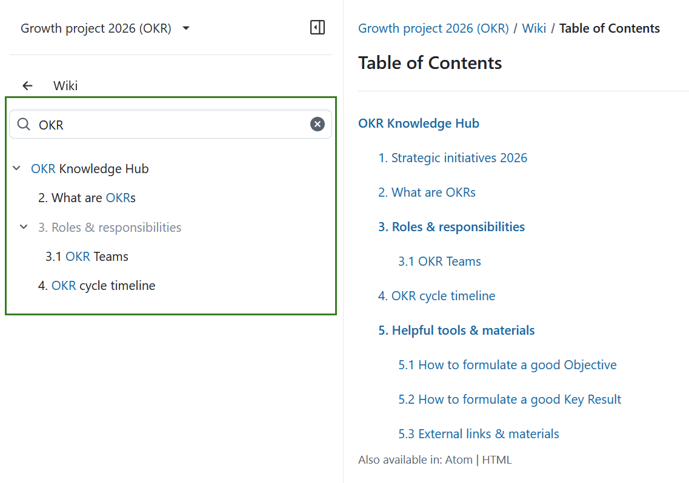
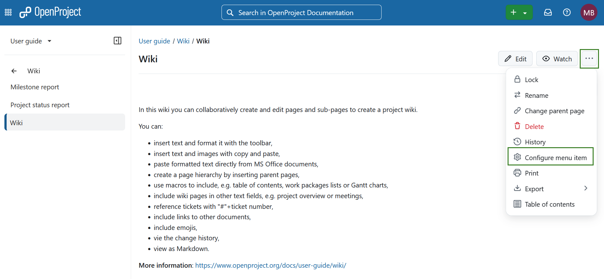
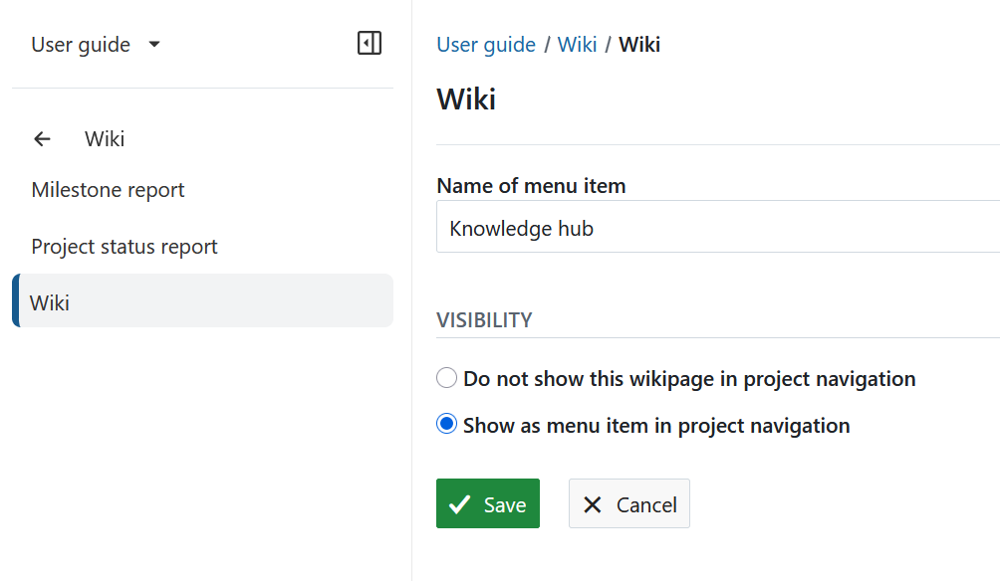
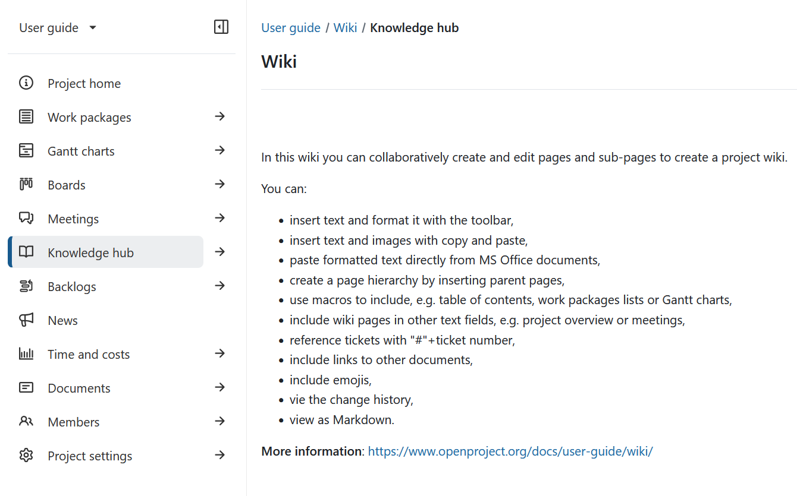

---
sidebar_navigation:
  title: Wiki navigation
  priority: 798
description: Create a project menu item for a wiki page.
keywords: wiki menu, wiki navigation
---

# Wiki project navigation

The project wiki sidebar displays the wiki page hierarchy for the project and makes it easy to navigate between wiki pages and sub-pages.

You can also add a wiki page directly to the project menu as a separate menu item to have the page easily accessible for all team members.

## Navigate wiki pages in the sidebar

When you open the **Wiki** module, the sidebar displays the wiki hierarchy for the project. Only the first level is shown by default and all pages are collapsed.

Each item in the hierarchy is a wiki page. Any wiki page can also have sub-pages. If a page has sub-pages, you can expand it to view them.

When accessing a particular wiki page:

- The current page is marked as current in the sidebar.
- Its parent pages are expanded to show the location of the current page in the wiki hierarchy.
- The current page is expanded to show its immediate sub-pages, if there are any.

Select a wiki page in the sidebar to display it in the main content area.

## Search the wiki hierarchy

You can use the search field at the top of the wiki sidebar to filter the wiki hierarchy using a text search.

When a matching wiki page is displayed, its parent pages are also listed in grey so that you can see where the page is located in the wiki hierarchy.

## Add a wiki page to the project menu

To add a wiki page as a menu item to the project menu, select the **More** functions button on top of a wiki page and choose the **Configure menu item** topic.

You can configure the menu items and choose between different visibility options.

1. You can give the menu item in the project menu a different name than the wiki page itself by changing the **Name of menu item** in the list.
2. You can set different **visibility** options:

- **Do not show this wikipage in the project navigation** will NOT display a separate menu item in the project navigation. The wiki page is just displayed within the wiki module itself.
- **Show as menu item in project navigation** will add a separate menu item to the project navigation.

3. **Save** your changes to the wiki page menu.

The wiki page is now displayed as a separate item in the project navigation.

The default option is **Do not show this wiki page in project navigation**. Check this option if you want to undo earlier changes and hide the wiki page from the project menu.

## Remove a wiki page from the project navigation 

To remove a wiki page from the project navigation, open **Configure menu item** and select **Do not show this wiki page in project navigation**. This is the default setting. 

The wiki page remains available from the **Wiki** module but is no longer displayed as a separate menu item in the project navigation.