# Baseline comparison

Baseline is a powerful tool that allows you to view changes to work package table within a given period. This can be a saved view or a new filter query. Project managers can use baseline to get a quick overview of what has changed over time, making it easier to report on project progress and status.

## Enabling Baseline

Baseline comparison can be enabled on any work package table view:

1. Click on the **Baseline** button in the main toolbar.

2. Pick a comparison point by choosing one of the a preset options or inputting specific dates and times.

3. Click on **Apply** to enable Baseline.

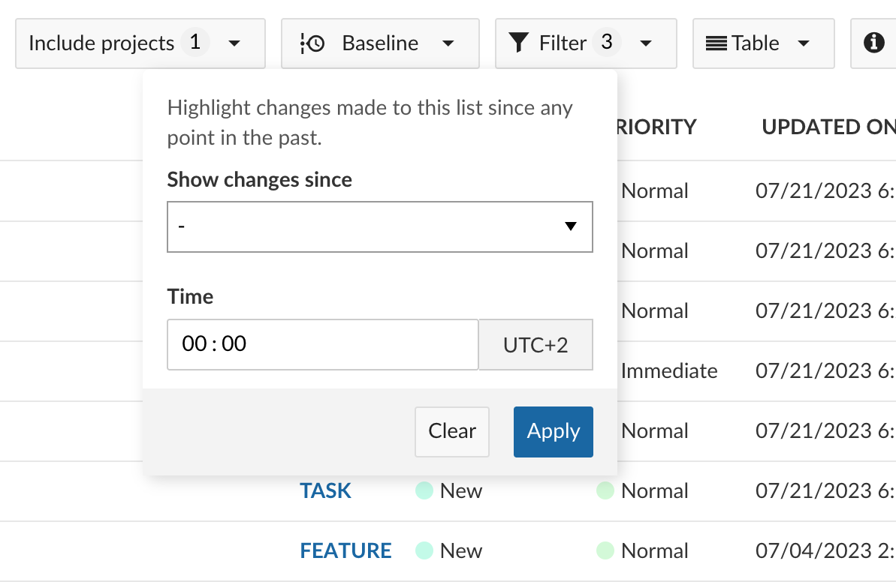

### Preset periods

Baseline offers these preset time ranges:

- _Yesterday_: Compare work packages to the previous day.

- _Last working day_: Compare work packages to the most recent working day.

- _Last week_: Compare work packages to seven working days ago.

- _Last month_: Compare work packages to thirty working days ago.

By default, Baseline will compare to 8 AM local time of the relevant day. You can change this to any other time of your choosing.

>**Note:** These are relative comparison points, which means that _Yesterday_ will always refer to the day before the current day, and not a specific date. You can use these to set up "running" baselines that show you all changes within the past day or week.

### A specific date

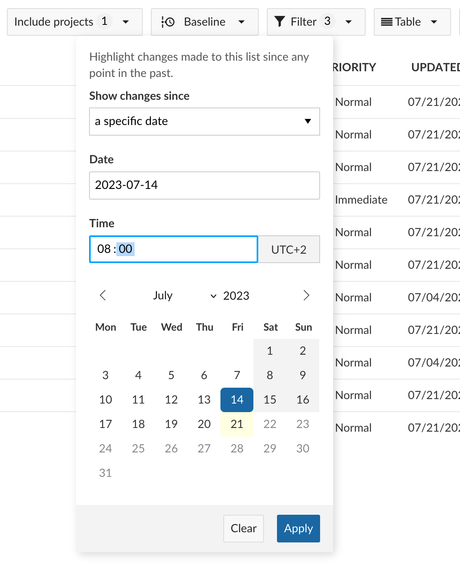

If you want to compare between now and a specific date in the past, you can select "a specific date" in the dropdown and select a particular date. With this option, the comparison will always be between the current state and that specific date in the past.

>**Note:** You can use this to "freeze" the baseline comparison point so that the view always shows changes in comparison to that specific date, regardless of when you access it.

### A custom date range

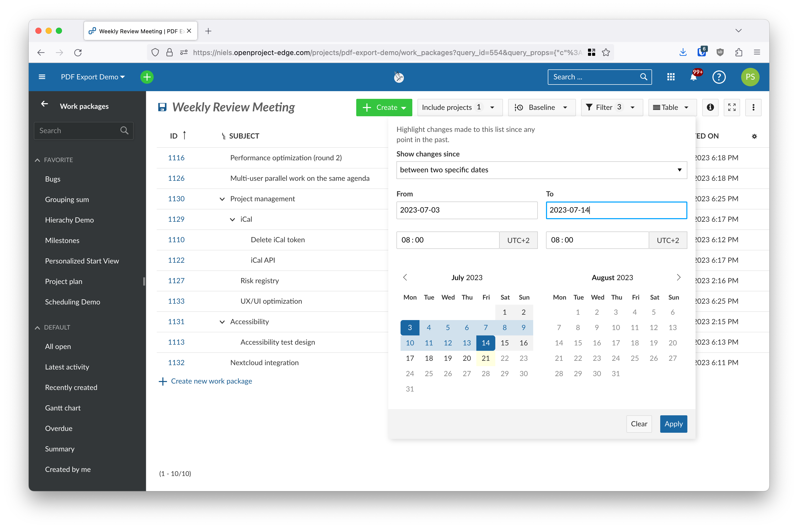

OpenProject also allows you to compare between two specific dates in the past. To select a custom date range, choose "between two specific dates" in the dropdown and select two dates in the date picker below.

>**Note**: This is will create a fixed baseline view that will remain the same regardless of when you accesses it, since both points are fixed in the past.

## Understanding the comparison results

After selecting the comparison point, OpenProject presents the comparison results in table view using three icons to indicate the type of change for each work package.

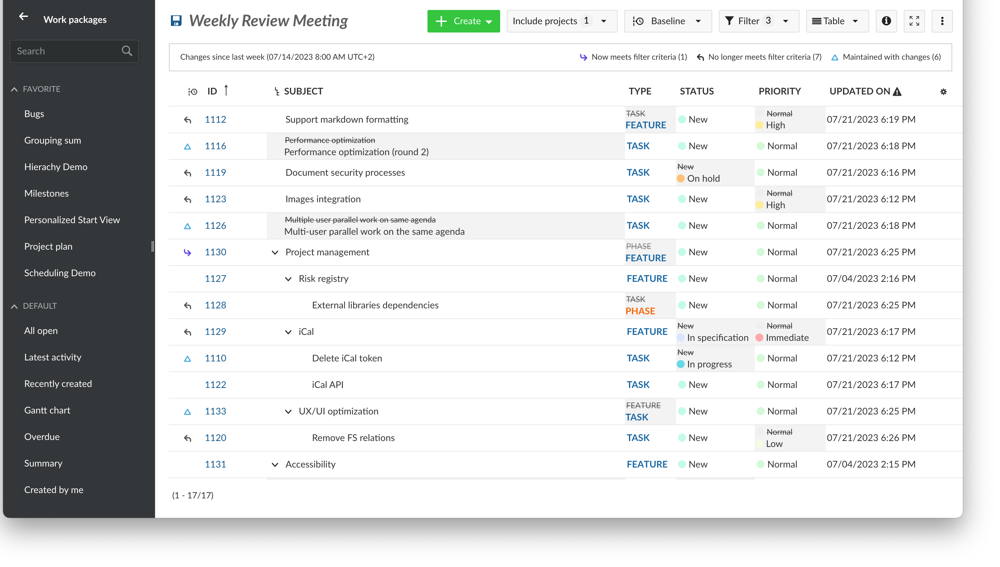

When Baseline is enabled, you will see a legend at the top of the page which shows:

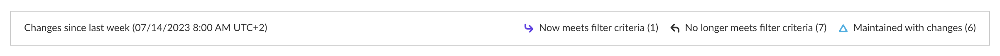

- The comparison point or comparison period
- The number of work packages added to view
- The number of work packages removed from view
- The number of work packages were modified

### Change icons

#### Now meets filter criteria

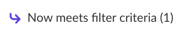

Work packages that meet the filter criteria now but did not in the past are marked with an "Added" icon. These work packages were added to the current query after the selected comparison point, either because they were newly created since then or certain attributes changed such that they meet the filter criteria. 

> **Note**: These do not necessarily represent _newly created_ work packages; simply those that are new to this particular view.

#### No longer meets filter criteria

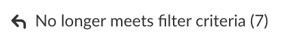

Work packages that no longer meet the filter criteria now are marked with a "Removed" icon. These work packages were filtered out within the comparison period.

>**Note**: These do _not_ represent deleted work packages, which are not visible at all since no history of deleted work packages is maintained. Deleted work packages are simply ignored by Baseline.

#### Maintained with changes

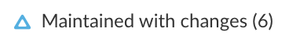

Work packages that meet the filter criteria now (and also did at the comparison point) but which have undergone changes in certain attributes are marked with a "Modified" icon.

#### No changes

When there are no changes to a work package in the comparison period, no icon is shown.

### Old values

When changes in the comparison period concern attributes that are visible as columns in the work package table, Baseline will show both old and current values. If the attribute you are interested in is not visible, you will need to [add it as a column](../work-package-table-configuration). 

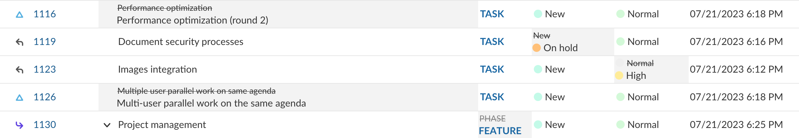

Each attribute that has changed will have a grey background, with the old value crossed out visible on the top left corner of the cell, above the new value.

This allows you to have a complete view of what has changed in the comparison period.

>**Note**: Some attributes that are not tracked by Baseline are not able to show the old values in the work package table. If any of the columns in your work package table are not tracked, a small warning in the column header will warn you of this.
>
> 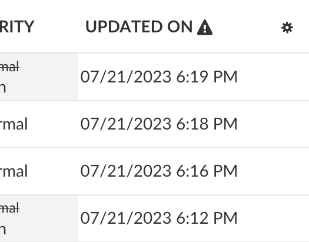

## Relation to active filters

Baseline always compares work packages between the two comparison points in relation to the current active filters. Changing the filters can change the results of the comparison.

It is not possible to compare between two different filter queries.

>**Note**: Some filter attributes are not tracked by Baseline and changes to them will not be taken into consideration. These include _Watcher_, _Attachment content_, _Attachment file name_ and _Comment_. These attributes are marked with a small warning icon next to them in the filter panel.
>
> 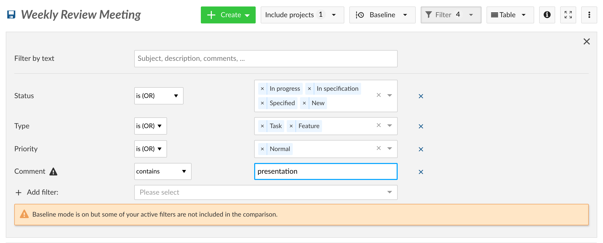

