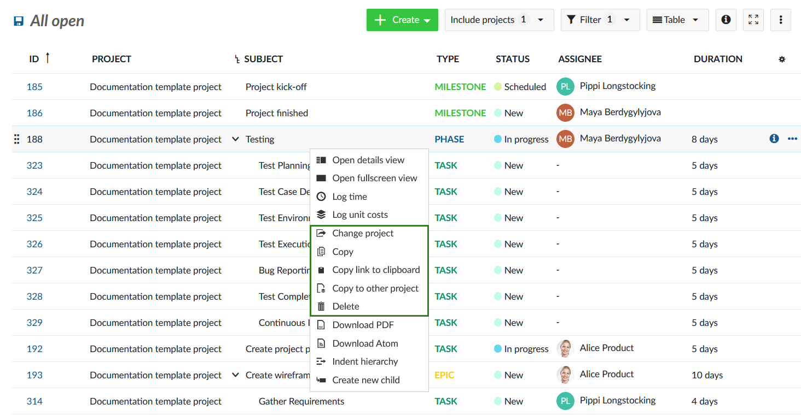
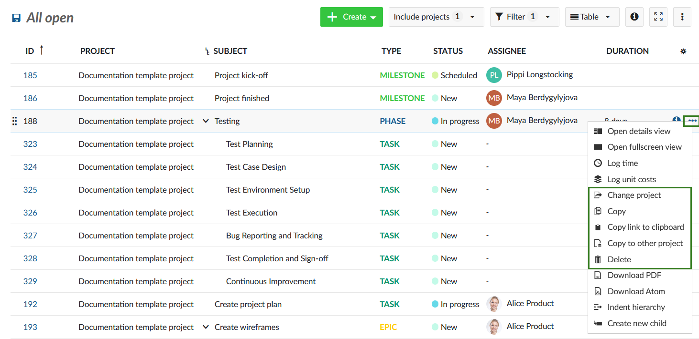
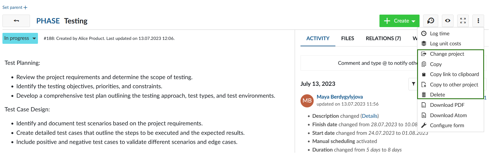
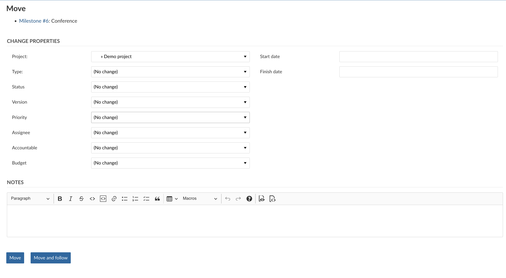

---
sidebar_navigation:
  title: Copy, move, delete work packages
  priority: 960
description: How to copy, change project or delete a work package.
keywords: copy work package, delete work package, move work package
---

# Copy, change project or delete a work package

If you right-click in a work package table, editing options will be displayed. Here, you can change project, copy the work package, or copy its URL to the clipboard, delete it or move it to another project.

You can also access these features by using the three dots at the far right of a row to access the menu.

Alternatively, open the work packages details view by double clicking the respective row, click on **More functions** (the three dots at the top right of the work package details) and select the respective menu item.

To copy, move or delete multiple work packages at once please refer to the documentation for [bulk edit](../edit-work-package/#bulk-edit-work-packages).

## Copy a work package

When copying a work package, a work package form with the pre-set values of the original work package is shown.

Copying a work package allows to easily create and adjust new work packages based on existing one’s.

## Copy link to clipboard

This option copies a short link to the work package to your clipboard  so you can quickly paste it elsewhere. It can also be useful when you  want to quickly copy links to multiple work packages without having to  open the detailed view of each one.

## Move a work package to a different project

The *change project* option moves a work package to another project or subproject. Select the project into which the work package is to be moved, check whether further adjustments are necessary and confirm by clicking on *Move*.

> [!NOTE]
> You can only move a work package into projects that you are a member of and for which you are authorized to carry out this function.

> [!TIP]
> If the current work package type does not exist in the target project, you will see a warning message asking you to either activate a desired work package type or select one of the activated ones. Read more on [activating a work package type for a specific project](../../projects/project-settings/work-package-types/) or [creating new work package types in OpenProject administration](../../../system-admin-guide/manage-work-packages/work-package-types/).

## Delete a work package

The right to delete work packages is tied to specified roles (for example system administrators). The roles and permission may vary from project to project.

You can select these options either in the detail view under *More* or via the context menu by right-clicking into the work package table. The latter option allows you to perform an action (such as copying, moving or deleting a work package) on multiple work packages at once.
