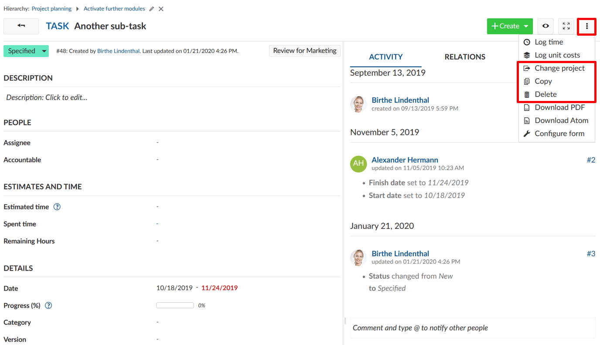
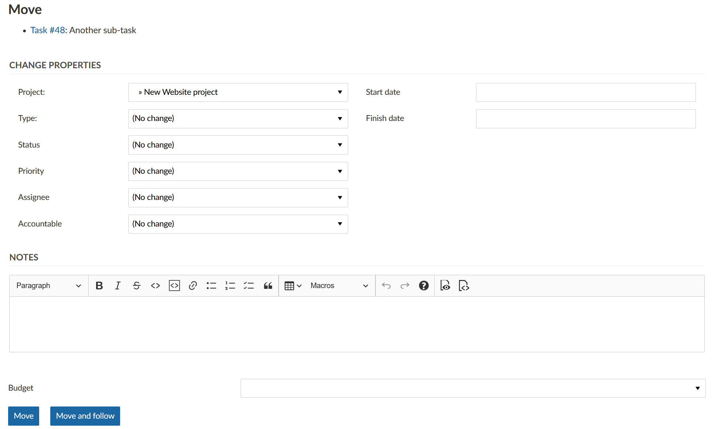

---
sidebar_navigation:
  title: Copy, move, delete work packages
  priority: 800
description: How to copy, change project or delete a work package?
robots: index, follow
keywords: copy work package, delete work package, move work package
---

# Copy, change project or delete a work package

You can make the following changes to your work packages: you can copy a work package, change the project or delete a work package. 

Open the work packages details view, click on the More functions (the three dots at the top right of the work package details) and select the respective menu item.

## Copy a work package

When copying a work package, a work package form with the pre-set values of the original work package is shown.

Copying a work package allows to easily create and adjust new work packages based on existing one’s.

## Move a work package to a different project.

The *change project* option moves a work package to another project or subproject. Select the project into which the work package is to be moved, check whether further adjustments are necessary and confirm by clicking on *Move*.

**Note**:  You can only move a work package into projects that you are a member of and for which you are authorized to carry out this function.

## Delete a work package

The right to delete work packages is tied to specified roles (for example system administrators). The roles and permission may vary from project to project.

You can select these options either in the detail view under *More* or via the context menu by right-clicking into the work package list. The latter option allows you to perform an action (such as copying, moving or deleting a work package) on multiple work packages at once.