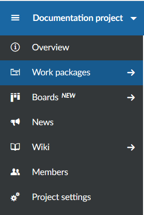
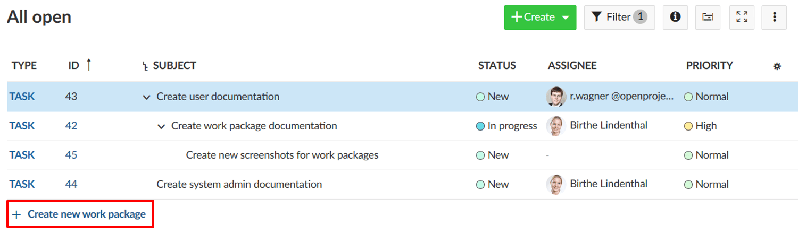
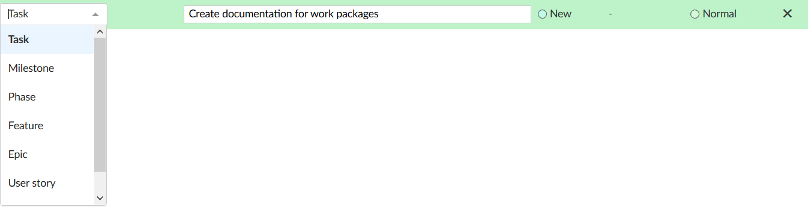
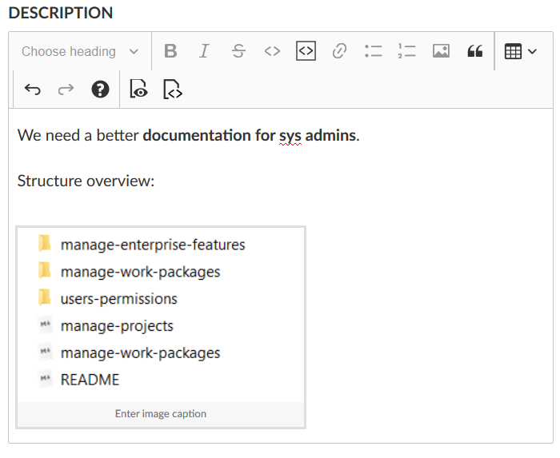
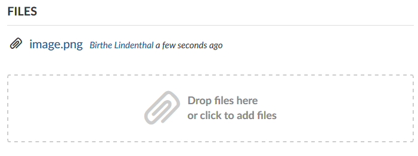

---
sidebar_navigation:
  title: Create work packages
  priority: 990
description: How to create work packages in OpenProject?
robots: index, follow
keywords: create work packages
---

# Create work packages

| Feature                                                      | Documentation for                              |
| ------------------------------------------------------------ | ---------------------------------------------- |
| [Create work packages](#how-to-create-work-packages?)        | How to create a new work package in a project? |
| [Add attachments to a work package](#add-attachments-to-work-packages) | How to add attachments to a work package?      |

## How to create work packages?

There are two ways to create new work packages:

- work packages can be [created in-line in the work package list](#create-a-work-package-in-the-list-view) (just like Excel) to quickly create multiple work packages.
- work packages can be [created in a split screen](#create-a work-package-in-the-split-screen-view) which allows you to specify detailed information from the start.

Work packages always belong to a project. Therefore, you first need to [select a project](../../../getting-started/#open-an-existing-project).

Then, navigate to the work package module in the project navigation.

### Create a work package in the list view

To create new work packages directly in line in the list view, click on the **+ Create new work package** link below the list.

The new work package appears in a green row. Type in the subject of the work package, change attributes, such as Type or Status directly in the list and hit Enter to save the changes.

This way, you can quickly and easily create new work packages in the list, just like Excel.

### Create a work package in the split screen view

In order to enter detailed information to the work package from the start, you can create a work package in the split screen view. In the work package module, click the green **+ Work package** button and select the type of work package you want to create.

The new work package form will open in the split screen view. Enter all information, such as description, assignee, status, priority, due date and more.

Click the green **Save** button.

## Add attachments to work packages

You can directly add images, e.g. via copy and paste to the **work package description**. You can also use the toolbar above the work package description and click the Insert image icon:

Also, at the bottom of the work package form you can add files via drag and drop or select the file from a folder to upload it to the work package.

Find out how to [edit existing work packages](#edit-work-packages).

