---
sidebar_navigation:
  title: Edit work packages
  priority: 980
description: How to edit work packages in OpenProject.
keywords: edit work packages
---

# Edit work packages

| Feature                                                      | Documentation for                                            |
| ------------------------------------------------------------ | ------------------------------------------------------------ |
| [Update a work package](#update-a-work-package)              | How to make a change to an existing work package.            |
| [Update a work package in a table view](#update-a-work-package-in-a-work-package-table-view) | How to use the quick context menu in the work package table view. |
| [Attach files to work packages](#attach-files-to-work-packages) | How to manually attach files to work packages.               |
| [Watchers](#watchers)                                        | How to add or remove watchers from a work package.           |
| [Export work packages](#export-work-packages)                | How to export work packages.                                 |
| [Bulk edit work packages](#bulk-edit-work-packages)          | How to edit several work packages as once.                   |

## Update a work package

To edit a work package, double-click a work package row in [table view](../../work-packages/work-package-views/#table-view) or open the [split screen view](../../work-packages/work-package-views/#split-screen-view) to see the details.

In the work package details, you can click in any field to update it, e.g. change the description, status, priority, assignee, or add a comment.

To save changes in the description, click the **checkmark** icon.

Other input fields can be saved with **Enter**.

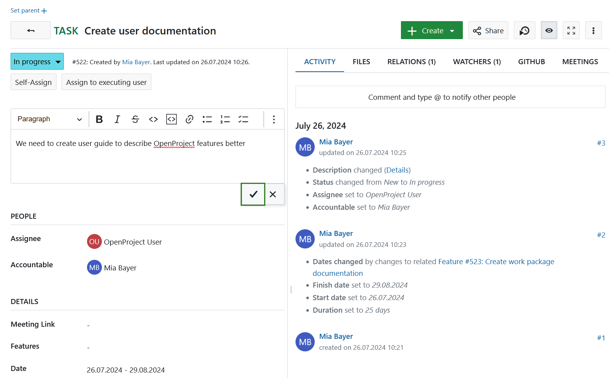

The green message on top of the work package indicates a successful update.

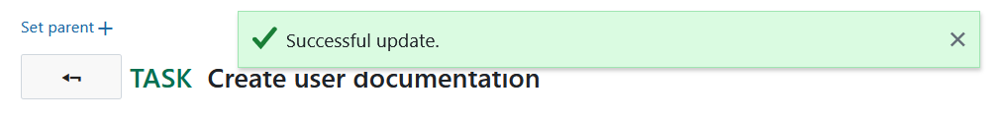

All changes of a work package are documented in the work package tab [Activity](../../../getting-started/work-packages-introduction/#activity-of-work-packages).

> [!NOTE]
> There is no possibility to undo changes to work packages by using Ctrl+Z combination.

### How to assign a team member to a work package

When you assign a team member to a work package, you can distinguish between **assignee** and **accountable**. Accountable per definition would be the one accountable for the delivery of the work package. The assignee is the person currently assigned and working on the work package.
Choose the respective team member from the drop down for assignee or accountable. If you are looking to add a team member that is not coming up in the drop down, this team member might not yet be a member of the project and needs to be [invited](../../members/#add-members).

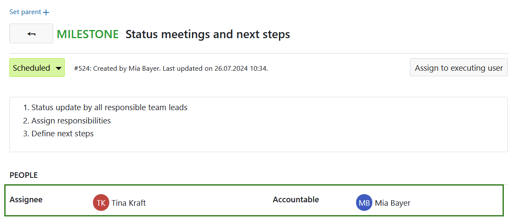

### How to update the status of a work package

To update the status of a work package, click on the current status in the work package details and select the new status in the drop-down list.

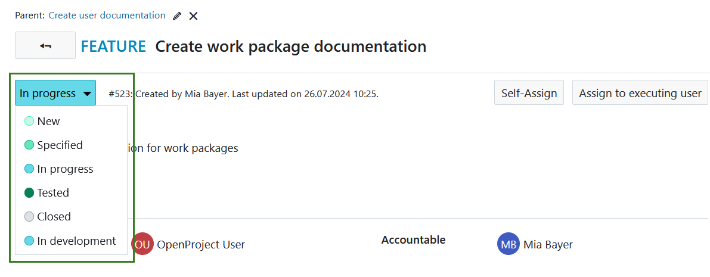

Please note, the status may differ from work package type. They can be configured in the [system administration](../../../system-admin-guide).

### How to add comments to a work package

To add a comment to a work package, open the [details view](../../work-packages/work-package-views/#full-screen-view) or the [split screen view](../../work-packages/work-package-views/#split-screen-view) of a work package. On the tab [Activity](../../../getting-started/work-packages-introduction/#activity-of-work-packages) tab you have a comment field at the bottom (or on top depending on your [My account settings](../../../getting-started/my-account/)).

**Split screen view:**

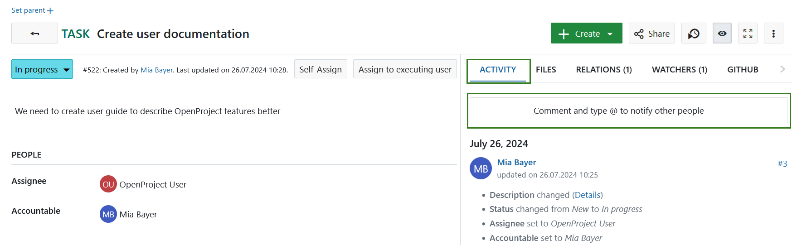

### @ notification (mention)

You can mention and notify team members via [@notification](../../notifications/). They will receive a notification in OpenProject about the updates (according to their [notification settings](../../../user-guide/notifications/) in the **My account** settings).

**Full-screen view**:

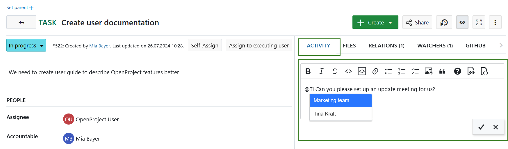

### Emojis

Starting with OpenProject 13.0 you can add emojis to all text editors. Type a colon and a letter, e.g. **:a** into the text editor and get a suggested list of emojis you can use.

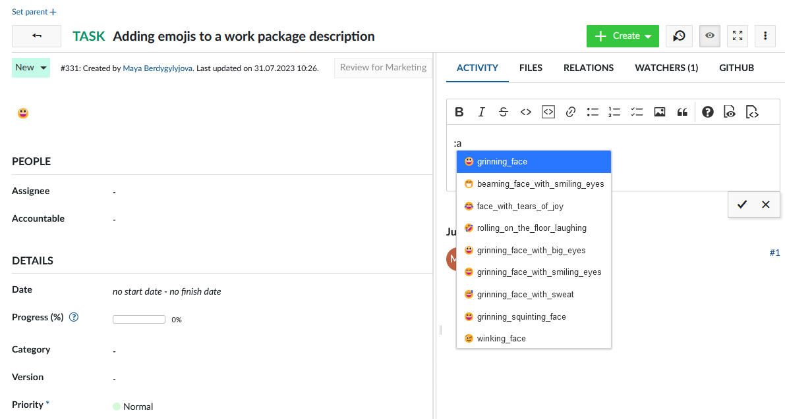

## Attach files to work packages

> [!IMPORTANT]
> Please note, that this option needs to activated by your project administrator under [*Project settings*](../../projects/project-settings/files/).

You can manually upload files to work packages directly under the tab **Files** in the work package detailed view. You can either attach files by dragging and dropping or by using the **+Attach files** option.

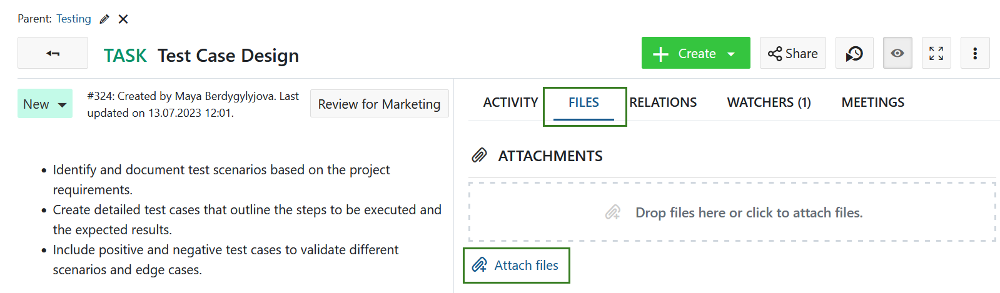

Under the **Files** tab you will see the list of the all previously uploaded attachments, including file names, as well as which user uploaded an attachment and when. If no files were attached yet, the list will be empty.

You can remove an attachment by hovering over it and clicking the **Delete** icon.

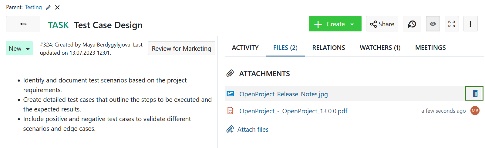

## Watchers

### How to add watchers to a work package

**Watchers** can be added to a work package in order to notify members about changes. They will receive notifications according to their notification settings if changes are made to the respective work package.

To add watchers, open the work package [detailed view](../../work-packages/work-package-views/#full-screen-view), select the tab watchers on the right hand side and choose the members you want to add with the drop-down menu or by starting to type their name.

It is also possible to add oneself as watcher (if you have sufficient permissions).

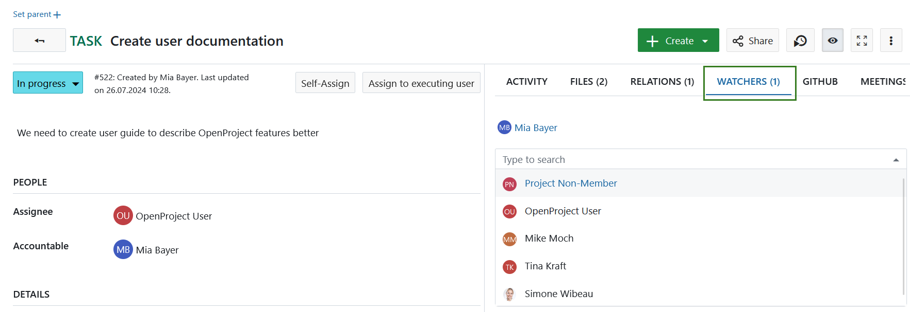

### How to remove watchers from a work package

To remove watchers, navigate to the work package [details view](../../work-packages/work-package-views/#full-screen-view) and select the tab Watchers. Hover over the name of the watcher you want to remove and click the cross icon next to the watcher name.
The user will no longer get notifications in OpenProject about changes to this work package according to their notification settings. However, if he/she is the author, assignee or accountable of the work package there still might be notifications. Read [here](../../../getting-started/my-account/#notifications-settings) for more information.

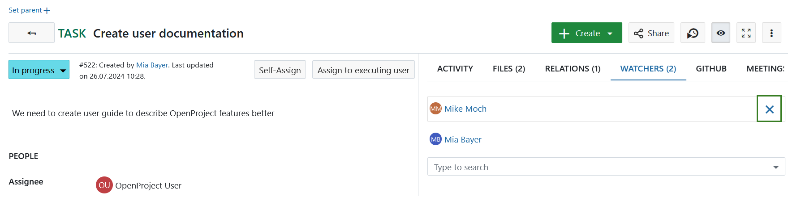

## Export work packages

To export the work packages, choose **Export ...** in the settings menu on the top right of the work package table view.

Please see [this separate guide](../exporting) for more information on exporting work packages.

## Bulk edit work packages

To make a bulk update and edit several work packages at once, navigate to the work packages table view.
Highlight all work packages which you want to edit.
Tip: **keep the Ctrl. button pressed** in order to select and edit several work packages at once.

To open the quick context menu, **press the RIGHT mouse button**.

Then you have the possibility to:

* Open details view of all selected work packages.
* Open the fullscreen view of all selected work packages.
* Bulk edit all selected work packages.
* Bulk change of the project of all selected work packages.
* Bulk copy all selected work packages, incl. the hierarchy relations (parent-child relations).
* Bulk delete all selected work packages.

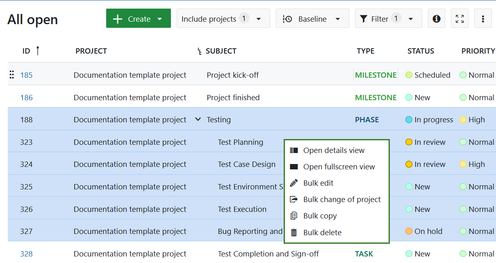

At the bottom of the page you can decide whether notifications about these changes should be sent or not. It makes sense not to tick the box for large updates to prevent users from getting flooded by emails.

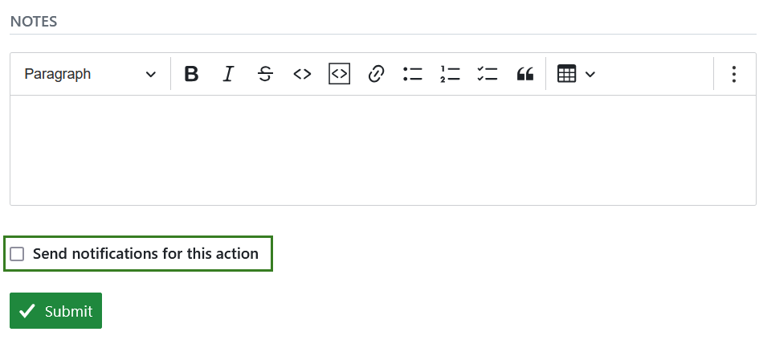

## Update a work package in a work package table view

In the work package table view, you can not only open a single work package but also trigger direct actions such as logging time and costs, copying, downloading or deleting said work package. To access the quick context menu, simply right-click any work package in a work package table view and select the preferred action.

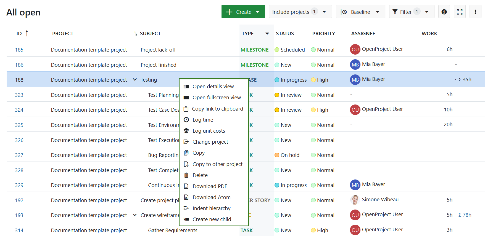

You have the following options:

- **Open details view** - opens the details view of a work package on the right side of the screen.
- **Open fullscreen view** - opens the detailed view of a work package across the entire screen.
- **Copy link to clipboard** - copies a short link to the selected work package to your clipboard.
- **Log time** - opens a pop-up dialogue allowing you to [log time](../../time-and-costs/time-tracking/#log-time-in-the-work-package-view) directly to a work package without having to open it first.
- **Log unit costs** - navigates you to the cost logging screen. Once you [log the costs](../../time-and-costs/cost-tracking/) and save the entry, you will return to the work package table view.
- **Change project** - allows moving the selected work package to a different project.
- **Copy** - opens a details view of a new work package on the right side of the screen. This new work package is an exact copy of the work package you selected, but you can adjust any details you would like to change and then save it.
- **Copy to other project** - allows copying the selected work package to a different project.
- **Delete** - deletes a work package. You will need to confirm the deletion.
- **Download PDF** - downloads the selected work package as a PDF file.
- **Download Atom** - downloads the selected work package as an Atom file.
- **Indent hierarchy** - creates a child-parent relationship with the work package directly above. The work package you selected become the child work package. The work package directly above becomes the parent work package.
- **Create new child** - opens a new work package on the right side of the screen. This new work package already has a child relationship to the work package you selected.  

If you have opened the quick context menu for a work package that has a parent work package, you will also see:

- **Outdent hierarchy** option, which will remove the child-parent relationship.

> [!NOTE]
> If you open the [Gantt charts module](../../gantt-chart/), the quick context menu will have different options than in the work package table view.
