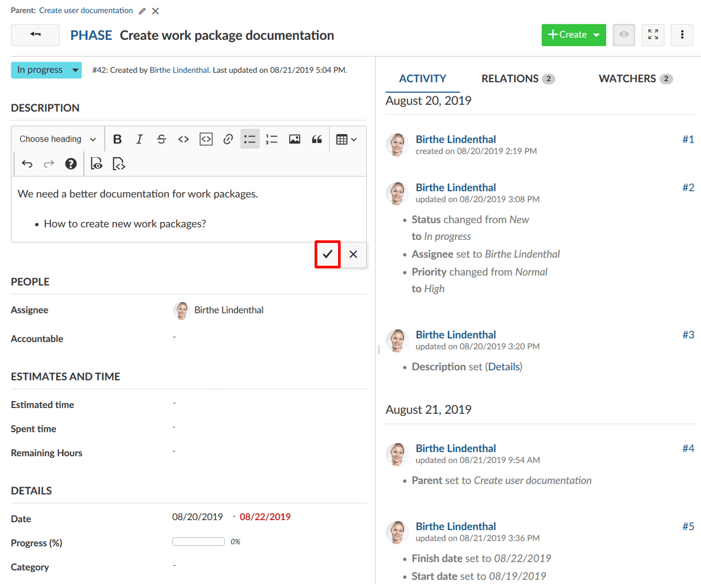
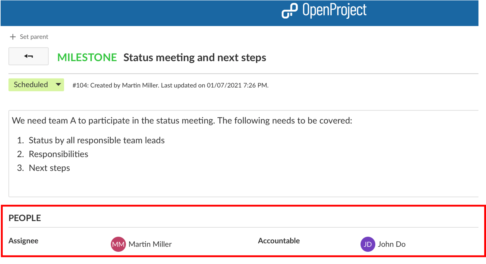
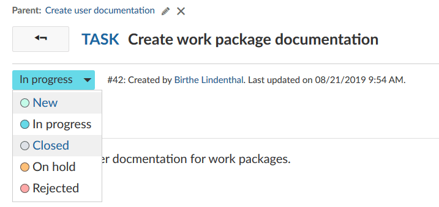
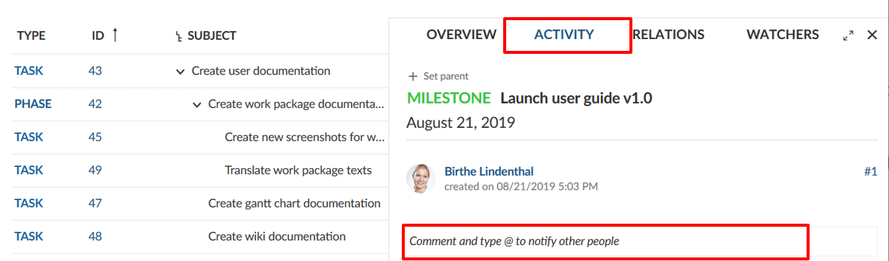
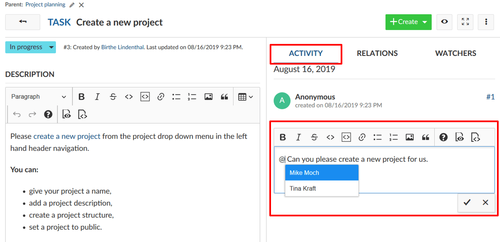
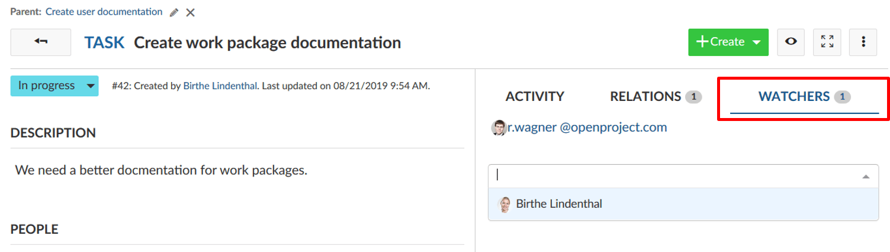
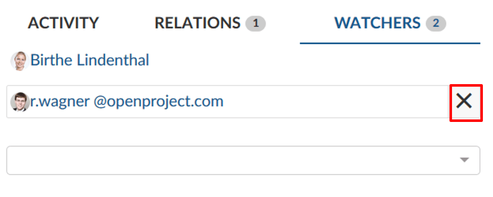
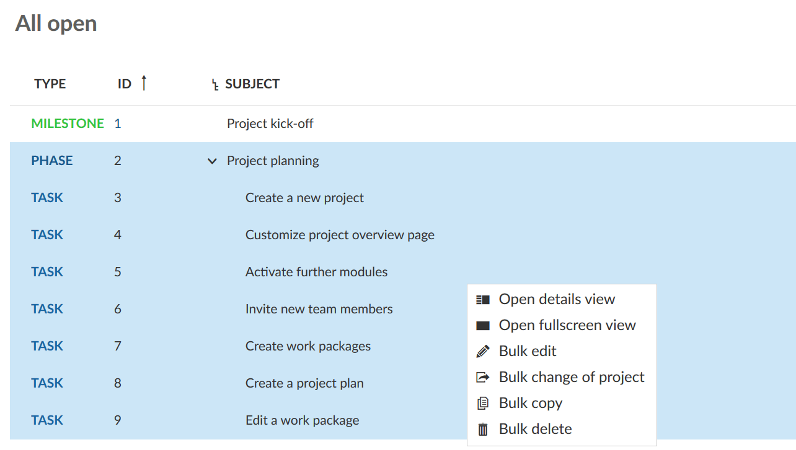
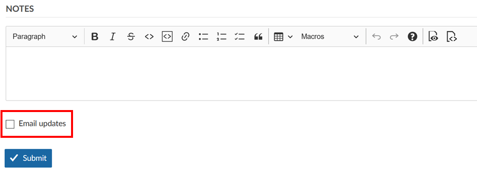

---
sidebar_navigation:
  title: Edit work packages
  priority: 900
description: How to edit work packages in OpenProject?
robots: index, follow
keywords: edit work packages
---

# Edit work packages

| Feature                                             | Documentation for                                  |
| --------------------------------------------------- | -------------------------------------------------- |
| [Update a work package](#update-a-work-package)     | How to make a change to an existing work package?  |
| [Watchers](#watchers)                               | How to add or remove watchers from a work package? |
| [Export work packages](#export-work-packages)       | How to export work packages?                       |
| [Bulk edit work packages](#bulk-edit-work-packages) | How to edit several work packages as once?         |

## Update a work package

To edit a work package, double-click in the row of a work package in the [list view](../../work-packages/work-package-views/#work-package-list-view) or open the [split screen view](../../work-packages/work-package-views/#work-package-split-screen-view) to see the details.

In the work package details, you can click in any field to update it, e.g. change the description, status, priority, assignee, or add a comment. 

To save changes in the description, click the **checkmark** icon.

Other input fields can be saved with **Enter**.

The green message on top of the work package indicates a successful update.

All changes of a work package are documented in the work package [Activity](../../../getting-started/work-packages-introduction/#activity-of-work-packages).

**Note**: There is no possibility to undo changes to work packages (Ctrl+Z).

### How to assign a team member to a work package?

When you assign a team member to a work package, you can distinguish between **assignee** and **accountable**. Accountable per definition would be the one accountable for the delivery of the work package. The assignee is the person currently assigned and working on the work package.
Choose the respective team member from the drop down for assignee or accountable. If you are looking to add a team member that is not coming up in the drop down, this team member might not yet be a member of the project and needs to be [invited](../../members/#add-members).

### How to update the status of a work package?

To update the status of a work package, click on the current status in the work package details and select the new status in the drop-down list.

Please note, the status may differ from work package type. They can be configured in the [system administration](../../../system-admin-guide).

### How to add comments to a work package?

To add a comment to a work package, open the [details view](../../work-packages/work-package-views/#work-package-full-screen-view) or the [split screen view](../../work-packages/work-package-views/#work-package-split-screen-view) of a work package. On the tab [Activity](../../../getting-started/work-packages-introduction/#activity-of-work-packages) tab you have a comment field at the bottom (or on top depending on your [My account settings](../../../getting-started/my-account/)).

**Split screen view:**

### @ notification (mention)

You can mention and notify team members via [@notification](../../notifications/). They will receive an email about the updates (according to their [email preferences](../../../getting-started/my-account/#notifications-settings) in the **My account** settings).

**Full-screen view**:

## Watchers

### How to add watchers to a work package?

**Watchers** can be added to a work package in order to notify members about changes. They will receive emails according to their notification settings if changes are made to the respective work package.

To add watchers, open the work package [details view](../../work-packages/work-package-views/#work-package-full-screen-view), select the tab watchers on the right hand side and choose the members you want to add with the drop-down menu or by starting to type their name.

It is also possible to add oneself as watcher (if you have sufficient permissions).

### How to remove watchers from a work package?

To remove watchers, navigate to the work package [details view](../../work-packages/work-package-views/#work-package-full-screen-view) and select the tab Watchers. Click the cross icon next to a watcher to remove the watcher from a a work package. 
The user will no longer get email notifications about changes to this work package according to their email notification settings. However, if he/she is the author, assignee or accountable of the work package there still might be email notifications. Read [here](../../../getting-started/my-account/#notifications-settings) for more information.

## Export work packages

To export the work packages, choose **Export ...** in the settings menu on the top right of the work package list (or Gantt chart) view.

Please see [this separate guide](../exporting) for more information on exporting work packages.

## Bulk edit work packages

To make a bulk update and edit several work packages at once, navigate to the work packages list view.
Highlight all work packages which you want to edit.
Tip: **keep the Ctrl. button pressed** in order to select and edit several work packages at once.

To open the quick context menu, **press the RIGHT mouse button**.

Then you have the possibility to:

* Open details view of all selected work packages.
* Open the fullscreen view of all selected work packages.
* Bulk edit all selected work packages.
* Bulk change of the project of all selected work packages.
* Bulk copy all selected work packages, incl. the hierarchy relations (parent-child relations).
* Bulk delete all selected work packages.

At the bottom of the page you can decide whether email updates regarding these changes should be sent or not. It makes sense not to tick the box for large updates to prevent users from getting flooded by emails.

