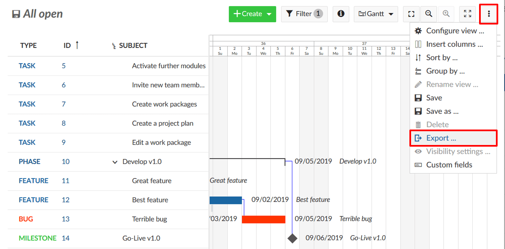
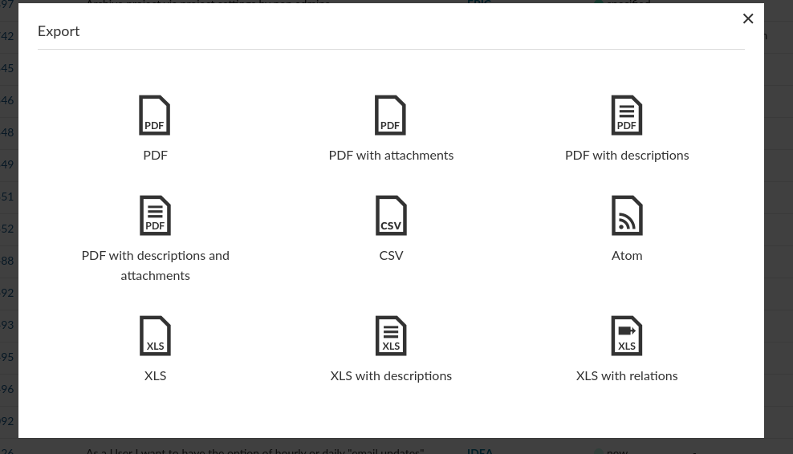

---
sidebar_navigation:
  title: Exporting
  priority: 600
description: How to export work packages for other tools, such as Microsoft Excel
robots: index, follow
keywords: work package exports, CSV, Excel, XLS, PDF
---

# Exporting work packages

You can export work packages from your OpenProject instance to other formats using the export functionality. 

## How to trigger an export

To export a work packages list or card view to another format, visit the *work packages* module or a saved view and click on the settings icon in the top right. Trigger the *Export* dialog from the dropdown menu that opens.

This will open a dialog similar to the following screenshot, where you can select the desired format. Below, we will detail how to control the data being exported as well as the various formats.

## Changing what will be exported

From the work packages module, all work packages that are included in the filter list will be exported. Up to a total of 500 work packages can be exported at once.

**Note**: If you need to export more than 500 items, filter the work packages appropriately to export multiple files.

**Columns**

The exported file will follow the columns that you activated for the work packages table. With it, you can control the columns that will be contained in various formats.

Some formats such as PDF will limit the number of columns available due to limitations of the PDF rendering engine to avoid overflowing the available space.

## PDF export

OpenProject has multiple options of exporting the results to PDF:

- **PDF** export of the work package list as rows
- **PDF with descriptions** same as above with work package descriptions output. Note that this does not include a fully rendered markdown description, but a stripped version of it due to technical limitations of the PDF rendering engine.
- **PDF with attachments** of work packages with their attachments inlined to fit as best as possible
- **PDF with descriptions and attachments** The above options combined to create a PDF export with work package descriptions and their attachments

## Excel (XLS) export

OpenProject can export the table for Microsoft Excel with the following options:

- **XLS** a plain sheet that matches the OpenProject work packages table with its columns and work packages as rows matching the selected filter(s).
- **XLS with descriptions** same as above, but with an additional column for work package descriptions, which cannot be selected in the table
- **XLS with relations** Same as XLS, but with additional columns to list each work package relation in a separate row with the relation target and its ID and relation type included in the export

**Note**: To open XLS exported files into Microsoft Excel, ensure you set the encoding to UTF-8. Excel will not auto-detect the encoding or ask you to specify it, but simply open with a wrong encoding under Microsoft Windows.

## CSV export

OpenProject can export the table into a comma-separated CSV. This file will be UTF-8 encoded.

**Note**: To open CSV exported files into Microsoft Excel, ensure you set the encoding to UTF-8. Excel will not auto-detect the encoding or ask you to specify it, but simply open with a wrong encoding under Microsoft Windows.

## Atom (XML) export

OpenProject can export the table into a XML-based atom format. This file will be UTF-8 encoded.

