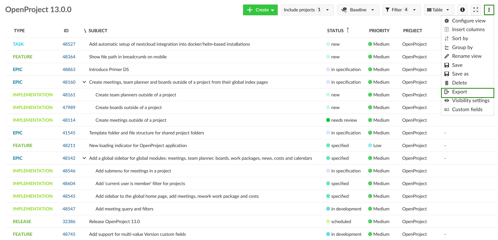

---
sidebar_navigation:
  title: Export work packages
  priority: 930
description: How to export work packages for other tools, such as Microsoft Excel
keywords: work package exports, CSV, Excel, XLS, PDF
---

# Export work packages

You can export [multiple work packages](#export-multiple-work-packages) in PDF/XLS/CSV formats or [a single work package](#export-a-single-work-package) in PDF/Atom format.

## Overview

| Topic                                               | Content                                                                           |
| --------------------------------------------------- | :-------------------------------------------------------------------------------- |
| [PDF table](pdf-table)                              | Export the work package table with the selected columns as rows in a PDF.         |
| [PDF report](pdf-report)                            | Export detailed work plans with a title page, table of contents and descriptions. |
| [Gantt chart PDF](gantt-chart-pdf)                  | Export the Gantt chart in PDF format.                                             |
| [XLS export (Excel)](xls-excel)                     | Export the work package table as a spreadsheet for Microsoft Excel.               |
| [CSV export](csv)                                   | Export the work package table as a comma-separated file.                          |
| [Work package PDF export](work-package-pdf)         | Export one work package in PDF format using a template.                           |
| [Work package Atom export](work-package-atom)       | Export one work package in Atom format.                                           |

## Export multiple work packages

### How to trigger an export

To export work packages to another format, visit the **Work packages** module and select a default or saved work package view (table or card view) you want to export. Click on the settings icon in the top right corner. Trigger the **Export** dialog from the dropdown menu.

This will open a dialog where you can select the desired format. For **PDF** you additionally select the export type: table, report or Gantt chart. Adjust the options offered for your selection and click the **Export** button to start the export. The pages linked above detail what each format contains.

The export is then prepared in the background. A dialog shows the progress and offers the download as soon as the file is ready. The generated file is only kept for a limited time, so a download link cannot be reused indefinitely.

> [!NOTE]
> You need the **Export work packages** permission in order to export a work package list. It can be assigned to a role in the [roles and permissions](../../../system-admin-guide/users-permissions/roles-permissions/) administration.

### Save export settings

Export settings can be saved for [saved work package views](../work-package-table-configuration/#save-work-package-views). This allows you to easily share export settings with your team and save time in the future.

To save export settings adjust the export to your liking and check the **Save setting** checkbox before triggering an export. Clicking the **Export** button will trigger the adjustments to a work package query. The checkbox will remain checked for the next export.

The checkbox is not offered for default views or views you have not saved yet.

> [!TIP]
>
> If the query is public, other users can edit it and save the export settings. If you want to prevent other users from adjusting the export settings, you need to create a private work package query.

## Export a single work package

It is also possible to export single work packages in PDF and Atom formats. To do that, click on the settings icon in the top right corner and select either the **Generate PDF** or the **Download Atom** option from the dropdown menu.

See [Work package PDF export](work-package-pdf) and [Work package Atom export](work-package-atom) for what each format contains.

## PDF export

OpenProject has multiple options for exporting work packages in PDF format. The following applies to all of them.

> [!TIP]
>
> OpenProject PDF export supports commonly used character sets, including multilingual fonts with different alphabets, various symbols (mathematical, technical) and emojis.
>

> [!NOTE]
>
> Rich text can be embedded using [Macros](../../wysiwyg/#attributes), such as descriptions of other work packages. This feature is supported as long as the embedding is not within table cells, or if it only contains basic text formatting.

### Page breaks

If you used page breaks in work package descriptions, contents will be split into separate pages accordingly.
