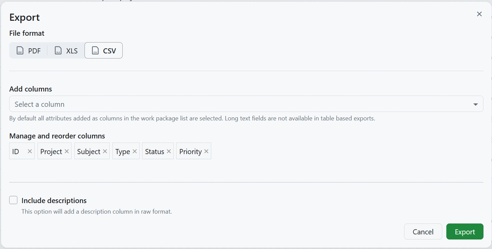
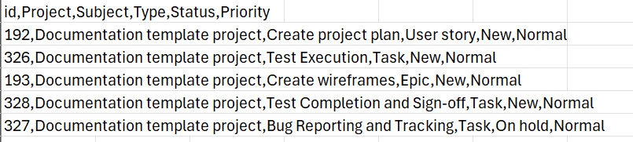
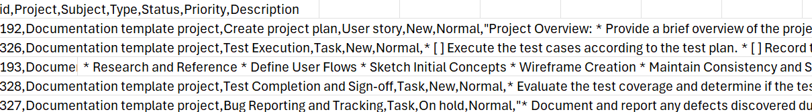

---
sidebar_navigation:
  title: CSV export
  priority: 500
description: How to export work packages in CSV format in OpenProject
keywords: work package exports, CSV, comma-separated values
---

# CSV export

OpenProject can export the table into a comma-separated CSV. This file will be UTF-8 encoded.

> [!TIP]
> To open CSV exported files in Microsoft Excel, ensure you set the encoding to UTF-8. Excel will not auto-detect the encoding or ask you to specify it, but simply open with the wrong encoding under Microsoft Windows.

If you select the **Include descriptions** option, the work package description field will be included in the export.

## Export limit

All work packages included in the work package table in the currently selected view will be exported, unless a certain export limit has been defined by the instance administrator. The limit can be changed in the [export settings](../../../../system-admin-guide/system-settings/exports/) in the system administration. Newly created instances have a maximum of 500 work packages set as a limit by default.

## Limitations

The OpenProject CSV export currently does not respect all options in the work package view being exported from:

- The hierarchy of work packages as displayed in the work package view. The exported CSV is always in "flat" mode.
- The description is exported in 'raw' format, so it may contain HTML tags.

See [Export work packages](../) for how to trigger an export and adjust the general export options.