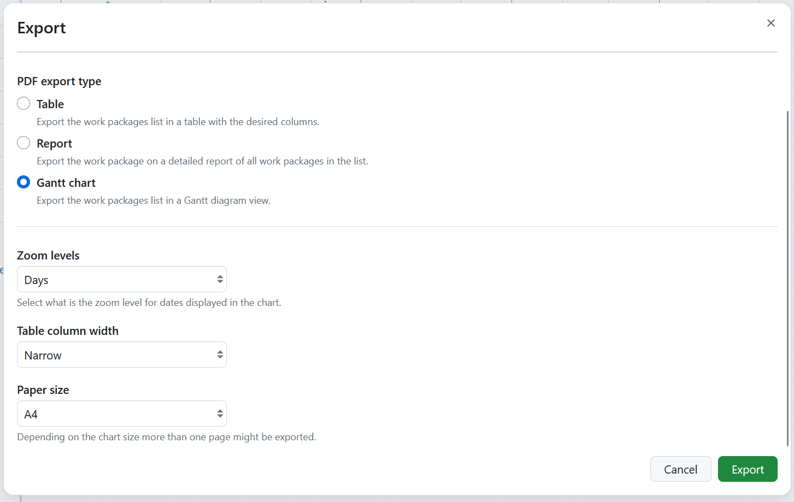

---
sidebar_navigation:
  title: Gantt chart PDF export
  priority: 700
description: How to export Gantt charts in PDF format in OpenProject
keywords: work package exports, Gantt chart PDF, Gantt export, PDF export
---

# Gantt chart PDF export

[feature: gantt_pdf_export ]

You can export Gantt charts directly from the work packages module by selecting the respective option, or from the Gantt charts module by doing the same.

## Export options

- **Zoom levels** define the zoom level for the dates displayed in the chart. You can select _Days_ (default), _Weeks_, _Months_ or _Quarters_.
- **Table column width** defines how much space the work package table next to the chart takes up. You can select _Narrow_, _Medium_ (default), _Wide_ or _Very wide_.
- **Paper size** defines the page size of the export. You can select _A4_ (default), _A3_, _A2_, _A1_, _A0_, _Executive_, _Folio_, _Letter_ or _Tabloid_. Depending on the chart size, more than one page might be exported.

For more information on using the Gantt chart module and Gantt exports, please refer to the [Gantt chart PDF Export guide](../../../gantt-chart/#gantt-chart-pdf-export-enterprise-add-on).

See [Export work packages](../) for how to trigger an export and adjust the general export options.