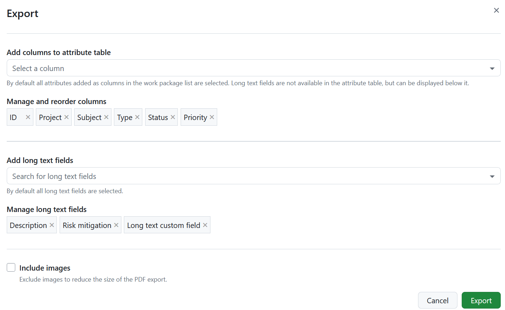
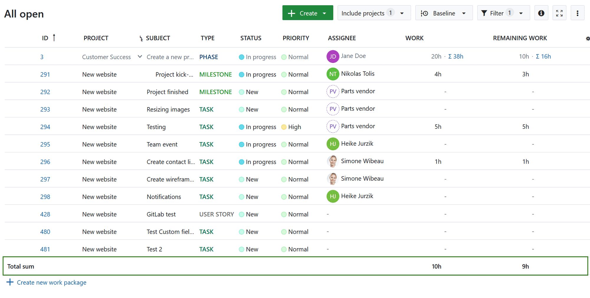
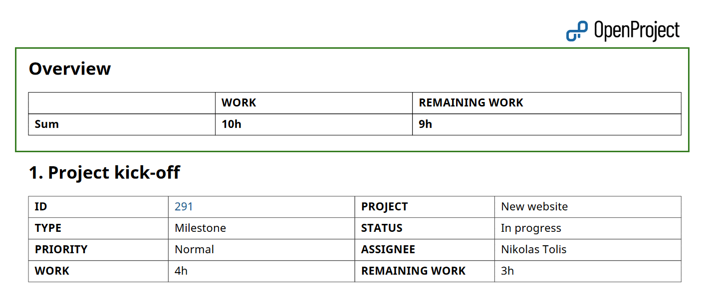
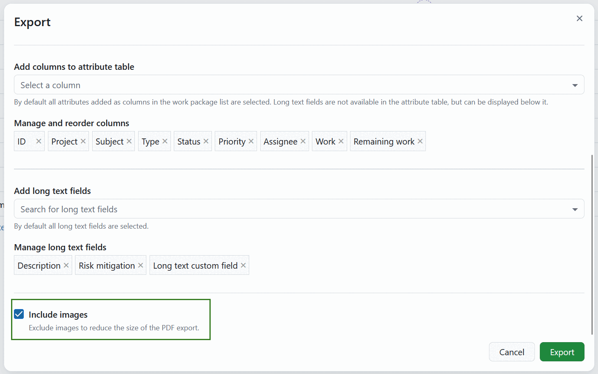
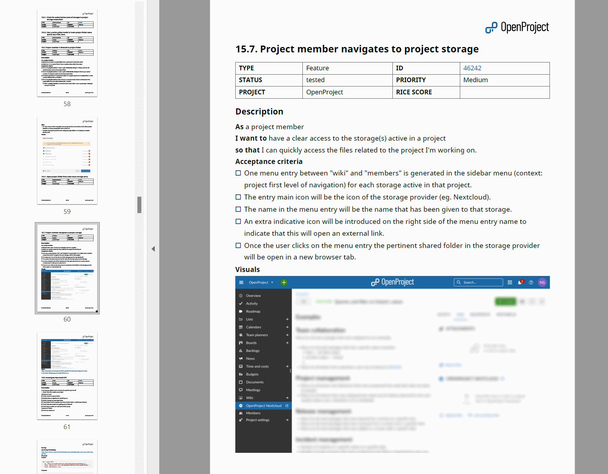

---
sidebar_navigation:
  title: PDF report export
  priority: 800
description: How to export work packages as a PDF report in OpenProject
keywords: work package exports, PDF report, work plans, PDF export
---

# PDF report export

With PDF Reports, you can export detailed up-to-date work plans for your project in a clean and practical format. It includes a title page, a table of contents (listing all of the work packages), followed by the description of single work packages in a block form. The table of contents is clickable and is linked to the respective pages within the report, making navigation much easier.

For each work package, a table of attributes is included, where attributes correspond to the columns you specified for the export. For a [single work package export](../work-package-pdf/), attributes are displayed according to the work package form configuration.

The table of attributes is followed by the work package description and, if necessary, custom long text fields, which support [embedded work package and project attributes](../../../wysiwyg/#attributes).

## Display sums

If ["display sums" is activated](../../work-package-table-configuration/) in the work package table, then the sum table is included between the table of contents and work packages description in an Overview section.

## Display relations

If relations, such as _children_, _blocked by_, _followed by_, etc. are included in the report as columns, they will be included in dedicated blocks.

## PDF report with images

If you select the **Include images** option, your PDF Report will include the images from the work package description. Supported formats include PNG, JPG, WebP. If an animated WebP or a GIF is used, the first frame will be included into the report.

> [!NOTE]
> Images attached or linked in the work package Files section or in the Activity comments are not included in the PDF Report with images.

See [Export work packages](../) for how to trigger an export and adjust the general export options.