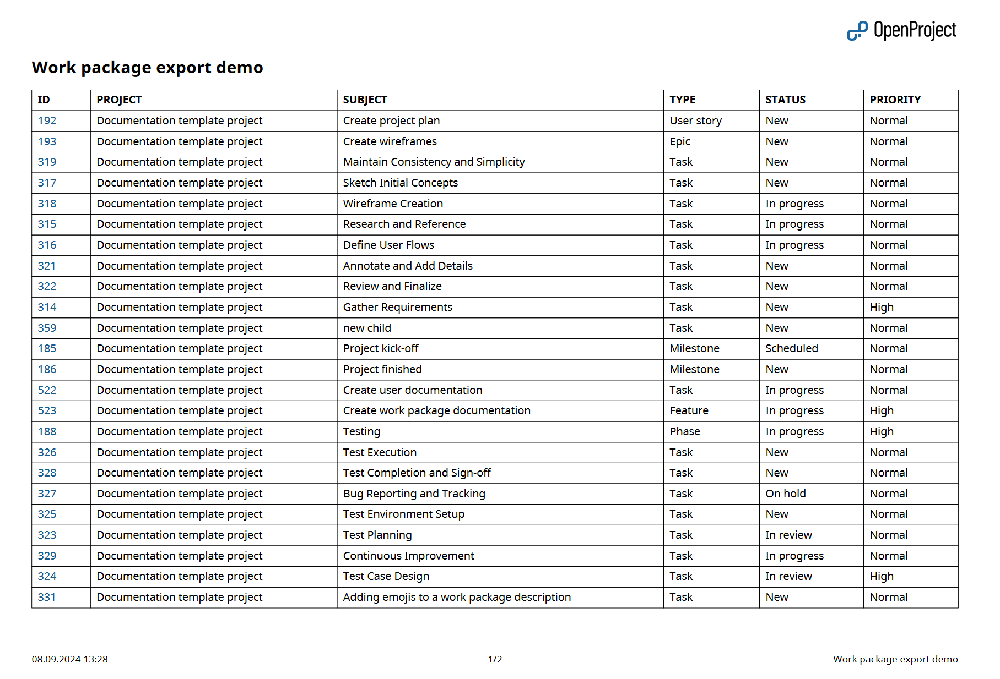

---
sidebar_navigation:
  title: PDF table export
  priority: 900
description: How to export work packages as a PDF table in OpenProject
keywords: work package exports, PDF table, PDF export
---

# PDF table export

PDF Table exports the work package table displaying work packages as single rows with the selected columns for the work package table. Work package IDs are linked to the respective work packages. Clicking on a work package ID will lead you directly to the work package in OpenProject.

## Display sums

If ["display sums" is activated](../../work-package-table-configuration/#display-sums-in-work-package-table) in the work package table, a sum row is added at the bottom of the exported work package table.

## Grouped work package tables

If the work package table is [grouped by an attribute](../../work-package-table-configuration/), the export contains one table per group. Each table is preceded by a heading with the group value.

The attribute the table is grouped by is not repeated as a column, since its value is already displayed in the group heading. With activated sums, every group table gets its own sum row.

## Columns

You can choose which columns will be displayed in the table (excluding long text fields) and change their order. The pre-selected columns are the ones in the work package table query. Learn how to [save the work package view](../../work-package-table-configuration/#save-work-package-views).

See [Export work packages](../) for how to trigger an export and adjust the general export options.