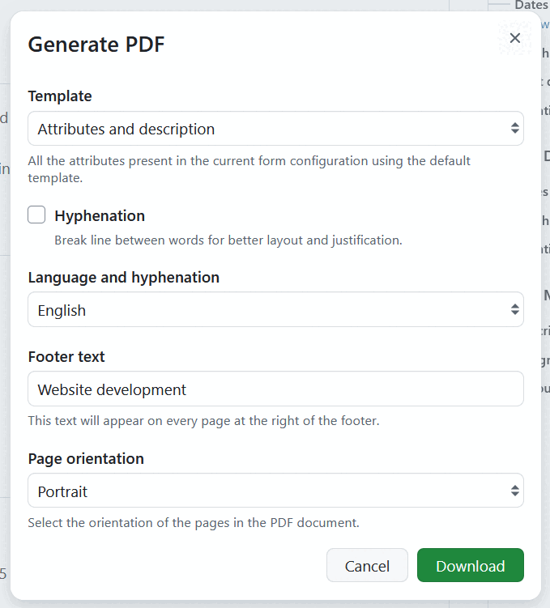
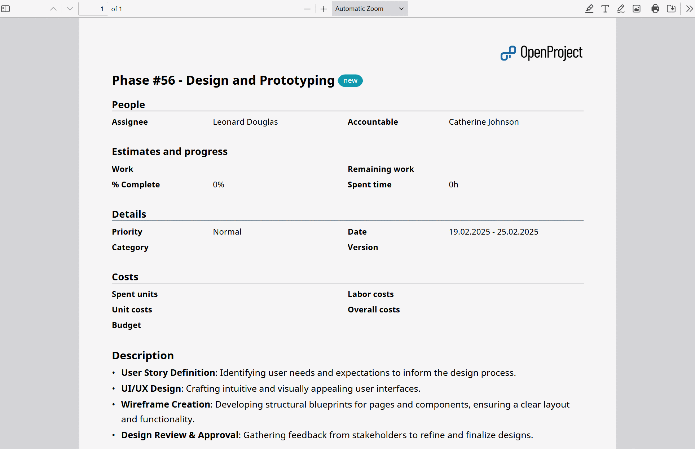

---
sidebar_navigation:
  title: Work package PDF export
  priority: 400
description: How to export a single work package in PDF format in OpenProject
keywords: work package exports, single work package, PDF, contract template, PMflex artefact
---

# Work package PDF export

If you select **Generate PDF** in the work package dropdown menu, a modal will open, where you can select a template and adjust its options.

**Template** is a dropdown menu showing all of the options currently enabled. Each template produces a different document and offers its own options, which are described in the sections below.

Which templates you can choose from depends on the work package type. Administrators can [activate and deactivate the templates](../../../../system-admin-guide/manage-work-packages/work-package-types/#activate-templates-for-pdf-exports) for every work package type and change their order, which determines the template preselected in the dropdown menu.

All templates have the following in common:

- Images used in the description and in long text fields are embedded into the PDF.
- [Embedded work package and project attributes](../../../wysiwyg/#attributes) are resolved to their current values.
- The logo displayed in the export is taken from the [design settings](../../../../system-admin-guide/design/). If no export logo is configured, the OpenProject logo is used.
- The name of the downloaded file is composed of project, work package type, ID and subject, followed by the date and time of the export.

## Options for all templates

Regardless of the selected template, you can adjust the following:

- **Hyphenation** - if selected, a break line will be included into the export between words for improved layout. This option is deactivated by default.

- **Language and hyphenation** - a dropdown menu showing languages to be used for hyphenation. Your current language is preselected if hyphenation is available for it. The selection does not change the language used in the PDF export.

## Attributes and description

This template exports the work package as a compact document containing all of its attributes and its description. It is the right choice if you need a printable snapshot of a single work package.

The export contains:

- A heading with work package type, ID and subject, followed by the current status. The heading is linked to the work package in OpenProject.
- All work package attributes, grouped and ordered exactly as in the form configuration of the work package type. Every group is introduced by its title. Attributes are also listed when they are empty, but attributes you are not allowed to see are left out.
- Long text custom fields at the position defined in the form configuration, each with its name as a label.
- The work package description.
- Embedded work package tables from the form configuration, for example a table of children. If such a table contains no work packages, the export states this instead.

> [!NOTE]
>
> Layout of the PDF export follows the [work package configuration form](../../../../system-admin-guide/manage-work-packages/work-package-types/#work-package-form-configuration-enterprise-add-on) defined for specific work package types.

In addition to the options above, you can adjust the following:

- **Footer text**, which is displayed at the center of the footer of every page, with the export date to the left and the page number to the right of it. The project name will be suggested as footer text. You can adjust the suggested footer text.

- **Page orientation**, which allows selecting _Portrait_ or _Landscape_ layout of the pages in the PDF. Portrait places two attributes next to each other, landscape four. Select _Landscape_ for work packages with many attributes or wide embedded tables.

## Contract

This template exports the work package description only, formatted to the standard German contract form. Attributes are not included, which makes the work package description the full content of the document.

The document uses a wide page margin, justified paragraphs and a bracketed numbering for lists, as it is common for contracts. The logo is placed in the upper left corner of every page.

> [!TIP]
> Since only the description is exported, you can prepare the contract wording as [default text for the description](../../../../system-admin-guide/manage-work-packages/work-package-types/) of a work package type and let [embedded attributes](../../../wysiwyg/#attributes) fill in values such as the contract partner or a date.

In addition to the options above, you can adjust the following:

- **Footer text**, which is displayed at the center of the footer of every page, with the export date to the left and the page number to the right of it. The work package subject will be suggested as footer text. You can adjust the suggested footer text.

## PMflex Artefact

This template renders the work package as a PMflex Artefact: a structured document that combines the context of the project with the content of the work package and its related work packages. 
The [PM² Project Management Guide](../../../../project-management-guide/3-overview-pm2/#33-pm-phase-drivers-and-key-artefacts) describes the key artefacts of the methodology and the phases they belong to.

The export contains:

- A cover page with work package type, ID, subject and status, along with the instance name and the export date and time.
- A table of contents, if the option below is activated.
- The work package description.
- All [project attributes](../../../projects/project-settings/project-attributes/) of the project, section by section. Empty sections are skipped.
- The project's lifecycle (phases) and budgets, if the options below are activated.
- All work package attributes, grouped as in the form configuration of the work package type.
- Related work packages from embedded tables of the form configuration. Unlike the other templates, 
  these are not listed as table rows but rendered with their attributes, their description and their long text custom fields, so the artefact is complete on its own.

In addition to the options above, you can adjust the following:

- **Table of contents** - if selected, a table of contents page indexing the section headers is added to the export. The entries are linked to the respective pages and list the project attribute sections and the work package attribute groups. This option is activated by default.
- **Project lifecycle** - if selected, the project's [phases](../../../projects/project-settings/project-life-cycle/) are listed with their date ranges and, where set, their start/finish gate names. Only phases with a date range or a set gate are included, and the section is only shown to users who can view the project's phases. This option is deactivated by default.
- **Project budgets** - if selected, a planned cost breakdown of the project's [budgets](../../../budgets/) is added. Each budget is listed with its planned total, its base amount if it has one, and its planned unit cost and planned labor cost items, each item with its quantity, cost per unit and sum. Every group carries a subtotal and the section closes with a total across all budgets. Spent and available amounts are not part of the export, and budget item comments are not exported. The section is only shown to users who can view the project's budgets, and individual amounts are left blank for users who may not see the underlying rates - just as they are in the budget views, which means the amounts a partially permitted user sees do not necessarily add up to the subtotal shown. This option is deactivated by default.

> [!TIP]
> Administrators can configure [automatic artefact export](../../../../system-admin-guide/manage-work-packages/work-package-types/#automatic-artefact-export) for a work package type. The artefact is then generated whenever the status of a work package changes and either added to the work package as an attachment or uploaded to the connected Nextcloud folder of the project.

## Generate the export

Click the **Download** button to generate the PDF export.

See [Export work packages](../#export-a-single-work-package) for how to trigger the export of a single work package.
