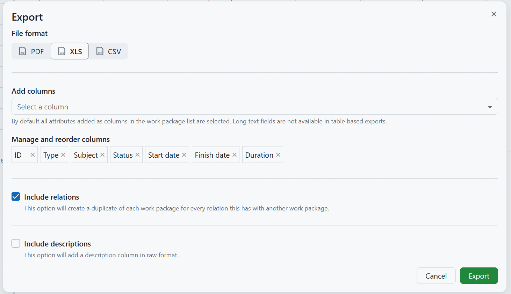
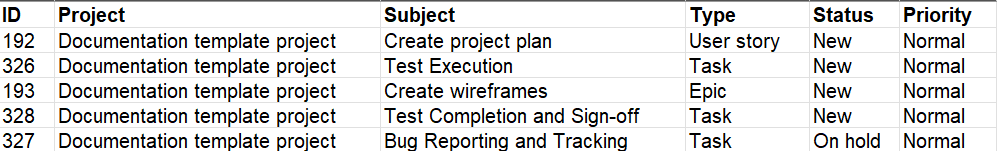
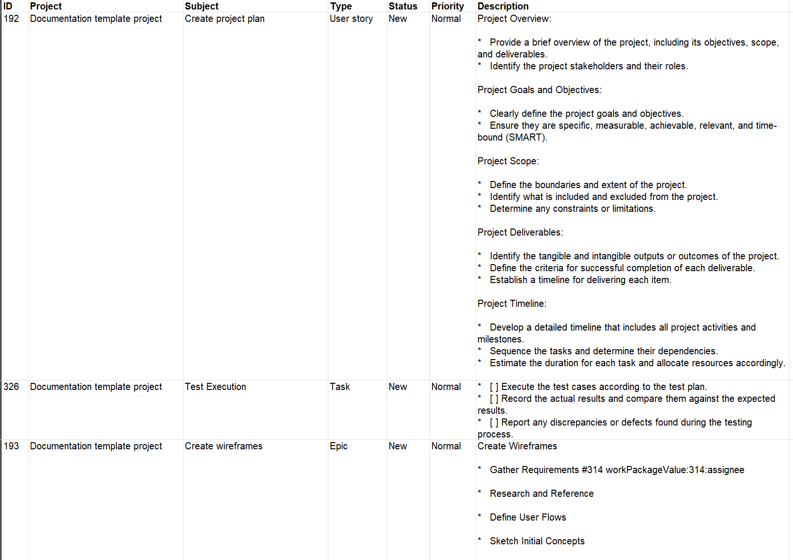
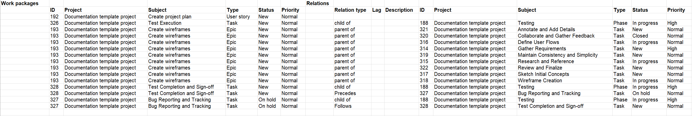

---
sidebar_navigation:
  title: XLS export (Excel)
  priority: 600
description: How to export work packages in XLS format for Microsoft Excel
keywords: work package exports, XLS, Excel, spreadsheet
---

# XLS export (Excel)

**XLS** is a plain sheet that matches the OpenProject work packages table with its columns and work packages as rows matching the selected filter(s).

OpenProject can export the table for Microsoft Excel with the following options:

In **XLS** format export, you can manage and reorder columns that should be included, as well as decide if relations and descriptions should be included in the report.

## Columns

You can choose which columns will be displayed in the table (excluding long text fields) and change their order. The pre-selected columns are the ones in the work package table query. Learn how to [save the work package view](../../work-package-table-configuration/#save-work-package-views).

## XLS with descriptions

If you activate the **Include descriptions** option, an additional column will be included in the report, showing work package descriptions. The descriptions are exported as raw text with HTML tags removed, so formatting characters remain visible.

## XLS with relations

If you activate the **Include relations** option, each work package is repeated in a separate row for every relation it has. Work packages without relations are exported in a single row.

Every row is extended by the columns **Relation type**, **Lag** and **Description** of the relation, followed by the selected columns of the related work package. Hierarchy relations are included as well and are labelled _parent of_ and _child of_.

## Export limit

All work packages included in the work package table in the currently selected view will be exported, unless a certain export limit has been defined by the instance administrator. The limit can be changed in the [export settings](../../../../system-admin-guide/system-settings/exports/) in the system administration. Newly created instances have a maximum of 500 work packages set as a limit by default.

## Limitations

The OpenProject XLS export currently does not respect all options in the work package view being exported from:

- The hierarchy of work packages as displayed in the work package view. The exported XLS is always in "flat" mode.

See [Export work packages](../) for how to trigger an export and adjust the general export options.