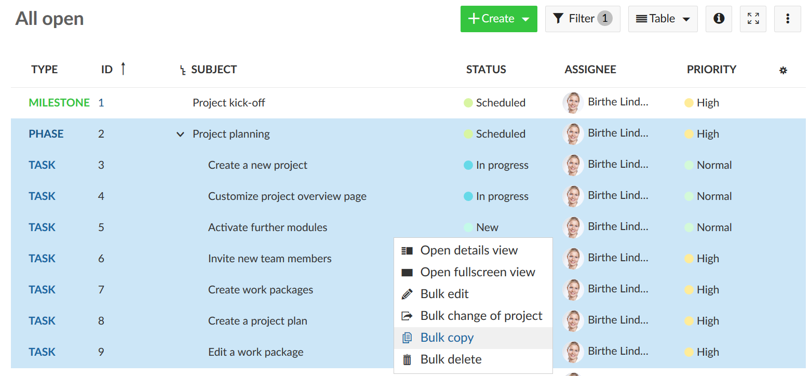

---
sidebar_navigation:
  title: FAQ
  priority: 001
description: Frequently asked questions regarding work packages
robots: index, follow
keywords: work packages FAQ, tickets, how to
---

# Frequently asked questions (FAQ) for work packages

## How can I copy work package hierarchies with their relations?

You can create work package templates with hierarchies (parent and child work packages) and copy these templates, including the relations.
First, navigate to the work package table. Highlight all work packages (in the hierarchy) which you want to copy. **To highlight and edit several work packages at once, keep Ctrl pressed** and select the ones to be copied.

**Press a RIGHT mouse click on the highlighted work packages**. This will open the in context menu to edit work packages.

Select **Bulk copy** in order to copy all selected work packages including their relations.

## Can I set multiple parents for one work package?

No, this is not possible. 

## I added new work package types. Why can i not see them?

Please make sure you [activated](../projects/project-settings/work-package-types/) them in the project settings first. If you still can't see them (e.g. in the boards module) please upgrade OpenProject to the newest release.

## Is it possible to adapt or rename the status list?

Yes, this is absolutely possible. To do this, you would first have to [create new statuses](../../system-admin-guide/manage-work-packages/work-package-status/).
In the second step you can then [assign them to workflows](../../system-admin-guide/manage-work-packages/work-package-workflows/).

## I created a new work package status, why can I not choose it?

Please add the new status to the workflow for all work packages you want to use it for, first. Find out [here](../../system-admin-guide/manage-work-packages/work-package-workflows) how to do it. Please make sure to un-check the box at top ("Only display statuses that are used by this type") to be able to see your new status.

## We like for each department to have their own custom "status" with different value options in OpenProject. How do we do this?

The status which can be selected by users (based on the workflow) is always determined based on the work package type and the role of the user. In order to use the same work package type (e.g. task) but display different status for each department, you would need to create a separate role for each department. You can then add the members of a department (ideally using a group) and assign them with the correct role. Please find the guide [here](../../system-admin-guide/manage-work-packages/work-package-workflows/#edit-workflows).
To work with different status, first create those status in “Administration” > “Work packages” > “Status”.
Next, go to “Administration” > “Work packages” > “Workflow” and select the combination of Type and Role for which you would like to set the allowed workflow transition.
You can e.g. create a role “Marketing – Member” and select it as well as the type (e.g. “Task”). Make sure to uncheck the option “Only display statuses that are used by this type” and click on “Edit”. Now, you can select the correct status transitions.
Repeat this step for the other (department) roles (e.g. “IT – Member”) and select the desired status transitions. This way, you can set different status for each department (only the default status is shared (i.e. “New” by default)). 
Please keep in mind that it may not be possible for a member of a different department to update the status of a work package if it has been updated before by another department (since the workflow may not support this status transition).

## Is it possible to create a PDF export for the overview of the work packages with Gantt chart?

The export is available via the browser print function (ideally Google Chrome).

To print the Gantt chart please have a look at [these tips](../gantt-chart/#how-to-print-a-gantt-chart).

## How can I add a table with child work packages to my work package?

Please navigate to *Administration ->Work packages ->Types*, choose the respective work package type and navigate to form configuration. Then, use **+Group** to insert a work package table. Don't forget to press **Save**.