---
sidebar_navigation:
  title: Set and change dates and duration
  priority: 970
description: How to use the date picker to set and update the start date, finish date and duration of a work packages
keywords: date picker start finish dates duration change modify update relations work package
---

# Set and change dates and duration of work packages

| Feature                                                             | Documentation for                                              |
|---------------------------------------------------------------------|----------------------------------------------------------------|
| [Set start and finish dates](#set-start-and-finish-dates)           | How to set start and finish dates, and how to change them      |
| [Working days and duration](#working-days-and-duration)             | How to set duration, and how it affects start and finish dates |
| [Scheduling mode](#scheduling-mode)                                 | Enabling manual scheduling and what it does                    |
| [Information and warning banners](#information-and-warning-banners) | What the different warning and information banners mean        |

## Set start and finish dates

You can change the start and finish dates of a work package by opening the date picker.

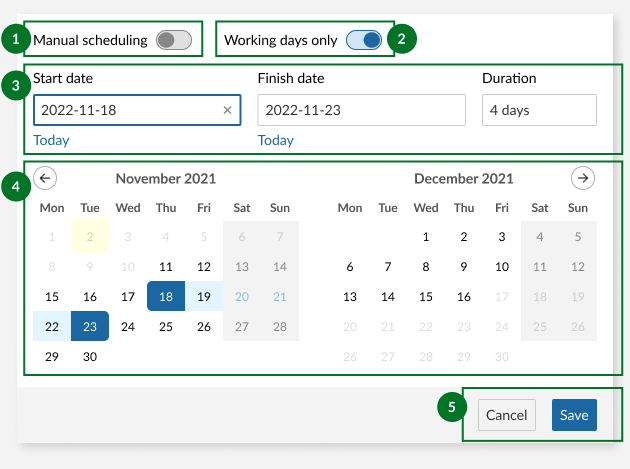

1. [Manual scheduling](#scheduling-mode) switch
2. Working days only switch
3. Start date, finish date and duration input fields
4. Mini calendars for date range preview
5. Save and cancel buttons

You can open the date picker for a work package from a number of different places:

- By clicking on the date field in the work package [details view](../work-package-views/#full-screen-view)
- By clicking the the date field in the work package [split screen view](../work-package-views/#split-screen-view) (from any other view, including [notification center](../../notifications), [team planner](../../team-planner/), [boards](../../agile-boards)...)
- By clicking the start date, finish date or duration fields in [table view](../work-package-views/#table-view)

### Using the date picker

You can enter dates either by typing them in into the start and finish date fields or by clicking on individual dates in the mini calendar below.

> **Note**: Typed dates need to be in the standard ISO 8601 format: **YYYY-MM-DD** (so 12 October 2022 would be 2022-10-12).
>
> They will nevertheless be displayed in your desired format (usually depending by your region or language).

You can also click on the **Today** link below the start and finish date fields to use today's date.

A more intuitive way to select start and end dates is to simply click on two different dates in the mini calendars below. Two calendar months are displayed for better visibility.

Start by clicking on a start date. This will enter the selected date as the start date, mark it with a dark color on the mini calendar below and move the focus to the finish date field. Hovering on different finish dates will give you a preview of the date range for the work package if you click this second date. Once you have decided on a finish date, click on it. This will enter the finish date in the date field and mark that date with another dark color. The dates in between will be highlighted with a lighter color.

To confirm the selected dates, click on the **Save** button. The green message on top of the work package indicates a successful update.

To clear a date field, simply click on the **clear icon** ("×") icon when the field is in focus.

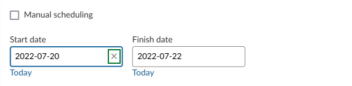

Date changes are documented in the work package [Activity](../../activity/).

### Advanced functionality

- The date picker allows you to pick start and finish dates in the opposite order. Clicking on a start date and then moving backwards to click on an earlier date will then use that first date as the finish date and the second (earlier) date as the start date.

- For a work package that already has a start and finish date, it is possible to adjust just the finish date: click on the finish date field and then click on a new date. As long as this date is after the start date, the finish date will update accordingly. If the date you pick is earlier than the start date, the original start date will then be cleared and a click on a second date will define the other end of the new range.

- It is possible to set only one of the two dates. To do this, click on the field you would like to set (start date is selected by default, but you can change this manually to finish date) and click on a date. Then save without selecting a second date. Alternatively, if a a range is already selected, simply remove one of the dates and save.

**Note**: The precedes-follows relation can constrain or affect the dates of work packages. For more information, see [Moving related work packages](../work-package-relations-hierarchies/#moving-related-work-packages).

### One-day events

If you want the work package to start and finish on the same date, simply click the same date twice.

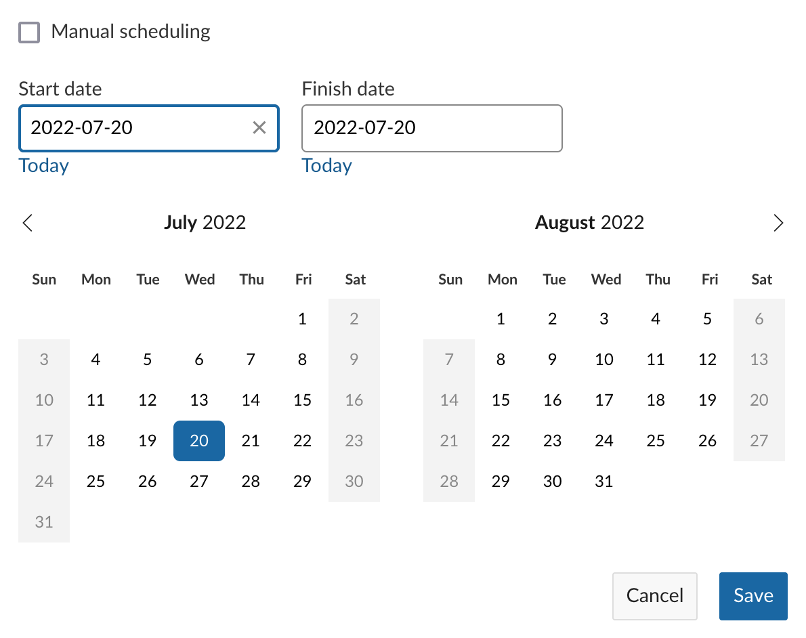

Work packages with *only* a start date or only a finish date are automatically considered one-day events.

Certain work package types (such as Milestones) can only span one day and thus have only one date field:

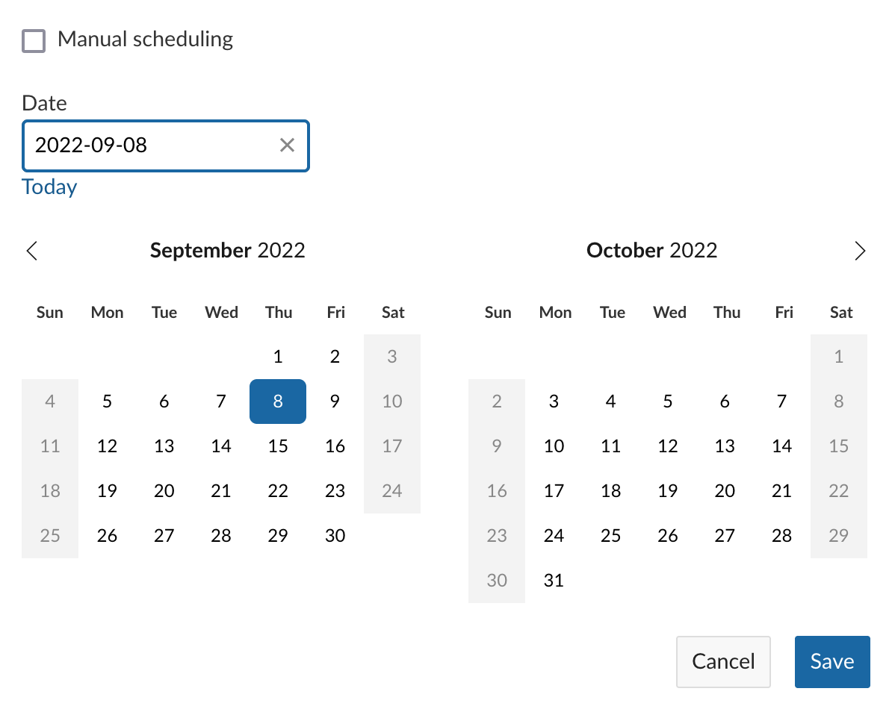

## Working days and duration

Starting with OpenProject 12.3, it is possible to manually input a duration for a work package and decide whether this duration should include working days only or all calendar days.

> **Note:** Working dates are currently defined by the administrator of your OpenProject instance. By default, they are Monday to Friday, with Saturday and Sunday considered non-working. If you are an administrator, please read our [admin guide on working days](../../../system-admin-guide/calendars-and-dates/#working-days-and-hours).
>
> **When upgrading to 12.3 from a previous version:** Please note that this switch will be set to ***off*** for all existing work packages so as to preserve start and finish dates. However, the switch will be ***on*** by default for new work packages.

### Working days

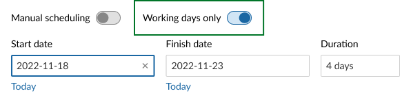

The **Working days only** switch is on by default, and the date picker skips over the weekend (or the days defined as non-working days) when scheduling work packages and deriving duration. In this mode, non-working days are marked with a darker color and are not clickable. Work packages cannot start or finish on non-working days, and these days do not count towards the calculation of duration.

Switching **Working days only** off will turn the previously disabled non-working days into regular working days, and make them available for scheduling. The duration will now take these days into account.

### Duration

Duration is always expressed in days, and is the total number of days between the start and finish dates (inclusive). The **Duration** field is directly related to the start and finish dates, but does not require them. Changing one will change the other.

Duration can either be automatically derived from dates or entered manually. When the duration field is is focus, you can enter a number corresponding to days; you do you not need to type the word "days" (or the equivalent in your language), this will automatically be added for you.

#### Duration when start and finish dates exist

When you set a start and a finish date, the duration is automatically derived. For example, if the start date is set to *Wednesday, 12 October, 2022* and the finish date to *Friday, 14 October, 2022*, a duration of 3 days is derived.

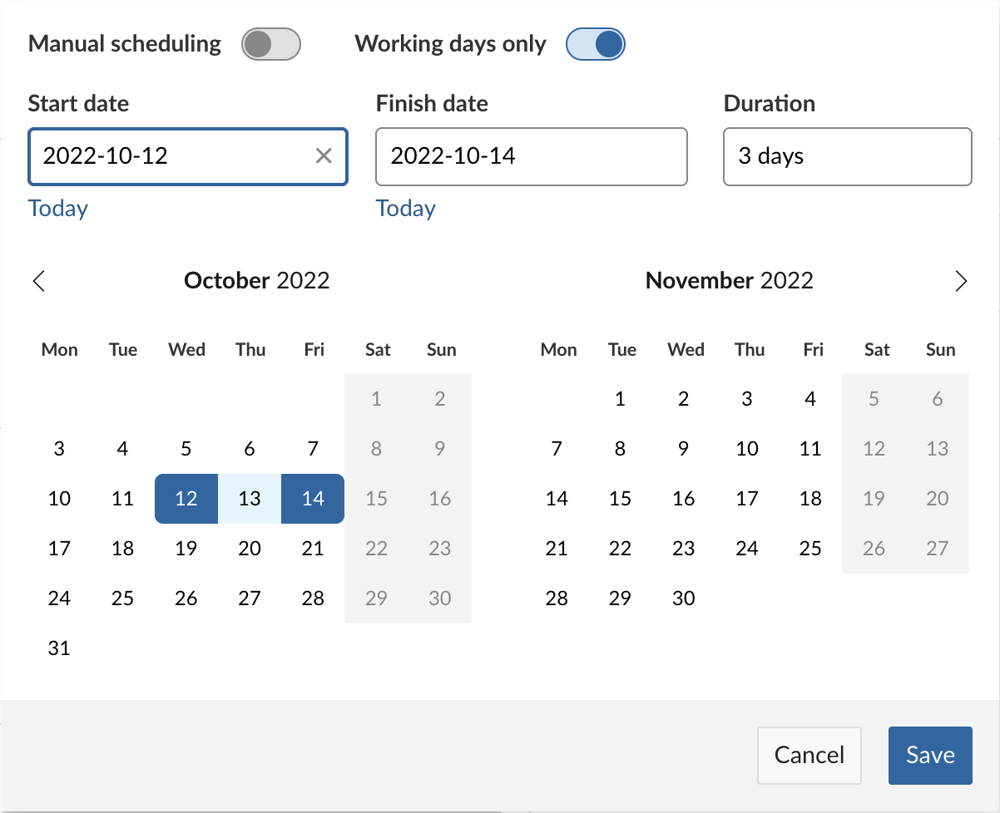

Changing the duration when both start and finish dates are already set will then update the finish date. In our example, if you change the duration to 4 days, one of two things can happen:

- *If the Working days only switch is **on***, the finish date is automatically set to Monday, 17 October, 2022 (since Saturday and Sunday are not working days)
- *If the Working days only switch is **off***, the finish date is automatically set to Saturday, 15 October, 2022 (since all calendar days are included)

### Duration when only one date exists

A work package cannot have only one date *and* a duration; the other date is automatically derived. This derived date can either be the start date or the finish date.

For example, if you set the start date to *Wednesday, 12 October* and enter a duration of 3 days, a finish date of Friday, 14 October is automatically derived. Conversely, if you set the finish date *Friday, 14 October* and then set the duration to 3 days, the date picker will count backwards and derive a start date of *Wednesday, 12 October.*

#### Duration without start and finish dates

It is possible for a work package to have only duration  without any start or finish dates set.

> **Note:** If you add even one date to a work package with duration, the other date is automatically derived; it is not possible to have just one date (start *or* finish) and duration set. Please note also that if a work package with only duration derives its start date via a relation, the finish date is then also derived.

Setting only duration without start or finish dates is especially useful when you have a general estimation of how long different tasks or phases of a project will take, but do not have exact dates defined quite yet.

> **Pro tip:** This feature makes it possible to automatically derive an estimated start or finish date for entire project.
>
> To do so, create a series of work packages that represent the main phases and set the approximate duration for each. Link them all using follow/precedes relationships. Now, when you set a start date on the first work package in the series, the start and end dates for all other work packages will be derived.

## Scheduling mode

### Manual scheduling

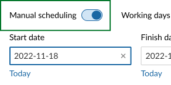

Switching "Manual scheduling" on enables [manual scheduling mode](../../gantt-chart/scheduling/#manual-scheduling-mode) for the work package. This ignores work package relations such that you're able to select any start and end dates, even ones that would normally be restricted due to follows/proceeds relationships.

Manual scheduling also decouples the start and end dates of parent and children work packages. This means that the dates of parents are no longer constrained by those of the children, and children can be scheduled outside of the range of parent work packages. These relationships are completely ignored as far as scheduling is concerned, but are not removed (so they will still be visible in Gantt view; the constraints are respected again if you switch manual scheduling off.

Manual scheduling can be useful when you need to anchor a work package to fixed dates, for example because the dates of preceding or following work packages are not yet known.

## Information and warning banners

OpenProject 12.2 introduced helpful banners to give you important contextual information when changing dates on work packages with [relations](../work-package-relations-hierarchies).

Information banners have a blue background and display information that is helpful to the user but is not critical. Warning banners have an orange background and display information that is critical, with potentially larger consequences to project scheduling.

There are four possible banners:

### Automatically scheduled

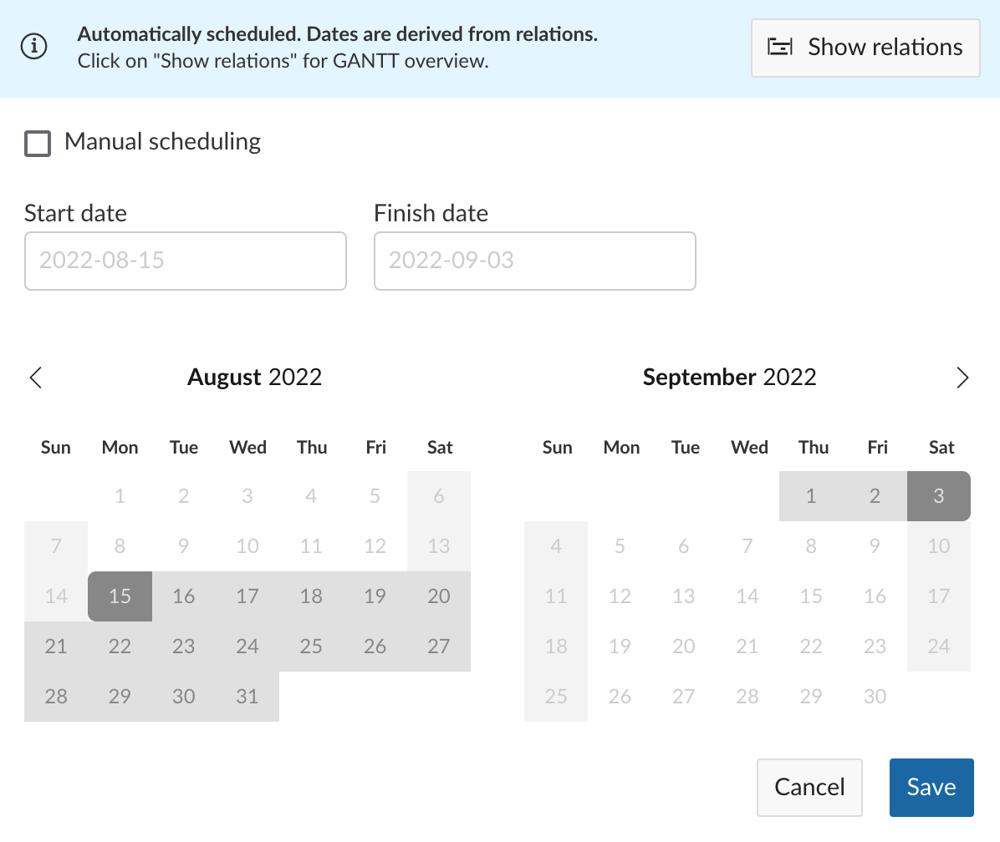

This information banner is displayed when the dates of the current work package are derived from existing relations and can therefore not  be modified. This is the case of parent work packages whose start and finish dates are derived from the earliest and latest child work packages respectively.

It is nevertheless possible to input specific start and finish dates for such work packages by enabling manual scheduling (which will ignore relations from which the dates were originally derived).

### Available start date and finish dates limited by relations

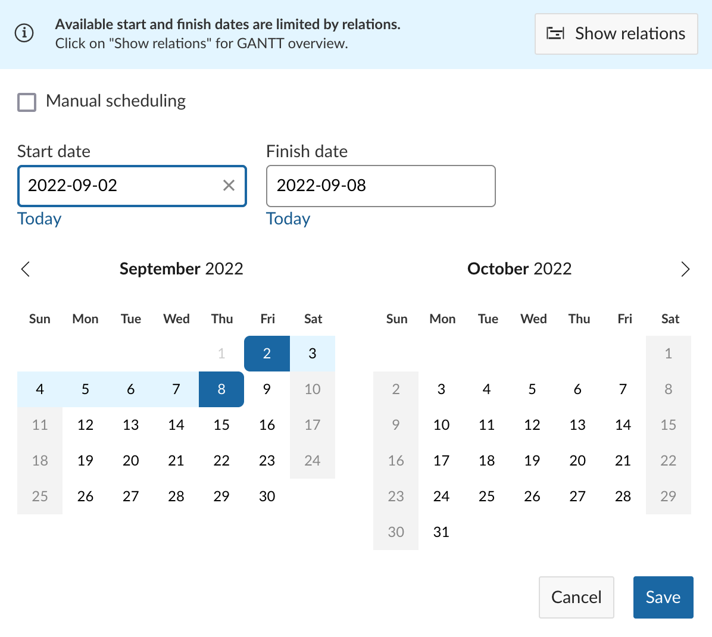

This information banner is displayed when certain date ranges are disabled due to constraints imposed by follows/precedes relations. For example, a work packages following another one cannot be scheduled before the finish date of the the preceding one.

### Manually scheduled, relations ignored

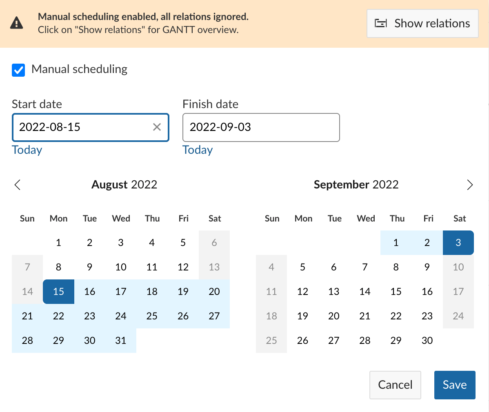

This warning banner is displayed when you enable manual scheduling on work packages that have follows/precedes or parent/child relations, which are now ignored and no longer limit which dates can be selected for this work package. This also means that changes a manually scheduled work package no longer affect others, despite those existing relations.

This banner is _not_ displayed when manual scheduling is enabled on work packages without relations.

### Other work packages affected

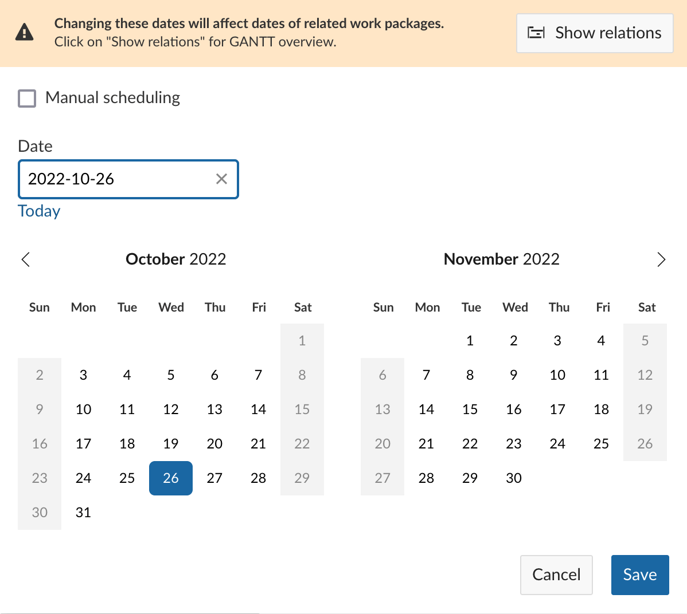

This warning banner is displayed on work packages whose start and end dates affect those of other related work packages. For example, when changing the finish date will consequently change the start date of another (following) work package and/or the finish date of a parent.

> **Info**: When both an information and a warning banner are applicable to a work package, only the more important warning banner is displayed.

### Show Relations button

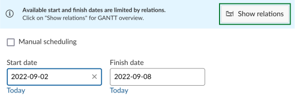

The information and warning banners also feature a **Show Relations** button. Clicking on this will open a new tab that displays work packages with direct relations to the current work package in [Gantt view](../../gantt-chart), in hierarchy mode.

> **Info**: This preview is intended to give a quick overview of only _direct_ relations that might affect scheduling options for the current work package. It does not show second-level relations (and above). To get a full overview, please use the project work package [table view](../work-package-views/#table-view) or [Gantt view](../../gantt-chart) with your desired [filter/view configuration](../work-package-table-configuration/).
