---
sidebar_navigation:
  title: Configure work package table
  priority: 700
description: How to configure the work package table in OpenProject?
robots: index, follow
keywords: work packages table configuration
---

# Work package table configuration

| Feature                                                      | Documentation for                                            |
| ------------------------------------------------------------ | ------------------------------------------------------------ |
| [Add or remove columns](#add-or-remove-columns-in-the-work-package-table) | How to add or remove columns in the work package table?      |
| [Filter work packages](#filter-work-packages)                | How to filter in the work package list?                      |
| [Sort the work package list](#sort-the-work-package-list)    | How to sort within the work package list?                    |
| [Display settings](#how-to-switch-from-flat-list-to-hierarchy-mode?) | How to switch from flat list to hierarchy mode in the work package list? |
| [Attribute highlighting (Premium Feature)](#attribute-highlighting-premium-feature) | How to highlight certain attributes in the work package list? |
| [Save work package views](#save-work-package-views)          | How to save a new work package view?                         |

You can configure the work package table view in OpenProject to display the information that you need in the list.

You can change the header in the table and add or remove columns, filter and group work packages or sort them according to a specific criteria. Save the view to have it available directly from your project menu.

Also, you can change between a flat list view and a hierarchy view.

To open the work package table configuration, open the **Settings** icon with the three dots at the top right of the work package table.

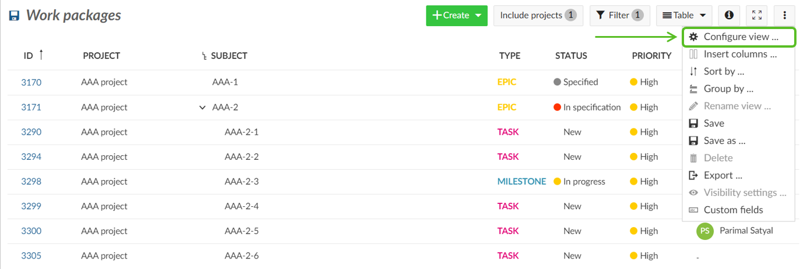

## Add or remove columns in the work package table

To configure the view of the work package table and have different attributes displayed in the list you can add or remove columns in the work package list.

First, [open the work package table configuration](#work-package-table-configuration).

In the pop-up window, choose the tab **Columns**.

You can add columns by typing the name of the attribute which you would like to add.

You can remove columns by clicking the **x** icon.

You order the attributes in the list with drag and drop.

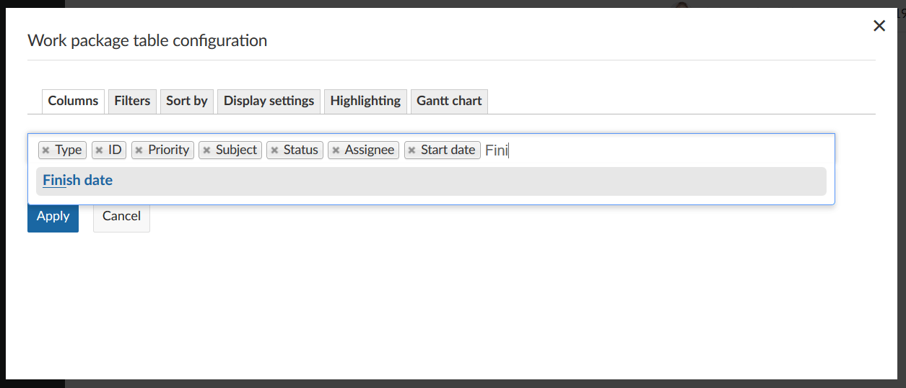

Clicking the **Apply** button will save your changes and adapt the table according to your configuration.

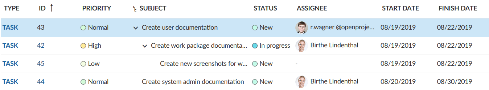

## Filter work packages

In the work package list there will soon be quite a lot of work packages in a project. To filter the work packages in the list, click on the **Filter** button on top of the work packages view. The number next to it tells you how many filter criteria you have applied to a list.

In this example 1 filter criteria: Status = open.

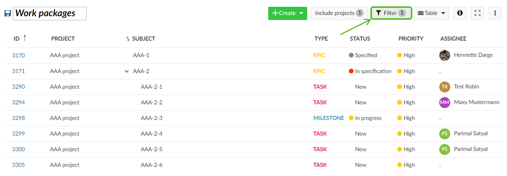

To add a filter criteria, click the **+ Add filter:** button in the grey filter area. You can choose a filter criteria from the drop-down list or start typing to search for a criteria.

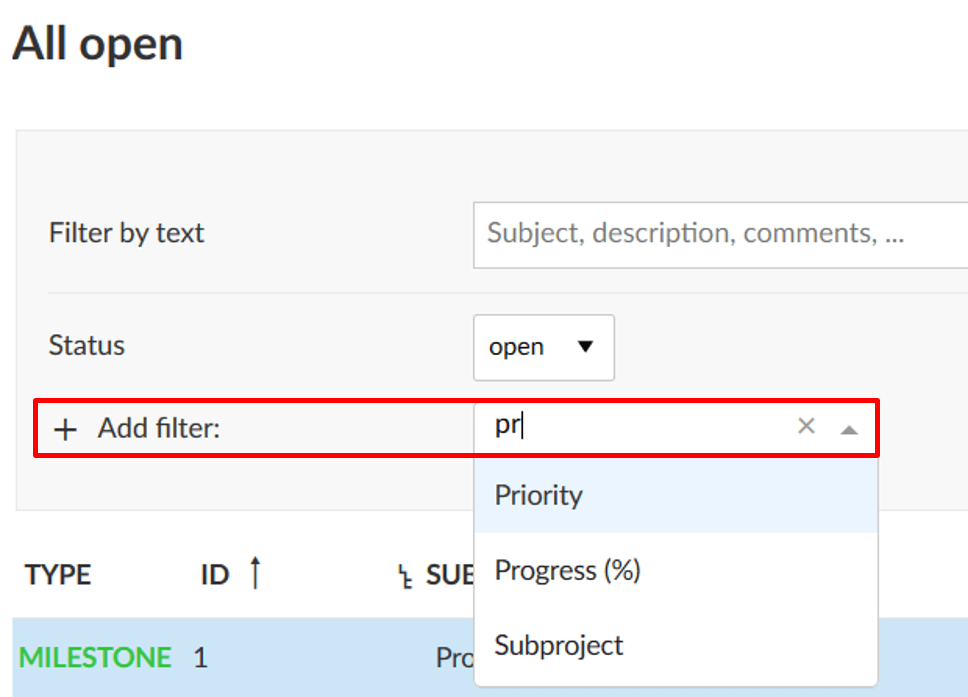

You can add as many filter criteria as needed. 
Also, you can filter by [custom fields](../../../system-admin-guide/) if you set this in the custom field configuration.

If you want to search by subject of a work package, type in the **Filter by text** the expression you want to filter for.

The results will be displayed accordingly in the work package list.

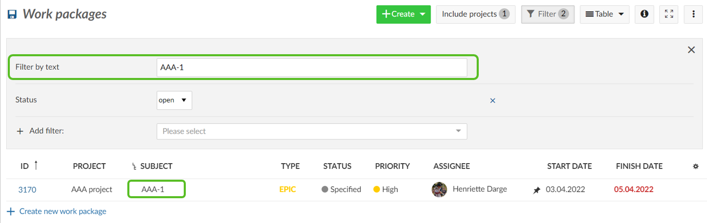

## Sort the work package list

By default, the work package list will be sorted by work package ID. 

The **ID** is unique for a work package within OpenProject. It will be set automatically from the system. With the ID you can reference to one specific work package in OpenProject.

To sort the work package list view, open the [work package table configuration](#work-package-table-configuration) and select the tab **Sort by**. You can sort by up to three attributes, either ascending or descending.

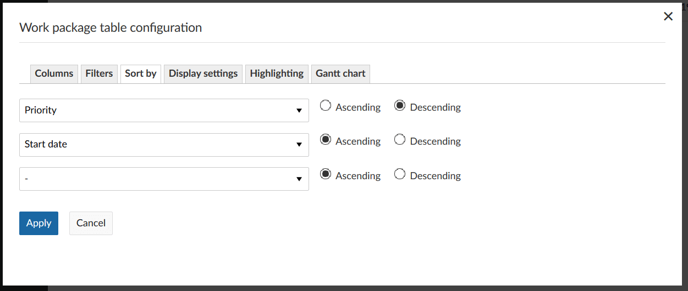

Click the blue **Apply** button will save your changes and display the results accordingly in the list view.

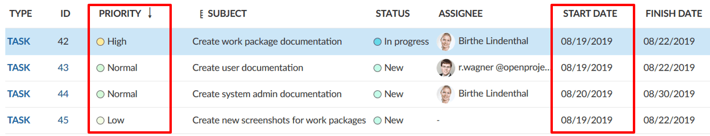

**Note**:  If you have the hierarchy mode activated, all filtered table results will be augmented with their ancestors. Hierarchies can be expanded and collapsed.

Therefore, the results may differ if you sort in a flat list or in a hierarchy mode.

The same filter applied in the hierarchy mode.

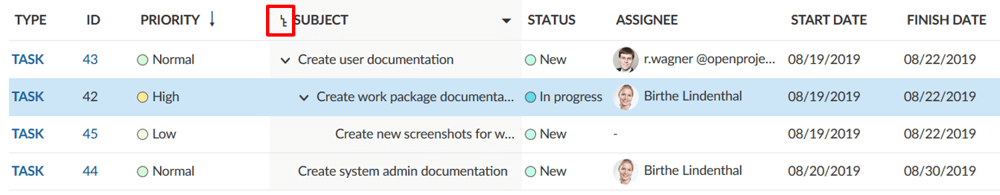

## How to switch from flat list to hierarchy mode?

You have three different options to display results in the work package list.

* **A flat list** (default), which contains all work packages in a list no matter how their parent-child-relation is.
* A **Hierarchy**, which will display the filtered results within the parent-child-relation.
* **Group by** will group the list according to a defined attribute.

You have to choose either option when displaying work packages in the list.

To switch between the different criteria, open the [work package table configuration](#work-package-table-configuration) and open the tab **Display settings**. Choose how to display the work packages in the list and click the blue **Apply** button.

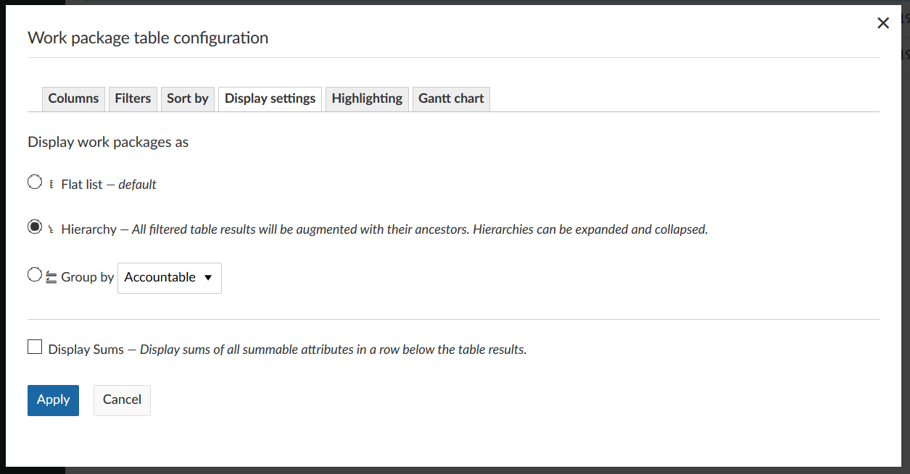

## Attribute highlighting (Premium Feature)

You can highlight attributes in the work package list to emphasize the importance of certain attributes and have important topics at a glance.

The following attributes can be highlighted in the list:

* Priority
* Status
* Finish date

Either 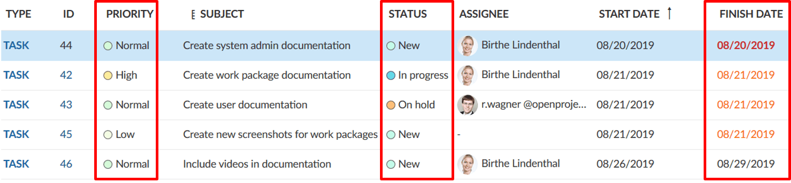

Furthermore, you can highlight the entire row by an attribute.

The following attributes can be highlighted as a complete row:

* Priority
* Status

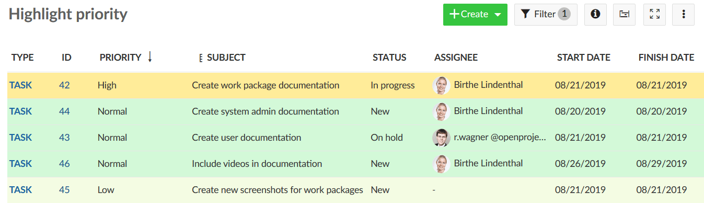

You can configure the colors for attribute highlighting in the [system administration](../../../system-admin-guide/#status-colors).

## Save work package views

When you have configured your work package table, you can save the views to access them again and share them with your team.

1. Press the **Settings icon** with the three dots on the top right of the work packages list.
2. Choose **Save as...**

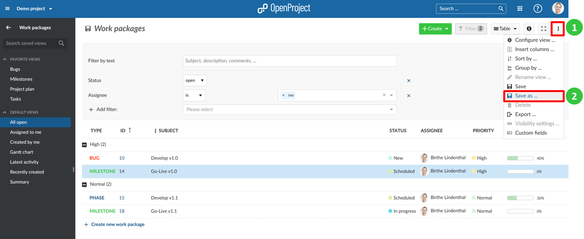

3. Enter a **Name** for your Saved view (according to the criteria you have chosen in your work package table configuration).

   In this example, the list was filtered for Work packages assigned to me which have a High Priority.

   **Public views:** Check the Public checkbox if you want to have this work package view accessible also for other users from this project.

   **Favored:** Check this Favored checkbox if you want to have this work package as a menu item in your Favorite views.

   Press the blue **Save** button to save your view.

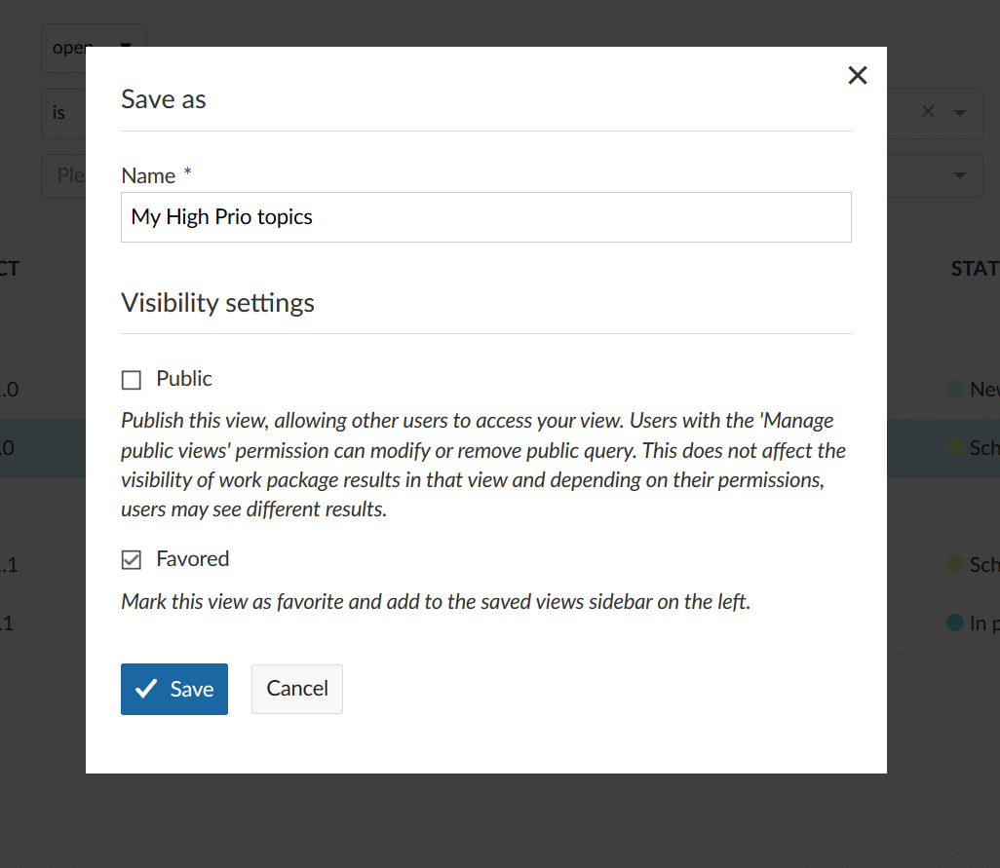

The view will then be saved in the work packages menu in your **Favorite views**:

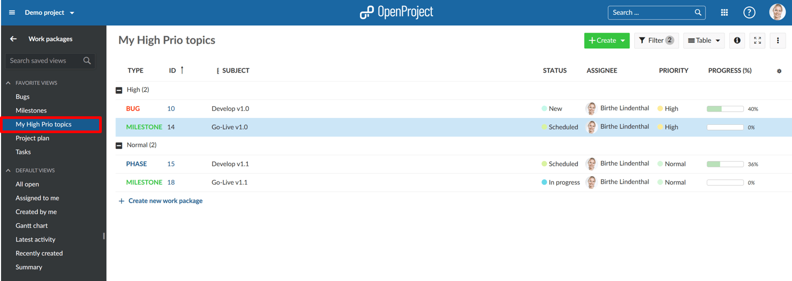

If you check the Public visibility, the view will be saved under your Public views in the work package menu:

### Change saved work package views

If you make changes to a saved view, e.g. change a filter criteria, you have to save the new view once again. In order to apply the change to the actual saved view, click on the disk icon which appears next to the title of the saved view:

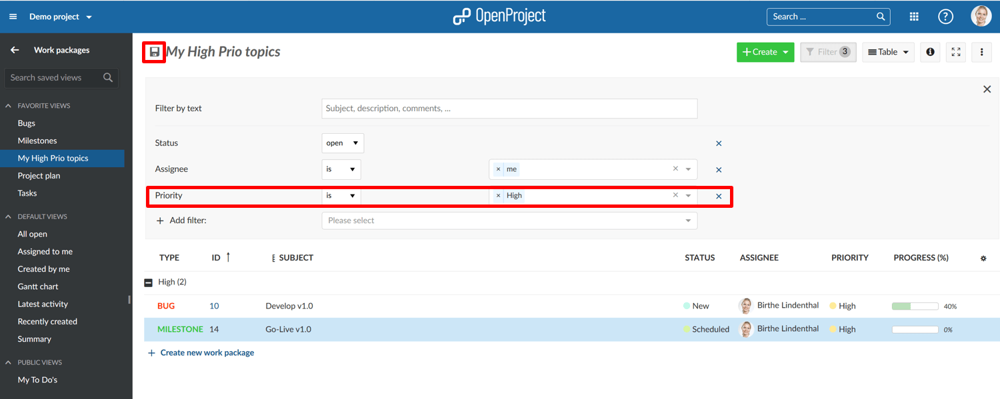

If you want to save a completely new work package view, again click on the Settings and select **Save as...** as described above to [Save work package views](#save-work-package-views).
