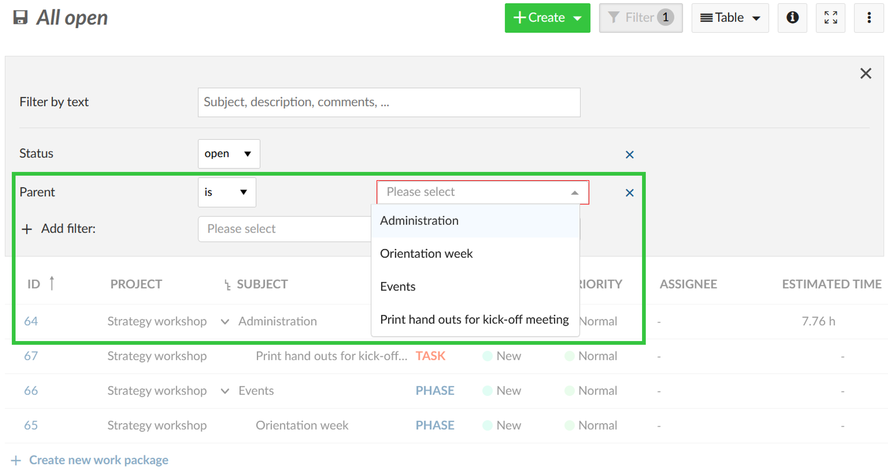
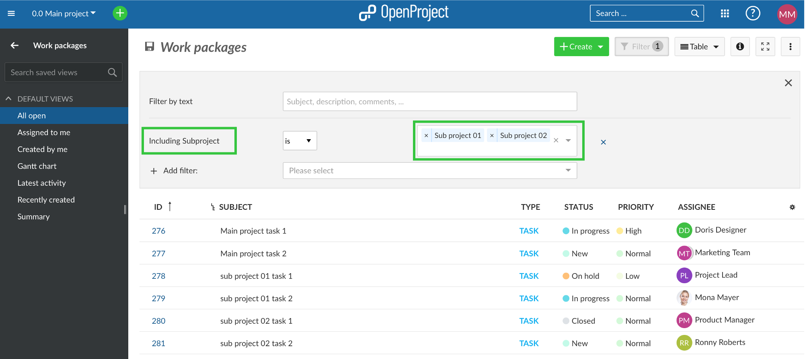
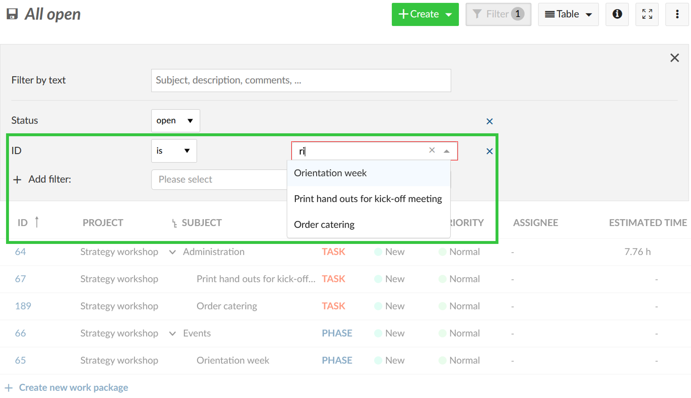
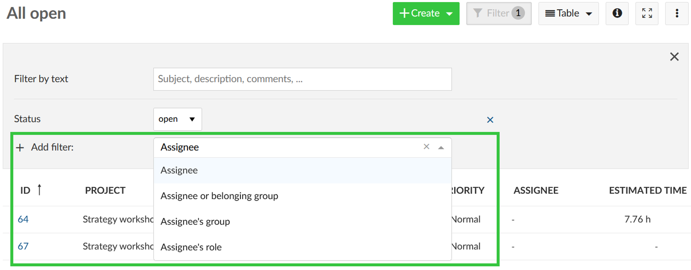
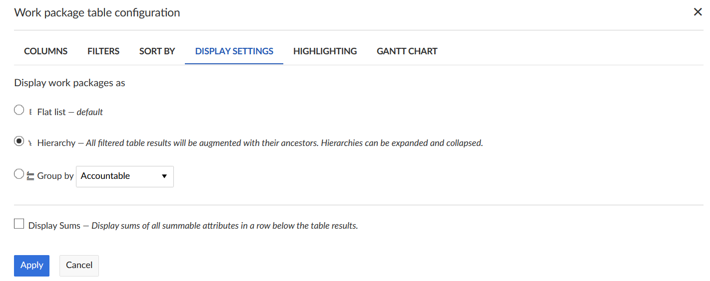
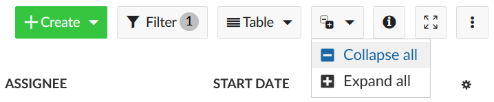

---
sidebar_navigation:
  title: Configure work package table
  priority: 700
description: How to configure the work package list in OpenProject?
robots: index, follow
keywords: work packages table configuration, work package list, columns, filter, group
---

# Work package table configuration

| Topic                                                        | Content                                                      |
| ------------------------------------------------------------ | ------------------------------------------------------------ |
| [Add or remove columns](#add-or-remove-columns-in-the-work-package-table) | How to add or remove columns in the work package table?      |
| [Filter work packages](#filter-work-packages)                | How to filter in the work package list?                      |
| [Sort the work package list](#sort-the-work-package-list)    | How to sort within the work package list?                    |
| [Display settings](#flat-list-hierarchy-mode-and-group-by)   | Get to know the flat list, the hierarchy mode, the group by and the sum feature. |
| [Attribute highlighting (Premium Feature)](#attribute-highlighting-premium-feature) | How to highlight certain attributes in the work package list? |
| [Save work package views](#save-work-package-views)          | How to save a new work package view and how to change existing ones? |

You can configure the work package table view in OpenProject to display the information that you need in the list.

You can change the header in the table and add or remove columns, filter and group work packages or sort them according to specific criteria. Also, you can change between a flat list view, a hierarchy view and a grouped view.

Save the view to have it available directly from your project menu. A work package view is the sum of all modifications you made to the default list (e.g. filters you set). 

To open the work package table configuration, open the **Settings** icon with the three dots at the top right of the work package table.

## Add or remove columns in the work package table

To configure the view of the work package table and have different attributes displayed in the list you can add or remove columns in the work package list.

First, [open the work package table configuration](#work-package-table-configuration).

In the pop-up window, choose the tab **Columns**.

You can add columns by typing the name of the attribute which you would like to add.

You can remove columns by clicking the **x** icon.

You order the attributes in the list with drag and drop.

Clicking the **Apply** button will save your changes and adapt the table according to your configuration.

## Filter work packages

In the work package list there will soon be quite a lot of work packages in a project. To filter the work packages in the list, click on the **Filter** button on top of the work packages view. The number next to it tells you how many filter criteria you have applied to a list.

In this example one filter criterion is applied: Status = open.

To add a filter criterion, choose one from the drop-down list next to **+ Add filter** or start typing to search for a criterion.

You can add as many filter criteria as needed. 
Also, you can filter by [custom fields](../../../system-admin-guide/custom-fields) if you set this in the custom field configuration.

**Good to know**: Filtering a work packages list will temporarily change the default work package type and default status to the values used in the filters to make newly created work packages visible in the list.

### Filtering by text
If you want to search for specific text in the subject, description or comments of a work package, type in the **Filter by text** the expression you want to filter for.

The results will be displayed accordingly in the work package list.

### Filtering for a work package's children

If you want to only show work package with specific parents (e.g. all work packages belonging to a specific phase of your project) you can use the filter "Parent". Enter all required work packages and press Enter. This will show the selected work package(s) and its/their children. 
If you only selected work packages without children, no work packages will be shown at all.

### Filter for work packages of a subproject

When you are in a parent project and would like to view the work packages of its subprojects, you can use a filter in the work package list.

The filter **Only subproject** will display all work packages of the subprojects you select. Thereby, the work packages of the parent project will not be displayed.

In order to view the work packages of the parent project as well as the subprojects that you select, you need to use the filter **Including subproject**.

To view all work packages across all projects, please refer to the [global work package list](../../projects/#global-work-packages-list).

### Filtering by ID or work package name

If you want to [create a work package view](#save-work-package-views) with only specific work packages you can use the filter "ID". By entering the ID or subject of work packages you can select them. 
Another use case would be to *exclude* specific work packages (e.g. you want to display all milestones but one). Therefore, use the "is not" option next to the filter's name on the left.

### Filtering for assignees or assigned groups

There are several options to filter for the assignee of a work package. You can choose one of these filters:

- Assignee: Filters for work packages where the specified user or group is set as Assignee
- Assignee or belonging group: 
  - When filtering for a single user: Work packages assigned to this user, and any group it belongs to
  - When filtering for a group: Work packages assigned to this group, and any users within
- Assignee's group: Filters for work packages assigned to a user from this group
- Assignee's role: Filters for work packages assigned to users with the specified project role

## Sort the work package list

### Automatic sorting of the work package list
By default, the work package list will be sorted by work package ID. 

The **ID** is unique for a work package within OpenProject. It will be set automatically from the system. With the ID you can reference a specific work package in OpenProject. 

To sort the work package list view, open the [work package table configuration](#work-package-table-configuration) and select the tab **Sort by**. You can sort by up to three attributes, either ascending or descending.

Clicking the blue **Apply** button will save your changes and display the results accordingly in the list view.

**Please note**:  If you have the hierarchy mode activated, all filtered table results will be augmented with their ancestors. Hierarchies can be expanded and collapsed. 

Therefore, the results may differ if you sort in a flat list or in a hierarchy mode.

The same filter applied in the hierarchy mode.

### Manual sorting of the work package list

You can sort the work package list manually, using the icon with the 6 dots on the left of each work package to drag and drop it. 

Moving a work package will change its attributes, depending on the kind of list displayed, e.g. hierarchy changes or priority.

To keep the sorting it is necessary to [save the work package view](#save-work-package-views). 
Please note: This has no effect on the "All open" view; you have to save your sorting with another name.

## Flat list, Hierarchy mode and Group by

You have three different options to display results in the work package list.

* A **Flat list** (default), which contains all work packages in a list no matter how their parent-child-relation is.
* A **Hierarchy**, which will display the filtered results within the parent-child-relation.
* **Group by** will group the list according to a defined attribute.

You have to choose either option when displaying work packages in the list.

To switch between the different criteria, open the [work package table configuration](#work-package-table-configuration) and open the tab **Display settings**. Choose how to display the work packages in the list and click the blue **Apply** button.

When you group the work package list by an attribute or by project a **button to collapse groups** shows up:

Use it to quickly collapse or expand all groups at the same time. Find out [here](../../gantt-chart/#aggregation-by-project) how to use this feature for a **quick overview of several projects** at once.

### Display sums in work package list

To display the sums of eligible work package attributes, go to the work package table configuration and click on the tab **Display settings** (see screenshot above). When you tick the box next to **Display sums** the sums of Estimated time and Remaining hours as well as custom fields of the type Integer or Float will be displayed at the bottom of the work package list. 
If you group the work package list, sums will be shown for each group.

## Attribute highlighting (Premium Feature)

You can highlight attributes in the work package list to emphasize the importance of certain attributes and have important topics at a glance.

The following attributes can be highlighted in the list:

* Priority
* Status
* Finish date

Furthermore, you can highlight the entire row by an attribute. The following attributes can be highlighted as a complete row:

* Priority
* Status

You can configure the colors for attribute highlighting in the system administration. Find out how to set it for the color of the priority [here](../../../system-admin-guide/enumerations/#edit-or-remove-enumeration-value) and for the color of the status [here](../../../system-admin-guide/manage-work-packages/work-package-status/#edit-re-order-or-remove-a-work-package-status).

## Save work package views

When you have configured your work package table, you can save the views to access them again and share them with your team.

1. Press the **Settings icon** with the three dots on the top right of the work packages list.
2. Choose **Save as...**

3. Enter a **Name** for your Saved view (according to the criteria you have chosen in your work package table configuration).

   In this example, the list was filtered for Work packages assigned to me which have a High Priority.

   **Public views:** Check the Public checkbox if you want to have this work package view accessible also for other users from this project.

   **Favored:** Check this Favored checkbox if you want to have this work package as a menu item in your Favorite views.

   Press the blue **Save** button to save your view.

The view will then be saved in the work packages menu in your **Favorite views**:

If you check the Public visibility, the view will be saved under your Public views in the work package menu:

**Please note:** The collapse status (collapsed or expanded groups) can not be saved.

### Change saved work package views

If you make changes to a saved view, e.g. change a filter criteria, you have to save the new view once again. In order to apply the change to the actual saved view, click on the disk icon which appears next to the title of the saved view:

If you want to save a completely new work package view, again click on the Settings and select **Save as...** as described [above](#save-work-package-views). 

**Please note**:  You can't change the default "All open" view. Therefore pressing the disc icon won't have any effect on the default view that is displayed when navigating to the work packages module. 

