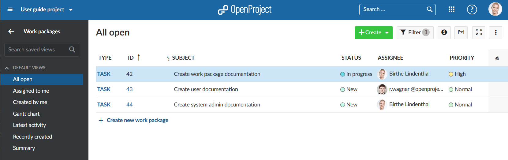
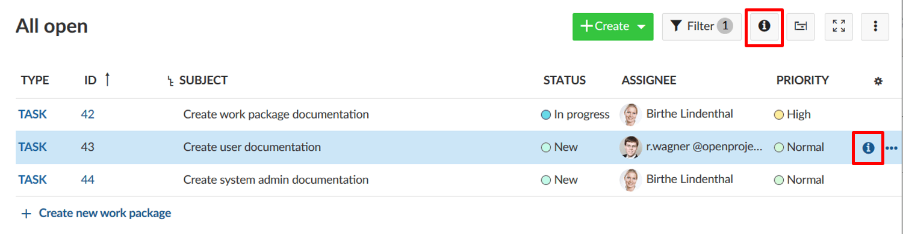
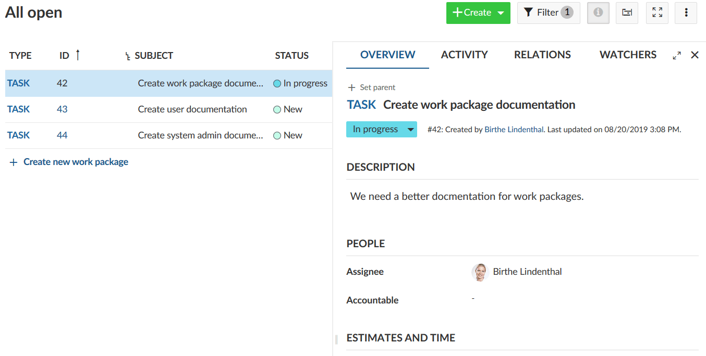
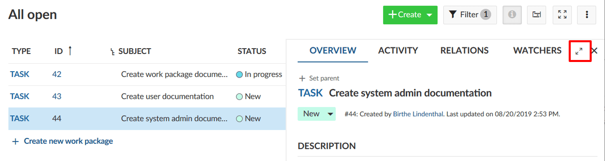

---
sidebar_navigation:
  title: Work packages views
  priority: 999
description: What are the different work packages views?
robots: index, follow
keywords: work packages views
---

# Work packages views

Work packages can be displayed in different views. They include the same work package(s) but just have a different form to display the work packages.

* List view
* Split screen view
* Details view
* Gantt view
* Board view

## Work package list view

The list view shows all work packages in a list with selected attributes in the columns.

Find out how to make changes to the work package list view, e.g. change the titles in the header, filter, group or add dependencies.

## Work package split screen view

If you are in the work package list, click on the blue info icon at the right end of a work package row to open the split screen view.

Also, the split screen view can be activated or de-activated with the **info button** at the top right of the work packages list, next to the Filter.

Once the split screen is open, you can easily navigate through the work package list by clicking in a row of a work package and display the details in the split screen on the right.

## Work package full screen view

To display  a work package with all its details in full screen mode, double click on a row within the work package list.

Also, you can use the full screen icon in the work package split screen view in the header at the right (next to Watcher).

Then, the work package with all its details will be displayed. 

The arrow next to the subject will bring you back to the list view.

