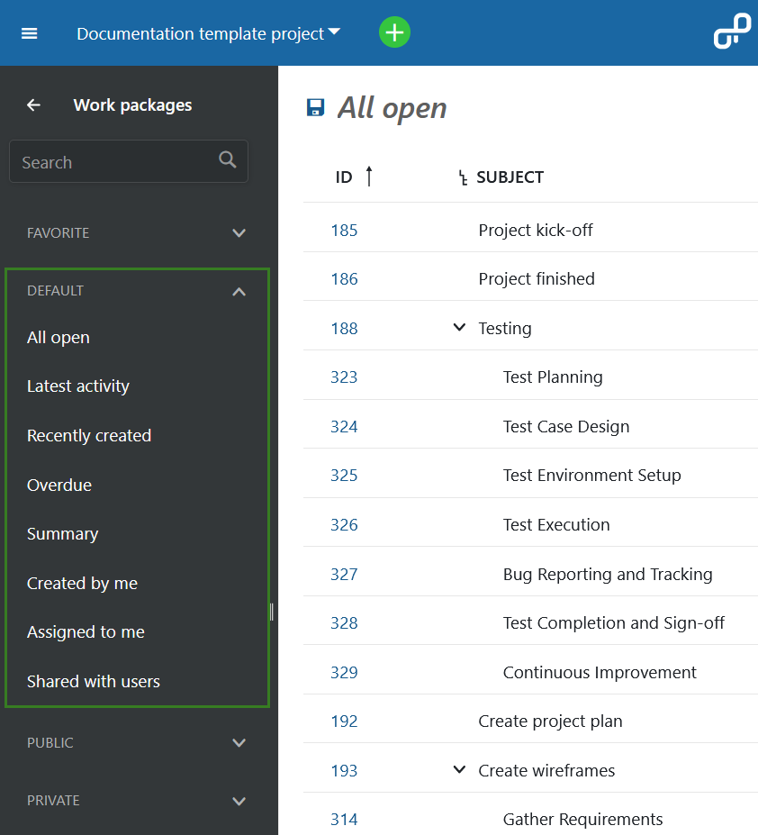
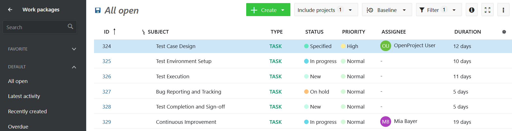
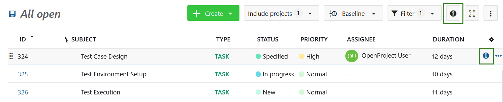
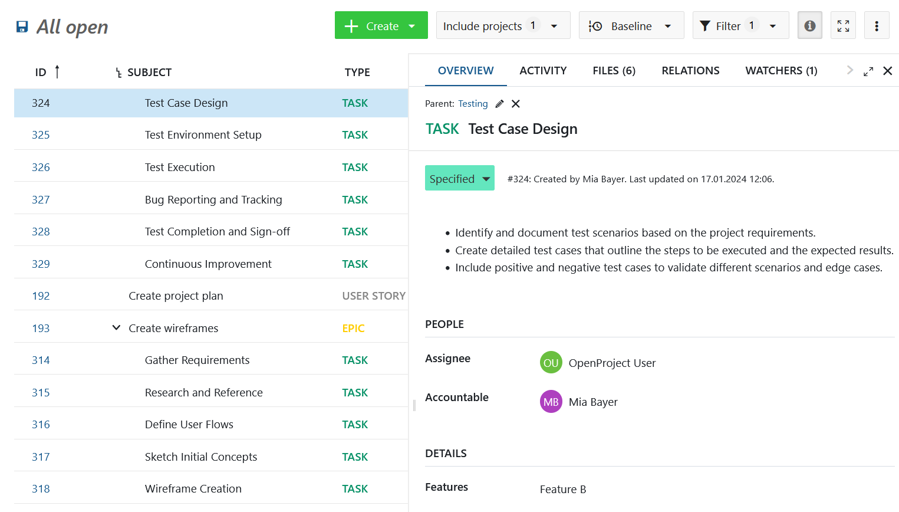
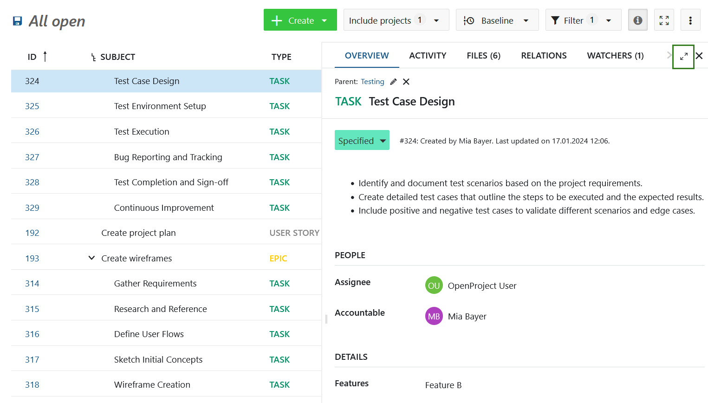
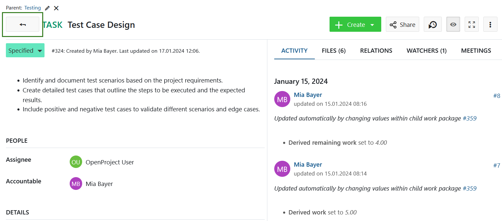

---
sidebar_navigation:
  title: Work packages views
  priority: 999
description: Different ways of organizing and viewing work packages, including table, split screen, board and Gantt.
keywords: work packages views
---

# Work packages views

A list of work packages is considered a view. Each view is based on a set of filter criteria and displays all work packages that meet those criteria. Every project in OpenProject automatically has these default views:

- **All open**: All open work packages ( that is, with statuses that are not defined as _closed_), sorted in ascending order of ID (lowest on top)
- **Latest activity**: All work packages, open and closed, in descending order of last updated date (latest on top)
- **Recently created**: All open work packages in descending order of creation date (latest on top)
- **Overdue**: All open work packages with finish dates that are in the past in descending order of how long each is overdue (closest to current date on top)
- **Summary**: Table overview of the number of work packages grouped by type, status, priority, assignee, accountable, author, version, category and subproject
- **Created by me**: All work packages created by you (the current user) in descending order of last updated date (latest on top)
- **Assigned to me**: All work packages that are assigned to you in descending order of last updated date (latest on top)
- **Shared with users**: All work packages that have been [shared with users or groups](../share-work-packages/) (including the current user and/or external users or groups)

You can also create, save and modify your own work package views, which will be displayed under **Private** views. If you mark the visibility settings to **Public** or **Favorite**, they will be displayed under the respective views sections.  Read about [work package table configuration](../work-package-table-configuration/#save-work-package-views) to learn how.

## View modes

The containing work packages in any view can be displayed a number of different ways. Each of these view modes display the same set of work packages but display them differently:

* [Table view](#table-view)
* [Split screen view](#split-screen-view)
* [Details view](#full-screen-view)
* [Gantt view](../../gantt-chart)
* [Board view](../../../getting-started/boards-introduction/)

### Table view

The table view shows all work packages in a table with selected attributes in the columns.

Find out how to make changes to the work package table view, e.g. change the titles in the header, filter, group or add dependencies in the [work package table configuration guide](../work-package-table-configuration/).

### Split screen view

If you are in the work package table, click on the blue info icon at the right end of a work package row to open the split screen view.

Also, the split screen view can be activated or de-activated with the **info button** at the top right corner of the work package table, next to the Filter.

Once the split screen is open, you can easily navigate through the work package table by clicking in a row of a work package and display the details in the split screen on the right.

### Full screen view

To display  a work package with all its details in full screen mode, double click on a row within the work package table.

Also, you can use the full screen icon in the work package split screen view in the header at the right (next to Watcher).

Then, the work package with all its details will be displayed.

The arrow next to the subject will bring you back to the table view.

