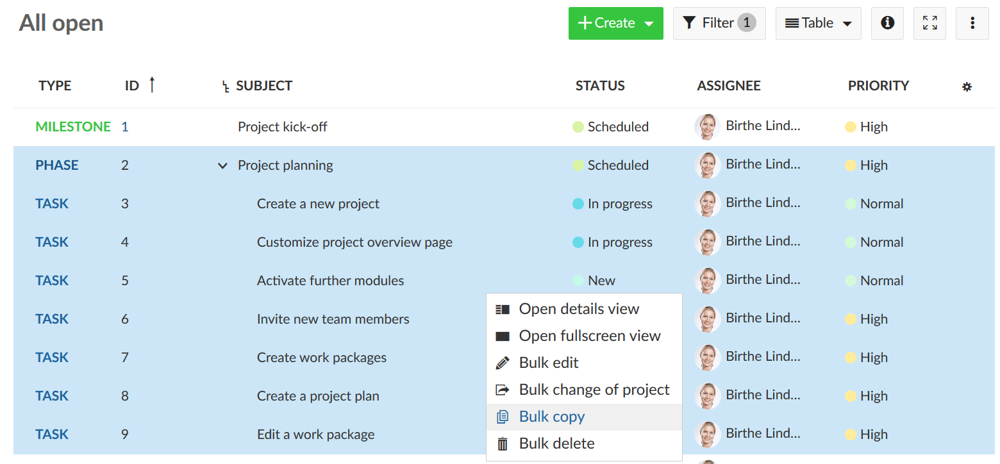

---
sidebar_navigation:
  title: Work packages FAQ
  priority: 001
description: Frequently asked questions regarding work packages
keywords: work packages FAQ, tickets, how to, task
---

# Frequently asked questions (FAQ) for work packages

| Topic                                                     | Content                                                      |
| --------------------------------------------------------- | ------------------------------------------------------------ |
| [Working with work packages](#working-with-work-packages) | Work package attributes, work package form, relations        |
| [Filters and queries](#filters-and-queries)               | Work package table, saving and changing filters and views    |
| [Status and type](#status-and-type)                       | Work package statuses and work package types                 |
| [Move and duplicate](#move-and-duplicate)                 | Moving and duplicating work packages                         |
| [Custom fields](#custom-fields)                           | Additional fields, self-defined attributes and values        |
| [Export](#export)                                         | Exporting, printing, external saving                         |
| [Sharing](#sharing-work-packages)                         | Sharing work packages                                        |
| [Versions and backlog](#versions-and-backlog)             | Using versions in work packages, relations to the backlogs module |

## Working with work packages

### How can I add a table with child work packages to my work package?

Please navigate to *Administration ->Work packages ->Types*, choose the respective work package type and navigate to form configuration. Then, use **+Group** to insert a work package table. Don't forget to press **Save**.

### How can I assign users who do not have an account to work packages?

If you want to manage your project alone (without informing other team members) we recommend to use the [placeholder users](../../../system-admin-guide/users-permissions/placeholder-users) feature.

### How can I add an attachment to a work package if I am not a member of the project?

It is possible for a project non-member to add attachments to work packages. For this the system administrator needs to add the **Add attachments** permission to the **Non member** role.

### How can I set workload, deadline and duration in a work package?

- Workload: Use the "Work" field (earlier this field was called "Estimated time")
- Deadline: Use the "Finish date" field
- Duration: Use the "Duration" field

### How can I see which work packages have been assigned to me as part of a group (e.g. "Marketing team")?

You can set the assignee filter in the work package table to "Assignee and belonging group" to see all work package directly and indirectly (through a group membership) assigned to you. [Save the view](../work-package-table-configuration/#save-work-package-views) to keep it for the future.

### How can I track the progress of my work package?

Progress of a work package is demonstrated by the value of **% Complete**. This is calculated either based on the status of the work package or on the values of *Work* and *Remaining work*. Please read more on progress reporting [here](../../time-and-costs/progress-tracking/#progress-reporting-modes).

### How can I track the progress of work packages with children?

OpenProject automatically calculates the progress of work packages with children.
It sums up the progress of the children weighted by the **Work** (earlier called Estimated time)
of each child. OpenProject uses 1 hour as the default value if **Work** field
is empty. When adding the progress bar to a work package hierarchy view,
please always add the **Work** column as well so that you can track
the calculation.
**Work** (Estimated time) manually added to work packages with children is ignored.

### Can I set multiple parents for one work package?

No, this is not possible.

### Why can I not log time in a work package?

You need to activate the module "Time and costs" in the project settings, first.

### I receive the error message "subject can't be blank", what's wrong?

One possible solution: If you receive this error message when trying to create a new work package: Please navigate to *Administration ->Work packages ->Status ->[status of the work package you were trying to change, e.g. "New"]* and un-check the box next to "Work package read-only". If this box was checked it could have caused these problems, as project attributes couldn't be changed.

### How can I change the order of the activities/comments in the activity tab of a work package?

You can change this in your account settings. Please find out more [here](../../../user-guide/my-account/#change-the-order-to-display-comments).

### Why are changes on parent work packages which are triggered by making changes to a child work package not aggregated?

OpenProject aggregates work package activities only if:

- They are within the defined time frame
- Are made by the same user
- If at most one comment is part of the aggregate (because it is hard to merge two bodies of text)

As an inherited change is always commented ("Updated automatically by...") they can not be aggregated.

### How can I fill/populate the position field/column for work packages?

The "Position" attribute is provided by the Backlogs plugin and shows the position of a work package in the backlog.
If you create e.g. a Feature and assign it to a sprint, the position of the feature in the sprint is shown in the "Position" attribute on the work package table.

### Can I restore a deleted work  package?

There is no easy way to restore a deleted work package. Generally, you have the option to create and restore your own backups.

## Filters and queries

### How can I keep changed columns or filters for the work package tables?

Click on the three dots in the upper right corner and choose **Save** or **Save as**. The view's name will appear in the menu bar on the left.
Please note: You can't change the default view "All open", clicking Save will have no effect.

### How can I set certain filters and columns in the work package tables for my colleagues?

Tick the box next to "Public" when saving the work package view. We suggest ticking the box next to "Favored", too.

### How can I remove or change the pre-set filter "open" in the work package view?

This is not possible at the moment, but you can configure and save another view.

A [feature request](../../../development/submit-feature-idea/) to change this can be found [here](https://community.openproject.org/wp/31423).

### I sorted my work package table and when I get back to my work package table it doesn't look the same way again. Why?

It is most likely that you did not save the view of your work package table after sorting it. Make sure you save it (top right menu -> **Save as** or **Save**).

### In the global work package tables, not all custom fields are available for filters. Why?

In the [global work package tables](../../projects/project-lists/#global-work-package-tables), only the custom fields that apply to all projects are displayed in the filter area (setting "for all projects" in the administration).
There are two reasons for this: 1. Potentially, a lot of values are displayed in the global filter list - especially if a lot of custom fields are used in individual projects. This can impair usability and (in extreme cases) performance.  2. As the values in the filter area are displayed for all users, sensitive information (name of the custom fields and their values) could in principle be visible to users who do not have access to the respective project where the custom field is activated.

### I have a parent work package with multiple children. In the work package table I don't see all of the children below the parent. Why? How can I change this?

Please increase the number of displayed work packages per page [in the administration](../../../system-admin-guide/system-settings/general-settings/#general-system-settings). Then the probability of this phenomenon happening is lower.
This is a known behavior of OpenProject, but not trivial to solve. There's already a feature request for this [here](https://community.openproject.org/wp/34925).

## Status and type

### When I create a new work package it's always a "Task". How can I change the default work package type?

Please navigate to *Administration ->Work packages ->Types*. The type that is at the top of the list is the default type. To change it, use the arrows on the right to move another work package type to the top of the list.

### I added new work package types. Why can i not see them?

Please make sure you [activated](../../projects/project-settings/work-package-types/) them in the project settings first. If you still can't see them (e.g. in the boards module) please upgrade OpenProject to the newest release.

### When I change the work package type of an existing work package, all attributes that are not part of the new work package type will be removed. What will happen to their values? Will the values be displayed again when I switch back to the original type?

The original values will be deleted when the work package type is changed. When the type is changed, the values of the attributes of the previous type, which the new type does not have, are deleted. This is also shown in the work package activity. If you change the back to the original/former type, the original attributes (which are configured for the work package type in the form configuration) are displayed again, but the original values are not assigned/restored. One should therefore be very careful when changing work package types (e.g. from Task to Milestone).

### I created a new work package status, why can I not choose it?

Please add the new status to the workflow for all work packages you want to use it for, first. Find out [here](../../../system-admin-guide/manage-work-packages/work-package-workflows) how to do it. Please make sure to un-check the box at top ("Only display statuses that are used by this type") to be able to see your new status.

### Is it possible to adapt or rename the status list (i.e. the available work package statuses)?

Yes, this is absolutely possible. To do this, you would first have to [create new statuses](../../../system-admin-guide/manage-work-packages/work-package-status/).
In the second step you can then [assign them to workflows](../../../system-admin-guide/manage-work-packages/work-package-workflows/).

### We like for each department to have their own custom "status" with different value options in OpenProject. How do we do this?

The status which can be selected by users (based on the workflow) is always determined based on the work package type and the role of the user. In order to use the same work package type (e.g. task) but display different status for each department, you would need to create a separate role for each department. You can then add the members of a department (ideally using a group) and assign them with the correct role. Please find the guide [here](../../../system-admin-guide/manage-work-packages/work-package-workflows/#edit-workflows).
To work with different status, first create those status in *Administration ->Work packages ->Status*.
Next, go to *Administration ->Work packages ->Workflow* and select the combination of Type and Role for which you would like to set the allowed workflow transition.
You can e.g. create a role “Marketing – Member” and select it as well as the type (e.g. “Task”). Make sure to uncheck the option “Only display statuses that are used by this type” and click on **Edit**. Now, you can select the correct status transitions.
Repeat this step for the other (department) roles (e.g. “IT – Member”) and select the desired status transitions. This way, you can set different status for each department (only the default status is shared (i.e. “New” by default)).
Please keep in mind that it may not be possible for a member of a different department to update the status of a work package if it has been updated before by another department (since the workflow may not support this status transition).

## Move and duplicate

> [!TIP]
>
> In OpenProject 14.5 the term *Copy a work package* was replaced by *Duplicate a work package*.
>
> *Change project* was replaced by *Move to another project*.

### Which permissions are necessary to move a work package from one project to another?

To move a work package from one project to another, the following requirements must be met:

- The user must have access to both projects.
- The user needs at least the following permissions in both projects:
  - "Display work packages"
  - "Move work packages"

### How can I copy work package hierarchies with their relations?

You can create work package templates with hierarchies (parent and child work packages) and copy these templates, including the relations.
First, navigate to the work package table. Highlight all work packages (in the hierarchy) which you want to copy.
To highlight and edit several work packages at once, keep the Ctrl key pressed and select the ones to be copied.

**Right-click** on the highlighted work packages. This will open a context menu.

Select **Bulk copy** in order to copy all selected work packages including their relations.

In the following view you have the possibility to change additional attributes of the work packages to be copied. Confirm your selection with **Copy**.

### How can I move a work package to another project?

In the work package table: Right-click on the work package and choose **Move to another project**.  

In the details view of the work package: Click on **More** (button with three dots in the upper right hand corner) and the on **Move to another project**.

### Can I group tasks into folders?

There are no folders for work packages. To group work packages, such as tasks, you can use the [filter and grouping options](../work-package-table-configuration/#work-package-table-configuration) and [save the filters](../work-package-table-configuration/#save-work-package-views). You can also define all related work packages as children of the same parent work package (e.g. a phase). You can indent the hierarchy for work packages in the work package tables (with a right mouse click -> *Indent hierarchy*) to add them as children to another work package, for example a phase. This will then also be displayed in the Gantt chart. Alternatively, you can use the [work package categories](../../projects/project-settings/work-package-categories/#manage-work-package-categories) or a custom field to filter and group work packages. Also, you can create multiple projects to group different topics.

## Custom fields

### How can I add additional fields to a work package (e.g. "Department")?

You can create a custom field for this that you add to the work package form. Please follow [these instructions](../../../system-admin-guide/custom-fields/).

### Will work package custom fields of the type "long text" be shown in the export of a work package tables?

As custom fields of the type "long text" cannot be added as a column, they cannot be exported via the page-wide export. However, individual work packages can be exported. This can be done either via the "PDF Download" or (better) via the browser print function.

### Can I sum up custom fields?

Yes, you can display the sum of custom fields in the work package tables by checking the "Sum" option in [the work package display settings](../work-package-table-configuration/#display-sums-in-work-package-table).

Calculating a sum across different attributes (e.g. Estimated time + added hours) is however not possible.

## Sharing work packages

### Is it possible to share a work packages with a user outside my project?

Yes, starting with OpenProject 13.1 you can [share a work package](../share-work-packages) with users outside your project or even with user who do not yet have an account on your instance.

## Export

### Is it possible to create a PDF export for the overview of the work packages with Gantt chart?

The export is available via the browser print function (ideally Google Chrome).
To print the Gantt chart please have a look at [these tips](../../gantt-chart/#how-to-print-a-gantt-chart).

### The work package XLS export is taking very long (> 10 minutes). Why is that and what can we do about this?

The work package export is run as a background job (such as e.g. copying projects). Therefore, the export may be delayed.
The following factors can have an impact on the duration of the export:

- Number of work packages to be exported
- Chosen export (e.g. XLS with relations will possibly perform many more calculations)
- Number of columns in the export (less of an impact)

To identify how many background jobs have run or are delayed, enter "/health_checks/full" after the URL (e.g. myopenprojectinstance.com/health_checks/full).
This provides an overview of "worker_backed_up" which shows the number of background jobs that could not get ran within the last 5 minutes. If there are multiple entries, this can indicate that the number of web workers should be increased.

For a documentation of how to do this, please refer to [these instructions](../../../installation-and-operations/operation/control) (see section "Scaling the number of web workers").

## Versions and backlog

### I cannot change the version of a parent work package or child work package

The fastest way to resolve this issue is to deactivate the backlogs module in the project where your tasks are located. This should instantly resolve the issue that you cannot update the tasks anymore.
If you are actively working with the backlogs module in the project, you could then e.g. move the parent Epic from the parent project to the project where the tasks are located.
Alternatively, you could change the type "Task" to a different type (e.g. "User Story"). This should also resolve the issue.
For context: On the backlogs page you can switch to the "Task board".
The task board shows the work packages assigned to a sprint (e.g. Epic, User Story) as well as the associated tasks. The task board however can only display tasks located in the same project as the (parent) work package (Epic, User story). Therefore, to avoid showing limited data, tasks and their parent work packages must be located in the same project and have to be assigned to the same version.

### What does the error message "Parent is invalid because the work package (...) is a backlog task and therefore cannot have a parent outside of the current project" mean?

This message appears when the Backlogs module is activated and you try to set a work package belonging to project A as a child of another work package belonging to project B.

In the Backlogs module work packages can only have children of the same version and the same project. To avoid displaying different information in the backlog and in the boards view this restriction is in place. You can solve it by disabling the Backlogs module or by changing the project (and if necessary version) of the work package you'd like to move.
