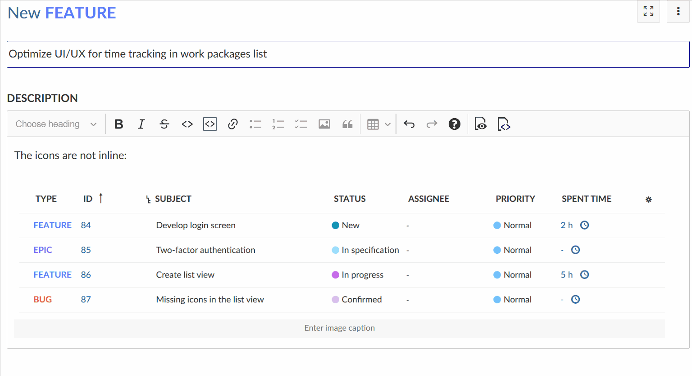
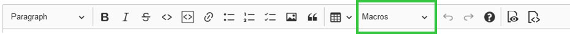

---
sidebar_navigation:
  title: Rich text editor
description: Find out about the CKEditor5 WYSIWYG editor in OpenProject
keywords: WYSIWYG, CKEditor, Links to OpenProject resources
---

# Rich text (WYSIWYG) editor in OpenProject

OpenProject features a quasi-WYSIWYG editor, powered by [CKSource CKEditor5](https://ckeditor5.github.io/). The underlying format is GitHub-flavored CommonMark ([GFM](https://github.github.com/gfm/)) with additional HTML for e.g. mentions and image sizing.

> [!NOTE]
> In some resources, such as work packages or comments, the editor does not exhibit all functionality, such as macros or image uploads.
> In the work package split screen view (details view), you may have to use the three vertical dots to access additional features of the editor.

| Topic                                                                                                                       | Content                                                     |
|-----------------------------------------------------------------------------------------------------------------------------|-------------------------------------------------------------|
| [Basic formatting](#basic-formatting)                                                                                       | Basic formatting elements in the WYSIWYG editor             |
| [Image handling](#image-handling)                                                                                           | How to add images in the WYSIWYG editor.                    |
| [Keyboard shortcuts](#keyboard-shortcuts)                                                                                   | Working with keyboard shortcuts in the WYSIWYG editor.      |
| [Macros](#macros)                                                                                                           | Available macros in the WYSIWYG editor                      |
| [Links to OpenProject resources](#links-to-openproject-resources)                                                           | How to link to resources like wikis, projects and meetings. |
| [Embedding of work package attributes and project attributes](#embedding-of-work-package-attributes-and-project-attributes) | How to embed attributes and attribute help texts.           |

## Basic formatting

The CKEditor5 build in OpenProject supports basic text styles, such as bold and italic formatting, headings,
strike-through, inline code, and quotes, as well as inline image handling. Pasting content such as images or rich text is also supported, while unsupported styling will be stripped by the editor.

### Line breaks

Instead of creating a new paragraph with Enter, you can also press `SHIFT+Enter` to create a line break without creating a new paragraph.

### Links

Create hyperlinks by pressing the tool-bar (optionally with some selected text), or by pressing `CTRL+k` to open a popup to enter the link here.

### Widgets and Newlines

CKEditor uses widgets to display block elements such as images, tables, and other elements that are not inline. You can select most widgets by pressing on them - The only exception to that is the table widget, it has a little select knob at the top left to select the entire table.

When you have a widget selected, you can remove or cut it. You can create a newline below it by selecting the widget and pressing `ENTER` or `↓ (ARROW DOWN)`, or a newline above it by pressing `SHIFT+enter` or `↑ (ARROW UP)`. This is especially needed when the widget is the first or last element on the page to insert a line below or above it.

### Code Blocks

As CKEditor5 currently does not provide support for code blocks, OpenProject can display, but not edit code blocks within the CKEditor instance. A code block can be edited through a modal window within a `CodeMirror` editor instance. This has the advantage of providing syntax highlighting and code sensing ([for supported languages](https://codemirror.net/mode/)).

### Tables

The GFM extension of the CommonMark specs adds a definition for table syntax, which the CKEditor of OpenProject supports. This definition requires all tables to have a heading row. For tables created with CKEditor without heading rows, a HTML table is output instead. This matches the behavior of, e.g., GitHub.

### Autoformatting

CKEditor5 allows certain CommonMark-like [autoformatting keyboard strokes](https://ckeditor5.github.io/docs/nightly/ckeditor5/latest/features/autoformat.html):

- Create bold or italic styles by typing `**will become bold**`, `_will become italic_`,
- Create heading of different indentation with `#`, `##`, `###`,  …
- Create a bulleted list by starting the line with `*` or `-` and a space  
- Create a numbered list by starting the line with `1.` or `1)`  and a space

## Image handling

In supported resources of OpenProject where attachments are allowed, you can add images to the page by either

- using the toolbar button,
- pasting an image from your clipboard,
- or drag & drop an image onto the editor.

The image will be automatically uploaded and stored as an attachment. You can adjust the image size in the editor using your mouse.

## Keyboard shortcuts

CKEditor has a wide variety of keyboard shortcuts you can use. You can find a list of documented shortcuts here: [https://ckeditor.com/docs/ckeditor5/latest/features/keyboard-support.html](https://ckeditor.com/docs/ckeditor5/latest/features/keyboard-support.html).

On top of that, OpenProject adds the following shortcut:

| Shortcut (Windows / Linux) | Shortcut (Mac) | Action                                                                                                                                                  |
|----------------------------|----------------|---------------------------------------------------------------------------------------------------------------------------------------------------------|
| CTRL + ENTER               | CMD + ENTER    | **Save changes.** For inline-editable fields, save the field and close it. For pages with a full WYSIWYG (meetings, wiki pages), submit the form. |

## Macros

OpenProject has supported macros on textile formatted pages and continues to do so with the WYSIWYG editor. Note that macros are not expanded while editing the page, instead, a placeholder is shown.

You can find the macros here in the text editor:

### Table of contents

Where applicable, the table of contents (TOC) macro will output a listing of all headings on the current page.

### Work package button

Configure a button or link to target the work package creation screen in the current project. You can preselect a work package type that should be selected, making it easy to guide the users to the work package creation form.

### Include wiki page

Include the content of a given wiki page in the current, or another visible project.

### Embed work package table and Gantt chart

This is the most flexible macro that provides extensive functionality regarding the inclusion of dynamic work package tables with all the potential of the regular work package table.

By adding an embedded work package table through the toolbar, you can configure the table view (such as columns, grouping, filters, and further properties) in a popup window.

The rendered page will then fetch the work package table results dynamically, respecting the visibility for each user.

Use it to embed views in other pages, create reporting of multiple results, or to embed a Gantt chart view.

## Links to OpenProject resources

As with the textile formatting syntax, you can link to other resources within OpenProject using the same shortcuts as before. Create links to a:

| **Link target**                                               | Usage example                                 |
|---------------------------------------------------------------|-----------------------------------------------|
| Wiki page                                                     | `[[Wiki page]]`                               |
| Wiki page with separate link name                             | `[[Wiki page\|The text of the link]]`         |
| Wiki page in the Sandbox project                              | `[[Sandbox:Wiki page]]`                       |
| Work package with ID12                                        | `#12`                                         |
| Work package with ID 12 with subject and type                 | `##12`                                        |
| Work package with ID 12 with subject, type, status, and dates | `###12`                                       |
| Version by ID or name                                         | `version#3`,  `version:"Release 1.0.0"`       |
| Project by ID/name                                            | `project#12` , `project:"My project name"`    |
| Attachment by filename                                        | `attachment:filename.zip`                     |
| Meeting by ID/name                                            | `meeting#12` , `meeting:"My meeting name"`    |
| Document by ID/name                                           | `document#12` , `document:"My document name"` |
| User by ID or login                                           | `user#4` , `user:"johndoe"`                   |
| Forum message by ID                                           | `message#1218`                                |
| Repository revision 43                                        | `r43`                                         |
| Commit by hash                                                | `commit:f30e13e4`                             |
| Source file in the repository                                 | `source:"some/file"`                          |

To avoid processing these items, preceding them with a bang `!` character such as `!#12` will prevent linking to a work package with ID 12.

> [!NOTE]
> All these macros need to be written as a new word (i.e., with at least one space before it or at the beginning of a paragraph/sentence). Macros contained within a word such as `somethingmeeting#4` will not be parsed.

> [!TIP]
>
> For more information on using macros, take a look at this [blog article](https://www.openproject.org/blog/how-to-use-macros/).

### Autocompletion for work packages and users

For work packages and users, typing `#` or `@` will open an autocomplete dropdown for visible work packages and users, respectively.

## Embedding of work package attributes and project attributes

> [!NOTE]
> These macros will only be expanded in the frontend. For each individual user, the correct permissions will be checked and
> the macro will result in an error if the user is not allowed to view the respective resource.

### Embedding of a work package value by work package ID

Use the `workPackageValue:ID:attribute` macros to embed attributes of a work package by its [work package ID](../work-packages). 
See the [table below](#available-attributes-for-work-packages) for available attributes.

Example:

**Linking to the subject of work package with ID #1234**: `workPackageValue:1234:subject`

### Embedding of a work package value by work package subject

Use the `workPackageValue:"Project name":attribute` macros to embed attributes of a work package by its subject. 
See the [table below](#available-attributes-for-work-packages) for available attributes.

Example:

**Linking to the assignee of work package with subject "Project start"**: `workPackageValue:"Project start":assignee`

> [!NOTE]
> Referencing a work package by subject results in only looking for work packages with that given subject in the current project (if any).
> If you need to cross-reference work packages, use their ID to pinpoint the work package you want to reference.
> We recommend against using subjects as references, as they are not updated when the referenced subject changes.

### Relative embedding of a work package value

Use the `workPackageValue:attribute` macros to embed attributes of the current work package.

If you are editing a work package description or a rich text custom field belonging to a work package you can omit the ID if you want to reference it.
You must include the work package ID if you are editing e.g. a wiki page or a meeting description.
See the [table below](#available-attributes-for-work-packages) for available attributes.

Example:

**Linking to the assigned person of the current work package**: `workPackageValue:assignee`

### Embedding of a project value by project ID

Use the `projectValue:ID:attribute` macros to embed attributes of a project by its project ID.
See the [table below](#available-attributes-for-projects) for available attributes.

Example:

**Linking to the project's status with the ID 1234**: `projectValue:1234:status`

### Relative embedding of a project value

Use the `projectValue:attribute` macros to embed attributes of the current project.
See the [table below](#available-attributes-for-projects) for available attributes.

Example:

**Linking to the current project's status**: `projectValue:status`

### Embedding attribute help texts

You can also embed attribute values and [their help texts](../../system-admin-guide/attribute-help-texts/) by using `workPackageLabel` or `projectLabel`.
For example`workPackageLabel:1234:status` would output the translated label for "Status" and (if exists), the corresponding help text for it.

## Attributes

The following lists show the supported attributes for work packages and projects.

> [!NOTE]
> If you are using a language different than English, a translation of the commands can only be used in the text editor if the language of all the users of an instance is set to the same language (for example German). 
> In this case, only the attribute to which the command refers is translated, e.g. (`workPackageValue:1234:"translated attribute"`). 
> We recommend against using translated attributes, as they might break in future versions due to fixes or changes to texts.

### Available attributes for work packages

The following list contains all supported attribute names for the `workPackageValue` and `workPackageLabel` macros, 
where `1234` stands for the [work package ID](../work-packages).

| **Attribute**       | Usage example                                                   |
|---------------------|-----------------------------------------------------------------|
| *Custom Fields*     | `workPackageValue:1234:"Name of the work package custom field"` |
| Assignee            | `workPackageValue:1234:assignee`                                |
| Author              | `workPackageValue:1234:author`                                  |
| Category            | `workPackageValue:1234:category`                                |
| Creation date       | `workPackageValue:1234:createdAt`                               |
| Description         | `workPackageValue:1234:description`                             |
| Estimated time      | `workPackageValue:1234:estimatedTime`                           |
| Finish date         | `workPackageValue:1234:dueDate`                                 |
| Parent work package | `workPackageValue:1234:parent`                                  |
| Priority            | `workPackageValue:1234:priority`                                |
| Project             | `workPackageValue:1234:project`                                 |
| Remaining hours     | `workPackageValue:1234:remainingTime`                           |
| Accountable         | `workPackageValue:1234:responsible`                             |
| Spent time          | `workPackageValue:1234:spentTime`                               |
| Start date          | `workPackageValue:1234:startDate`                               |
| Status              | `workPackageValue:1234:status`                                  |
| Subject / Title     | `workPackageValue:1234:subject`                                 |
| Work package type   | `workPackageValue:1234:type`                                    |
| Date of last update | `workPackageValue:1234:updatedAt`                               |
| Version             | `workPackageValue:1234:version`                                 |

> [!NOTE]
> Recursive embedding of rich text is not supported. For example, you cannot embed a work package description in itself with `workPackageValue:description`.

### Available attributes for projects

The following list contains all supported attribute names for the `projectValue`  and `projectLabel` macros. The examples all show references to the _current_ project the document is rendered in. They can also reference another project with `projectValue:"Identifier of the project":attribute`.

| **Attribute**             | Usage example                                     |
|---------------------------|---------------------------------------------------|
| *Custom Fields*           | `projectValue:"Name of the project custom field"` |
| Project active? (boolean) | `projectValue:active`                             |
| Description               | `projectValue:description`                        |
| Identifier of the project | `projectValue:identifier`                         |
| Name of the project       | `projectValue:name`                               |
| Status                    | `projectValue:status`                             |
| Status description        | `projectValue:statusExplanation`                  |
| Parent project            | `projectValue:parent`                             |
| Project public? (boolean) | `projectValue:public`                             |
