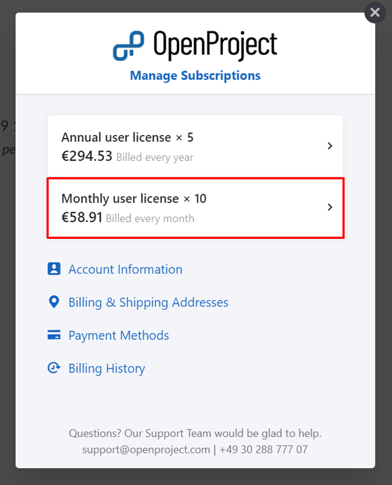

---
sidebar_navigation:
  title: Manage subscription
  priority: 
description: View the invoices and payment history.
robots: index, follow
keywords: manage subscription
---

# Invoices for the OpenProject Cloud Edition

You will **receive an invoice for your OpenProject Cloud Edition via email** to the email address which you used during the booking process.

The invoice lists the subscription (billing) period as well as the next billing date.

You will also see the payment status. 
For invoices via bank transfer, the money needs to be paid via bank transfer to the bank account listed at the bottom of the invoice. 

**Note**: For the correct assignment of payments, please enter the  invoice number on your bank transfer.

## Manage your subscription

If you want to make changes to your subscription, navigate to -> *Administration* -> *Billing* within your system's Administration.

Click the green **Manage button**.

You can choose between several topics:

(1) Update or cancel existing subscriptions

(2) Edit Account information

(3) Edit Billing Addresses

(4) Edit or add payment methods

(5) View billing history

### Update existing subscriptions

If you want to up- or downgrade the amount of users of an existing subscription, click on the subscription listed at the top.

Here you can either **Edit or Cancel the existing subscription**.

### Upgrade or downgrade subscription

You can upgrade an existing subscription at any time. Open the [Manage subscription menu](#manage-your-subscription). Additional users will be billed on a prorated basis, this means you will only pay the amount of additional users until the end of the current subscription period. 
You can downgrade a subscription to the end of a current subscription period. This means the downgrade becomes active with the next payment term.

Click the **Edit Subscription** link.

You can choose the new amount of users. Your next payment will be displayed below.

Click the blue **Update your subscription now button** to save the changes.

### Cancel subscription

To cancel your subscription, 

### View billing history to download invoices

If you need to **view your payment history or want to download your invoices**, 