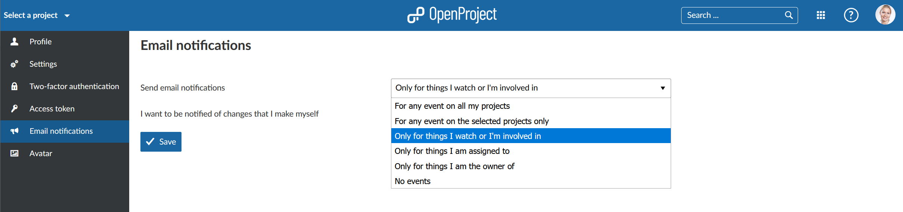

# My Account

Change your personal settings in My Account. Here you can adapt, e.g. the language, edit notifications, or add an avatar.

| Feature                                                      | Documentation for                                            |
| ------------------------------------------------------------ | ------------------------------------------------------------ |
| [Open My Account settings](#open-my-account-settings)        | How to open your personal settings in OpenProject?           |
| [Edit your user information](#edit-your-user-information)    | How to change the name or email address in OpenProject?      |
| [Profile settings: change your langue, time zone or display of comments](#profile-settings:-change-your-language,-time-zone-or-display-of-comments) | How to change the language, time zone or display of comments in Openproject? |
| [Email notifications](#email-notifications)                  | How to change email notifications sent by OpenProject?       |
| [Set an Avatar](#set-an-avatar)                              | How to set an Avatar in OpenProject to change the profile picture? |

## Open My Account settings

To open your personal settings in OpenProject, click on your user icon in the top right corner in the header of the application.

Choose **My account**.

## Edit your user information

To change your email address or your name, navigate to the **Profile** page in the menu of your My account settings.

Here you can adapt the information and **save** your changes with the blue button.

## Profile settings: change your langue, time zone or display of comments

To change the language in OpenProject, naviagte to the My account settings and choose the menu point **Settings**.

Here you can choose between multiple lanuages.

You can choose a Time zone in which you work and how the comments and changes will be saved.

Also, you can choose to receive a warning manssage when leaving an unsaved work package.

The auto-hide setting will hide the success notifications for changes automatically.

## Email notifications

To change the email notifications which you will receive from the system, navigate to My account and choose Email notifications in the menu.

You can choose between several email notifications. 
**Default: Send email notifications Only for things I watch or I'm involved in.**

You can choose to receive emails for any events in certain projects or for no events at all.

If you de-select the box **I want to be notified of changes that I make myself** then you will not receive email notifications for changes which you have done. This way you can reduce the emails sent by the system.

## Set an Avatar

To change your profile picture in OpenProject you can set an Avatar in your My account settings. Navigate to **Avatar** in the menu.

OpenProject uses Gravatar as default profile image. It displays a preview of your Avatar.

Also, you can upload a **Custom Avatar** by choosing a Avatar to be uploaded from a file. Press the blue **Update** button to change your profile picutre.

Note: The optimum size to upload a new profile picture is 128 by 128 pixel. Larger files will be cropped.

## Two-factor authentication

