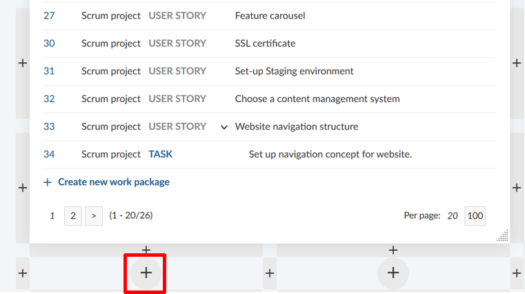

# My Page

The My Page is your personal dashbaord with important overaraching project information, such as work package reports, news, spent time, or a calendar. It can be configured to your specific needs.

| Feature                                         | Documentation for            |
| ----------------------------------------------- | ---------------------------- |
| [My Page introduction](#my-page-introduction)   | H                            |
| [Configure the My Page](#configure-the-my-page) | How to configure the MyPage? |
|                                                 |                              |
|                                                 |                              |
|                                                 |                              |

## My Page introduction

The My Page is your personal dashboard where you can display important information of your projects. This personal dashboard contains information from all your projects. The **My page** can be configured according to your preferences. You can include project information, for example the latest news, work packages assigned to you or reported work packages.

You can open your **My page** by clicking on your user avatar in the upper right corner and then selecting **My page** from the dropdown menu.

As a default, you will see two lists of all **work packages assigned to you** and **work packages created by you** from all your projects.

## Configure the My Page

In order to **add a widget to the My Page**, press the **+** icon on the top right corner of the page.

The dashboard shows the places where it is possible to add more widgets by displaying **+** icons.

Press a plus icon to add a widget to the My Page at the according place.

Once you have chosen the place where to add the new widget on the My Page, you can choose from a number of different widgets that can be included on your dashboard.

## Change position and size of the widgets

You can change the position of a widget on the dashboard with drag and drop.

Click the dots next to the title and drag it to the new place.

If you click the dots on the lower right hand corner in a widget you can change the size of a widget by pulling the widget left and right, up and down with the mouse.

