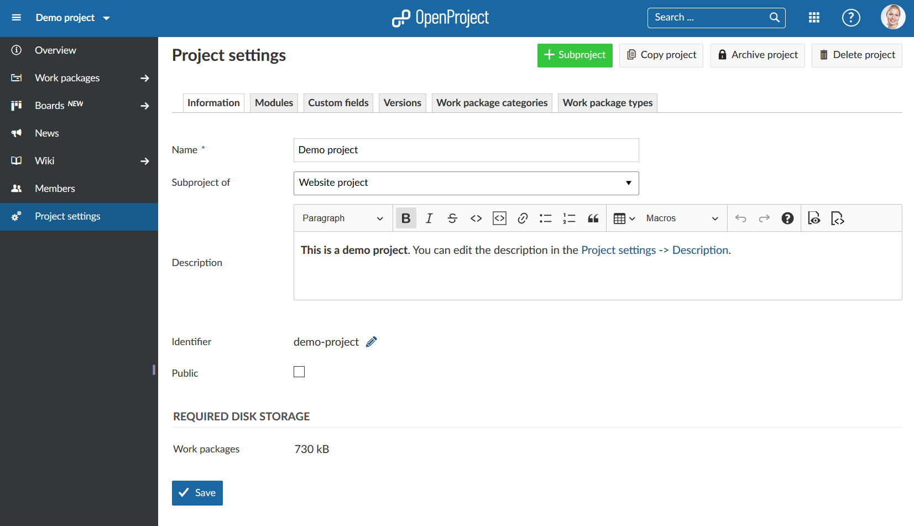
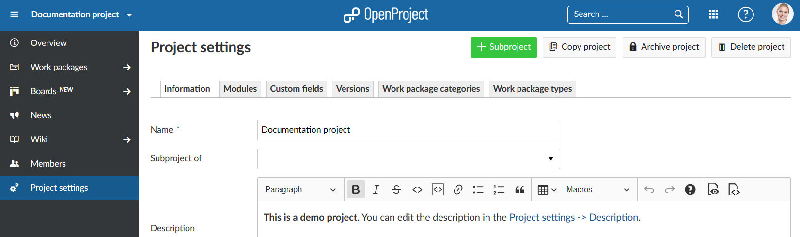
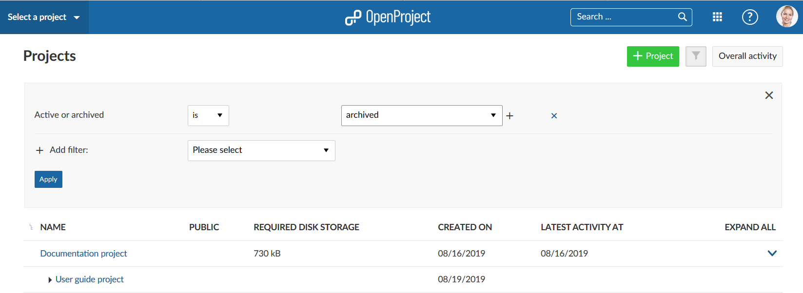

# Projects

in OpenProject you can create multiple projects to collaborate with your team members, track issues, document and share information with stakeholders, organize things. A project is a way to structure your work in OpenProject.

Your projects can be available publicly or internally. OpenProject does not limit the number of projects, neither in the Community nor in the Cloud or Enterprise Edition.

| Feature                                                   | Documentation for                                            |
| --------------------------------------------------------- | ------------------------------------------------------------ |
| [Create a new project](./getting-started/#create-project) | Find out how to create a new project in OpenProject.         |
| [Project structure](#project-structure)                   | Find out how to set up a project structure.                  |
| [Select a project](#select-a-project)                     | Open a project which you want to work at.                    |
| [Project settings](#project-settings)                     | Configure further settings for your projects, such as description, project hierarchy structure, or setting it to public. |
| Change the project hierarchy                              |                                                              |
| Set a project to public                                   |                                                              |
| Copy a project                                            |                                                              |
| Create a project template                                 |                                                              |

## Create a new project

Find out how to [create a new project](./getting-started/#create-project) in OpenProject.

## Project structure

Projects build a structure in OpenProject. You can have parent projects and sub-projects. A project can represent an organizational unit of a company, e.g. to have issues separated:

* Company (Parent project)
  * Marketing (Sub-project)
  * Sales
  * HR
  * IT
  * ...

Also, projects can be for overarching teams working on one topic:

* Launch a new product
  * Design
  * Development
  * ...

Or, a project can be to separate products or customers.

* Product A
  * Customer A
  * Customer B
  * Customer C

OpenProject, for example, uses the projects to structured the different modules/plugin development:

**Note**: You have to be a [member](./invite-members/#add-new-members) of a project in order to see the project and to work in a project.

## Select a project

In order to open a project, click on the Select a project button on the top left corner of the header, and click the project which you want to open. You can also type in a project name to filter.

## Project Settings

You can specify further advanced settings if you like. Navigate to your project settings by [selecting a project](#select-a-project), and click **Project settings** in the project menu on the bottom and select the tab **Information**.

- You can define whether the project should have a parent by selecting **Subproject of**. This way, you can [change the project hierarchy](change-the-project-hierarchy).

- Enter a detailed description for your project.

- You see the default project **Identifier**. The identifier will be shown in the URL. 

**Note**: The Identifier cannot be changed later after creating the project.

- You can set a project to **Public**. This means it can be accessed without signing in to OpenProject.

- Click the blue **Create** button in order to save your new project. Or click the blue **Save** button to save your changes.

### Change the project hierarchy

To change the project's hierarchy, navigate to the project's [advanced settings](#project-settings) and click the tab **Information** and change the **Subproject of** field.

### Set a project to public

If you want to set a project to public, you can do so by selecting the option in the [project settings](#project-settings).

### Copy a project

You can copy an existing project by navigating to the [Project settings](#project-settings) and click **Copy project** from the upper right of the project settings (next to the green +Subproject button)

Give the new project a name. Select which modules and settings you want to copy and whether or not you want to notify users via email during copying. 

Then click the blue **Copy** button.

### Archive a project

In order to archive a project, navigate to the project settings, and click the **Archive project** button. 

Then, the project cannot be selected from the project selection anymore. It is still available in the **View all projects** dashboard if you expand the filter and select the Archived projects.

### Delete a project

If you want to delete a project, navigate to the [project settings](#project-settings),

## View all projects

## Create a project template

You can create a project template in OpenProject by [creating a new project](./getting-started/#create-a-project) and configure your project to your needs. Name the project so you can identify it as a template, e.g. Project template.

Set up everything that you want to have available for next projects.

- Adding project members.
- Selecting the modules.
- Setting up a default project structure in the Gantt chart.
- Creating your work package templates.
- ...

[Copy the project](#copy-a-project) template if you want to start a new project and give the project a new name.