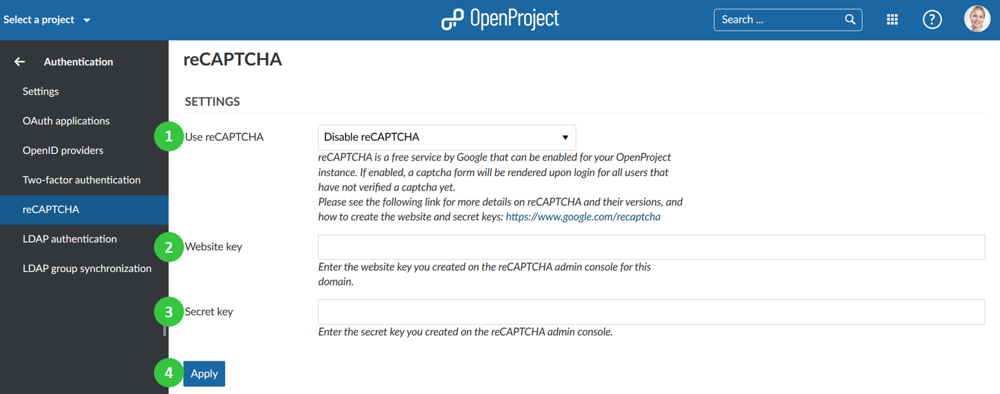

---
sidebar_navigation:
  title: reCAPTCHA
  priority: 600
description: configure reCAPTCHA for OpenProject.
robots: index, follow
keywords: reCAPTCHA
---
# reCAPTCHA configuration

To activate and **configure reCAPTCHA** for OpenProject, navigate to -> *Administration* -> *Authentication* and choose -> reCAPTCHA.

 If enabled, a captcha form will be rendered upon login for all users that have not verified a captcha yet. Please see the following link for more details on reCAPTCHA and their versions, and how to create the website and secret keys: https://www.google.com/recaptcha.

You can configure the following options:

1. Activate reCAPTCHA for OpenProject. You can choose between reCAPTCHA v2 and reCAPTCHA v3.
2. Insert the **website key**.
3. Insert the **secret key**.
4. Press the blue **Apply** button to save your changes.

