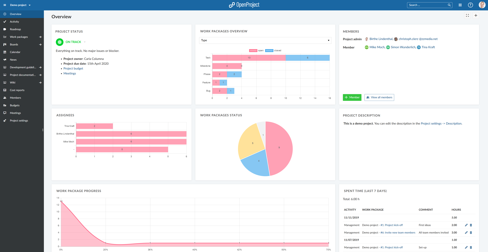
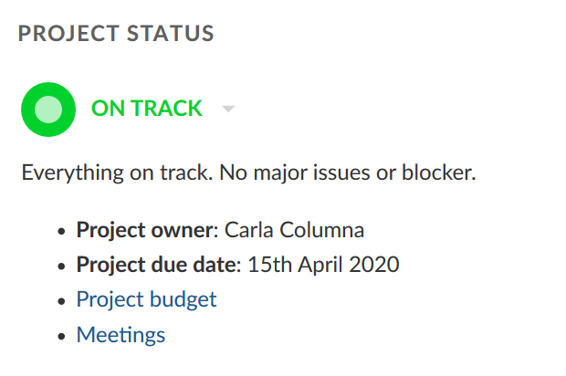

---
nav:
  title: Project overview
  priority: 900
title: Project overview
description: Learn how to configure a project overview page
robots: index, follow
keywords: project overview page
---

# Project overview

The **Project overview** page is a dashboard with important project information. You can display relevant information for the team, such as Members, News, Project description, Work package reports, or a project status. 

| Feature                                                      | Documentation for                                       |
| ------------------------------------------------------------ | ------------------------------------------------------- |
| [What is the project overview?](#what-is-the-project-overview?) | What can I do with the project overview page?           |
| Project overview widgets                                     | What kind of widgets can I add to the project overview? |
|                                                              |                                                         |
|                                                              |                                                         |
|                                                              |                                                         |

## What is the project overview?

The project overview is a single dashboard page where all important project information can be displayed to have it centrally available for the project team.

You can add project information as widgets to the dashboard and order and re-size the widgets to your need.

Also, you can add text widgets, to add custom texts, links and other information to your overview page.

## Project overview widgets

You can add the following information as widgets to your project overview:

### Project status widget

Add your project status as a widget to display at one sight whether your project is on track, off track or at risk.

First, select your project status from the drop-down. You can choose between:

ON TRACK (green

OFF TRACK (red)

AT RISK (yellow)

NOT SET (grey)

Add a **project status description** and further important information, such as project owner, milestones and other important links or status information.

### Project members widget

You can add a widget which displays all project members and their corresponding role(s) for this project at the project overview page.

With the green button you can add  members to your project.