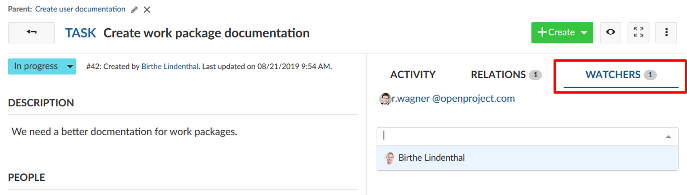

# Edit work packages

| Feature                                         | Documentation for                                  |
| ----------------------------------------------- | -------------------------------------------------- |
| [Update a work package](#update-a-work-package) | How to make a change to an existing work package?  |
| [Watchers](#watchers)                           | How to add or remove watchers from a work package? |
|                                                 |                                                    |
|                                                 |                                                    |
|                                                 |                                                    |

## Update a work package

To edit a work package, double-click in the row of a work package in the [list view](#work-package-list-view) or open the [split screen view](#work-package-split-screen-view).

### How to update the status of a work package?

To update the status of a work package, click on the current status in the work package details and select the new status in the drop-down list.

Please note, the status may differ from work package type. They can be configued in the [system administration](./system-admin-guide).

## Watchers

### How to add watchers to a work package?

**Watchers** can be added to a work package in order to notify members about changes . They will receive emails according to their notification settings if changes are made to the respective work package.

To add watchers, open the work package [details view](#work-package-full-screen-view), select the tab watchers on the right hand side and choose the members you want to add with the drop-down menu or by starting to type their name.

### How to remove watchers from a work package?

To remove watchers, navigate to the work package [details view](#work-package-full-screen-view) and select the tab Watchers. Click the cross icon next to a watcher to remove the watcher from a a work package. The user will no longer get email notifications about changes to this work package according to the email notification settings.

