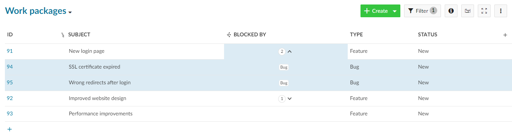

---
sidebar_navigation:
  title: Work package relations
  priority: 866
description: How to add or configure work package relations?
robots: index, follow
keywords: work package relations
---

# Work package relations

You can not only create [work package hierarchies](./work-package-hierarchies), but also define relations, for example to indicate that work packages address a similar topic or create status dependencies. To create a relationship between two work packages:

1. Select a work package, click on the **Relations** tab to open the relations tab and click the *+ Create new relations* link.
2. Select the type of relationship from the dropdown menu.
3. Enter the ID of the work package, to which the relation should be created and choose an entry from the dropdown menu.
4. Click the check icon.

You can select one of the following relations:

- **Related to** – This option adds a link from the work  package A to work package B, so that project members can immediately see the connection, even if the work packages are not members of the same  hierarchy. There is no additional effect.
- **Duplicates / Duplicated by** – This option indicates  that the work package A duplicates a work package B in one way or  another, for example both address the same task. This can be useful if  you have the same work package that needs to be a part of a closed and  public projects at the same time. The connection in this case is  semantic, the changes you make in work package A will need to be adapted in work package B manually.
- **Blocks / Blocked by** – This option defines status  change restrictions between two work packages. If you set a work package A to be blocking work package B, the status of work package B cannot be set to closed or resolved until the work package A is closed (in a  clode meta-status).
- **Precedes / Follows** – Defines a chronologically  relation between two work packages.  For example, if you set a work  package A to precede a work package B, you will not be able to change  the starting date of B to be earlier than the end date of A. In  addition, when you move the start or due date of A, the start and due  date of B will be updated as well.
- **Includes / Part of** – Defines if work package A  includes or is part of work package B. This relation type can be used  for example when you have a rollout work package and work packages which should be shown as included without using hierarchical relationships.  There is no additional effect.
- **Requires / Required by** – Defines if work package A requires or is required by work package B. There is no additional effect.

The selected relation status will be automatically displayed in the  work package that you enter. For example if you select “Blocks” in the  current work package A and specify work package B, work package B will  automatically show that it is “Blocked by” A.

## Display relations in work package list (Premium feature)

As a user of the [Enterprise Edition](https://www.openproject.org/enterprise-edition/) or [Cloud Edition](https://www.openproject.org/hosting/) you can display relations as columns in the work package list.

This is useful if you want to get an overview of certain types of  relationships between work packages. You can for example see which work  packages are blocking other work packages.

To add relation columns, open the columns modal and select a relation from the dropdown menu (e.g. “blocked by relations”).

The relations column shows the number of relations each work package has for the relation type (e.g. “blocked by”).

You can click on the number to display the work packages which have the relation type.

        