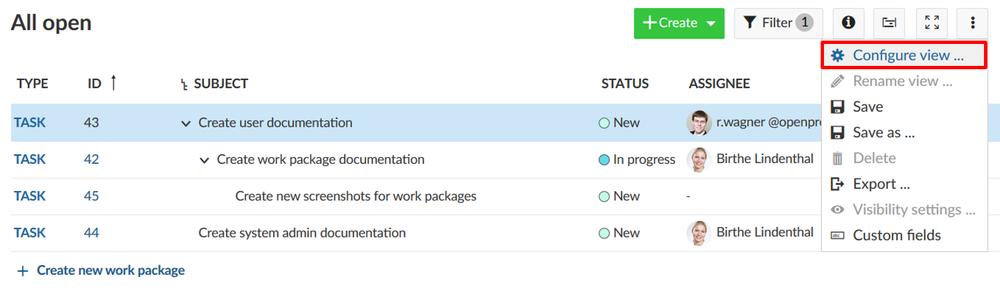
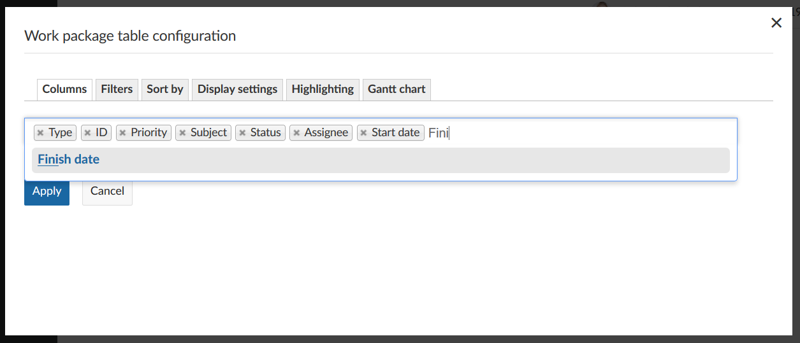
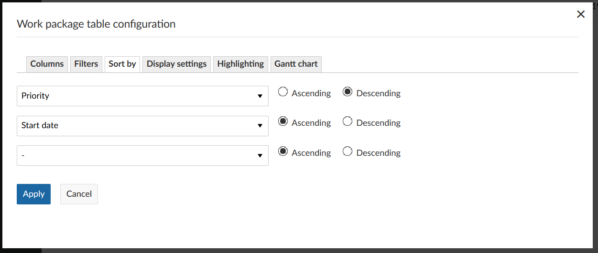
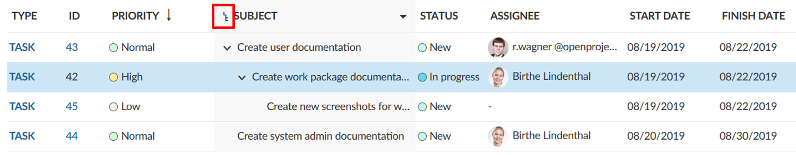
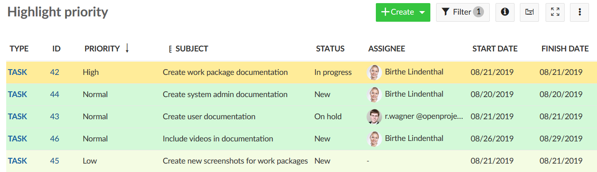

# Work package table configuration

You can configure the work package table view in OpenProject to display the information that you need in the list.

You can change the header in the table and add or remove columns, filter and group work packages or sort them according to a specific criteria. Save the view to have it available directly from your project menu.

Also, you can change between a flat list view and a hierarchy view.

To open the work package table configuration, open the **Settings** icon with the three dots at the top right of the work package table.

| Feature                                                      | Documentation for                                            |
| ------------------------------------------------------------ | ------------------------------------------------------------ |
| [Add or remove columns](#add-or-remove-columns-in-the-work-package-table) | How to add or remove columns in the work package table?      |
| [Filter work packages](#filter-work-packages)                | How to filter in the work package list?                      |
| [Sort the work package list](#sort-the-work-package-list)    | How to sort within the work package list?                    |
| [Display settings](#how-to-switch-from-flat-list-to-hierarchy-mode?) | How to switch from flat list to hierarchy mode in the work pacakge list? |
| [Attribute highlighting (Enterprise Feature)](#attribute-highlighting-(Enterprise-Feature)) | How to highlight certain attributes in the work package list? |

## Add or remove columns in the work package table

To configure the view of the work package table and have different attributes displayed in the list you can add or remove columns in the work package list.

First, [open the work package table configuration](#work-package-table-configuration).

In the pop-up window, choose the tab **Columns**.

You can add columns by typing the name of the attribute which you would like to add.

You can remove columns by clicking the **x** icon.

You order the attributes in the list with drag and drop.

Clicking the **Apply** button will save your changes and adapt the table according to your configuration.

## Filter work packages

In the work package list there will soon be quite a lot of work packages in a project. To filter the work packages in the list, click on the **Filter** button on top of the work packages view. The number next to it tells you how many filter criteria you have applied to a list.

In this example 1 filter criteria: Status = open.

To add a filter criteria, click the **+ Add filter:** button in the grey filter area. You can choose a filter criteria from the drop-down list or start typing to search for a criteria.

You can add as many filter criteria as needed. 
Also, you can filter by [custom fields](./system-admin-guide/#custom-fields) if you set this in the custom field configuration.

If you want to search by subject of a work package, type in the **Filter by text** the expression you want to filter for.

The results will be displayed accordingly in the work package list.

## Sort the work package list

By default, the work package list will be sorted by work package ID. 

The **ID** is unique for a work package within OpenProject. It will be set automatically from the system. With the ID you can reference to one specific work package in OpenProject.

To sort the work package list view, open the [work package table configuration](#work-package-table-configuration) and select the tab **Sort by**. You can sort by up to three attributes, either ascending or descending.

Click the blue **Apply** button will save your changes and display the results accordingly in the list view.

**Note**:  If you have the hierarchy mode activated, all filtered table results will be augmented with their ancestors. Hierarchies can be expanded and collapsed.

Therefore, the results may differ if you sort in a flat list or in a hierarchy mode.

The same filter applied in the hierarchy mode.

## How to switch from flat list to hierarchy mode?

You have three different options to display results in the work package list.

* **A flast list** (default), which contains all work packages in a list no matter how their parent-child-relation is.
* A **Hierarchy**, which will display the filtered results within the parent-child-relation.
* **Group by** will group the list according to a defined attribute.

You have to choose either option when displaying work packages in the list.

To switch between the different criteria, open the [work packag table configuration](#work-package-table-configuration) and open the tab **Display settings**. Choose how to display the work packages in the list and click the blue **Apply** button.

## Attribute highlighting (Enterprise Feature)

You can highlight attributes in the work package list to emphasize the importance of certain attributes and have important topics at one sight.

The following attributes can be highlighted in the list:

* Priority
* Status
* Finish date

Either 

Furthermore, you can highlight the entire row by an attribute.

The following attributes can be highlighted as a complete row:

* Priority
* Status

You can configure the colors for attribute highlighting in the [system administration](./system-admin-guide/#status-colors).