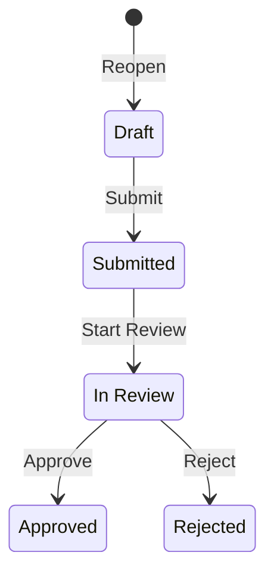

# BIM Workflow Automation System

## Overview

The BIM Workflow Automation System provides configurable, structured workflows for BIM reviews, issue approvals, clash resolution, and coordination processes. It enables teams to define review sequences from issue detection → review → approval → closure, fully integrated with BIM elements and WorkPackages.

## Architecture

### Core Components

1. **WorkflowTemplate** - Defines workflow states and transitions
2. **WorkflowLog** - Audit trail for all state changes
3. **WorkflowEngine** - Executes transitions with validations
4. **Workflowable Models** - Issues, Clashes, ElementLinks with workflow support

### Data Model

```
┌─────────────────────────────┐
│   WorkflowTemplate          │
│  ┌──────────────────────┐   │
│  │ States (JSON):       │   │
│  │ - name               │   │
│  │ - label              │   │
│  │ - color              │   │
│  │ - initial/final      │   │
│  └──────────────────────┘   │
│  ┌──────────────────────┐   │
│  │ Transitions (JSON):  │   │
│  │ - name               │   │
│  │ - from → to          │   │
│  │ - guard conditions   │   │
│  │ - actions            │   │
│  │ - required_role      │   │
│  └──────────────────────┘   │
└─────────────────────────────┘
           ↓
    ┌──────────────────┐
    │   Workflowable   │
    │   (polymorphic)  │
    │                  │
    │ - BCF Issues     │
    │ - Clashes        │
    │ - Element Links  │
    └──────────────────┘
           ↓
    ┌──────────────────┐
    │  WorkflowLog     │
    │  (audit trail)   │
    │                  │
    │ - from_state     │
    │ - to_state       │
    │ - user           │
    │ - comment        │
    │ - metadata       │
    │ - timestamp      │
    └──────────────────┘
```

## Workflow Types

### 1. Issue Review Workflow

**Purpose**: Structured review and approval process for BCF issues

**Default States**:
- `draft` (initial) - Issue being drafted
- `submitted` - Submitted for review
- `in_review` - Being reviewed
- `changes_requested` - Reviewer requested changes
- `approved` (final) - Issue approved
- `rejected` (final) - Issue rejected

**Example Transitions**:
```ruby
{
  name: 'submit',
  from: 'draft',
  to: 'submitted',
  label: 'Submit for Review',
  actions: ['notify_reviewers'],
  required_role: 'member'
}
```

### 2. Clash Resolution Workflow

**Purpose**: Managing clash detection and resolution lifecycle

**Default States**:
- `new` (initial) - Just detected
- `active` - Acknowledged
- `under_investigation` - Being investigated
- `resolved` - Fixed
- `approved` - Accepted as minor/acceptable
- `verified` (final) - Resolution verified
- `closed` (final) - No longer relevant

### 3. Element Approval Workflow

**Purpose**: Design and construction readiness approval

**Default States**:
- `pending` (initial) - Awaiting review
- `design_review` - Design being reviewed
- `design_approved` - Design approved
- `construction_review` - Construction readiness review
- `ready_for_construction` (final) - Approved for construction
- `changes_required` - Needs changes
- `on_hold` - Temporarily paused

## API Reference

### Workflow Templates

#### List Templates

```http
GET /api/v3/bim/workflows/templates
```

Query Parameters:
- `project_id` (optional) - Filter by project
- `workflow_type` (optional) - Filter by type (issue_review, clash_resolution, element_approval)

Response:
```json
{
  "_type": "Collection",
  "count": 3,
  "_embedded": {
    "elements": [
      {
        "_type": "WorkflowTemplate",
        "id": 1,
        "name": "Standard Issue Review",
        "workflow_type": "issue_review",
        "is_default": true
      }
    ]
  }
}
```

#### Create Template

```http
POST /api/v3/bim/workflows/templates
```

Request Body:
```json
{
  "workflow_template": {
    "name": "Custom Review Workflow",
    "description": "Tailored for our project",
    "workflow_type": "issue_review",
    "project_id": null,
    "states": [
      {
        "name": "draft",
        "label": "Draft",
        "color": "#gray",
        "initial": true
      },
      {
        "name": "approved",
        "label": "Approved",
        "color": "#green",
        "final": true
      }
    ],
    "transitions": [
      {
        "name": "approve",
        "from": "draft",
        "to": "approved",
        "label": "Approve",
        "required_role": "manager"
      }
    ]
  }
}
```

### Workflow Operations

#### Execute Transition

```http
POST /api/v3/bim/workflows/:workflowable_type/:workflowable_id/transition
```

Request Body:
```json
{
  "transition": "submit",
  "comment": "Ready for review",
  "metadata": {
    "priority": "high",
    "reviewer": "john.doe"
  }
}
```

Parameters:
- `workflowable_type`: `issue`, `clash`, or `element_link`
- `workflowable_id`: ID of the workflowable object
- `transition`: Name of transition to execute
- `comment` (optional): Comment/note for the transition
- `metadata` (optional): Additional metadata

Response:
```json
{
  "_type": "WorkflowTransition",
  "success": true,
  "message": "Transition 'submit' executed successfully",
  "workflow_state": "submitted",
  "workflow_state_label": "Submitted"
}
```

#### Get Available Transitions

```http
GET /api/v3/bim/workflows/:workflowable_type/:workflowable_id/available_transitions
```

Response:
```json
{
  "_type": "Collection",
  "workflow_state": "in_review",
  "_embedded": {
    "elements": [
      {
        "name": "approve",
        "label": "Approve",
        "from": "in_review",
        "to": "approved",
        "to_label": "Approved",
        "required_role": "manager"
      }
    ]
  }
}
```

#### Get Workflow State

```http
GET /api/v3/bim/workflows/:workflowable_type/:workflowable_id/state
```

Response:
```json
{
  "_type": "WorkflowState",
  "workflow_state": "in_review",
  "workflow_state_label": "In Review",
  "workflow_state_color": "#purple",
  "is_initial_state": false,
  "is_final_state": false,
  "time_in_state": 3600,
  "time_in_state_label": "1.0h"
}
```

#### Get Workflow Timeline

```http
GET /api/v3/bim/workflows/:workflowable_type/:workflowable_id/timeline
```

Response:
```json
{
  "_type": "WorkflowTimeline",
  "statistics": {
    "total_transitions": 3,
    "total_duration": 7200,
    "average_transition_time": 2400,
    "states_visited": ["draft", "submitted", "in_review"],
    "contributors": 2
  },
  "_embedded": {
    "timeline": [
      {
        "timestamp": "2025-11-10T10:00:00Z",
        "from_state": null,
        "to_state": "draft",
        "transition": "initialize",
        "user": "John Doe",
        "duration": null,
        "comment": "Workflow initialized"
      }
    ]
  }
}
```

## Ruby API

### Initializing Workflow

```ruby
# Get default template for issue review
template = Bim::WorkflowTemplate.default_templates.for_type(:issue_review).first

# Initialize workflow on an issue
issue = Bim::Bcf::Issue.find(123)
issue.initialize_workflow!(template, user: current_user)
```

### Executing Transitions

```ruby
# Execute named transition
issue.transition_to!('submit', user: current_user, comment: 'Ready for review')

# Direct state transition (bypasses transition validation)
issue.transition_to!('approved', user: current_user, comment: 'Fast-track approval')
```

### Querying Workflow State

```ruby
# Check current state
issue.workflow_state               # => "in_review"
issue.workflow_state_label         # => "In Review"
issue.workflow_state_color         # => "#purple"

# Check state type
issue.in_initial_state?            # => false
issue.in_final_state?              # => false

# Time in current state
issue.time_in_current_state        # => 3600 (seconds)
issue.time_in_current_state_label  # => "1.0h"
```

### Available Transitions

```ruby
# Get available transitions for current user
transitions = issue.available_transitions(user: current_user)
# => [{ name: 'approve', from: 'in_review', to: 'approved', ... }]

# Check if transition is allowed
issue.can_transition?('approve', user: current_user)  # => true
```

### Workflow History

```ruby
# Get timeline
timeline = issue.workflow_timeline
# => [{ timestamp: ..., from_state: 'draft', to_state: 'submitted', ... }]

# Get statistics
stats = issue.workflow_statistics
# => { total_transitions: 3, total_duration: 7200, ... }

# Access workflow logs
logs = issue.workflow_logs.chronological
logs.each do |log|
  puts "#{log.user.name} transitioned from #{log.from_state} to #{log.to_state}"
end
```

## Guards and Permissions

### Built-in Guards

Guards control whether a transition can be executed based on conditions:

- `can_submit?` - User is member of project
- `can_approve?` - User is admin or has management permission
- `can_reject?` - Same as can_approve?
- `always` - Always allow
- `never` - Never allow

Example:
```ruby
{
  name: 'approve',
  from: 'in_review',
  to: 'approved',
  guard: 'can_approve?',  # Only admins/managers
  required_role: 'manager'
}
```

### Required Roles

- `admin` - User must be admin
- `manager` - User must have project management permission
- `member` - User must be project member

## Actions

Automated actions executed on successful transition:

### Notification Actions

- `notify_reviewers` - Notify project members with review permission
- `notify_assignee` - Notify the assignee
- `notify_creator` - Notify the creator/submitter
- `create_notification` - Create in-app notification

### Assignment Actions

- `auto_assign` - Auto-assign to the user executing transition

Example:
```ruby
{
  name: 'submit',
  from: 'draft',
  to: 'submitted',
  actions: ['notify_reviewers', 'auto_assign']
}
```

## Domain Events

The workflow engine emits OpenProject::Notifications events:

### Event: `bim_workflow_transitioned`

Payload:
```ruby
{
  workflowable: <Issue/Clash/ElementLink>,
  transition: 'submit',
  from_state: 'draft',
  to_state: 'submitted',
  user: <User>,
  metadata: {},
  timestamp: <Time>
}
```

### Subscribing to Events

```ruby
OpenProject::Notifications.subscribe('bim_workflow_transitioned') do |payload|
  workflowable = payload[:workflowable]
  user = payload[:user]

  Rails.logger.info "#{workflowable.class.name} transitioned to #{payload[:to_state]}"

  # Custom logic here (e.g., send webhooks, update external systems)
end
```

## Configuration

### Template Configuration Options

```ruby
template.configuration = {
  notifications_enabled: true,
  auto_assignment: true,
  require_comments_on_rejection: true,
  severity_based_routing: true,      # For clash workflows
  multi_stage_approval: true,        # For element workflows
  require_sign_off: true
}
```

## Database Schema

### workflow_templates

| Column | Type | Description |
|--------|------|-------------|
| id | bigint | Primary key |
| name | string | Template name |
| description | text | Description |
| workflow_type | integer | Type enum (issue_review=0, clash_resolution=1, element_approval=2, custom=3) |
| states | jsonb | State definitions |
| transitions | jsonb | Transition definitions |
| project_id | bigint | Optional project scope |
| is_default | boolean | Default for its type |
| active | boolean | Active status |
| configuration | jsonb | Configuration options |
| created_by_id | bigint | Creator user |
| updated_by_id | bigint | Last updater |

### workflow_logs

| Column | Type | Description |
|--------|------|-------------|
| id | bigint | Primary key |
| workflow_template_id | bigint | Template used |
| workflowable_type | string | Polymorphic type |
| workflowable_id | bigint | Polymorphic ID |
| from_state | string | Previous state |
| to_state | string | New state |
| transition_name | string | Transition name |
| user_id | bigint | User who executed |
| comment | text | Optional comment |
| metadata | jsonb | Additional data |
| duration_in_state | integer | Seconds in previous state |
| ip_address | string | IP address |
| user_agent | string | User agent |
| automated | boolean | Automated transition |
| created_at | datetime | Timestamp |

### Workflowable Models

Added columns to:
- `bcf_issues`
- `bim_clashes`
- `bim_element_links`

Columns:
- `workflow_state` (string)
- `workflow_template_id` (bigint)
- `workflow_state_updated_at` (datetime)

## Seeding Default Templates

```bash
# Run workflow template seeds
rails runner "Bim::Seeds::WorkflowTemplates.seed!"

# Or include in main seed file
# db/seeds.rb:
require_relative '../modules/bim/db/seeds/workflow_templates'
Bim::Seeds::WorkflowTemplates.seed!
```

## Best Practices

### 1. Workflow Design

- **Keep states simple**: 5-7 states is ideal
- **Clear state names**: Use descriptive names (not just "state1", "state2")
- **Define initial and final states**: Required for proper lifecycle
- **Wildcard transitions**: Use `from: '*'` for "reopen" or "close" actions
- **Guard conditions**: Protect sensitive transitions (approve, reject)

### 2. Transition Actions

- **Notify stakeholders**: Use notification actions appropriately
- **Avoid side effects**: Keep actions lightweight
- **Log important metadata**: Store decision reasons in comments/metadata

### 3. Project-Specific Templates

```ruby
# Clone global template for project customization
global_template = Bim::WorkflowTemplate.default_templates.for_type(:issue_review).first
project_template = global_template.clone_for_project(project, user: current_user)

# Customize as needed
project_template.update(
  name: "Project X Issue Review",
  states: [...]  # Custom states
)
```

### 4. Error Handling

```ruby
begin
  issue.transition_to!('approve', user: current_user)
rescue Bim::Services::WorkflowEngine::InvalidTransitionError => e
  # Transition not allowed from current state
  render_error(e.message, status: :unprocessable_entity)
rescue Bim::Services::WorkflowEngine::GuardFailedError => e
  # Guard condition failed
  render_error(e.message, status: :forbidden)
rescue Bim::Services::WorkflowEngine::PermissionError => e
  # User lacks required role
  render_error(e.message, status: :forbidden)
end
```

## Troubleshooting

### Issue: Transition not available

**Problem**: Available transitions list is empty

**Solution**:
- Check current state is correct
- Verify guards are not failing
- Confirm user has required role
- Review transition `from` state matches current state

### Issue: Guard always fails

**Problem**: Guard condition returns false

**Solution**:
- Check user permissions in project
- Verify guard logic in WorkflowEngine
- Test guard in console:
  ```ruby
  engine = Bim::Services::WorkflowEngine.new(issue)
  engine.send(:evaluate_guard, 'can_approve?', user: user)
  ```

### Issue: Notifications not sent

**Problem**: Users not receiving workflow notifications

**Solution**:
- Check `notifications_enabled` in template configuration
- Verify NotificationService is configured
- Check user email preferences
- Review Rails logs for notification errors

## Examples

### Example 1: Custom Clash Review Workflow

```ruby
# Create custom workflow for critical clashes
template = Bim::WorkflowTemplate.create!(
  name: 'Critical Clash Review',
  workflow_type: :clash_resolution,
  project: project,
  states: [
    { name: 'detected', label: 'Detected', color: '#red', initial: true },
    { name: 'coordinator_review', label: 'Coordinator Review', color: '#orange' },
    { name: 'engineering_review', label: 'Engineering Review', color: '#blue' },
    { name: 'approved', label: 'Approved', color: '#green', final: true }
  ],
  transitions: [
    {
      name: 'assign_coordinator',
      from: 'detected',
      to: 'coordinator_review',
      actions: ['auto_assign', 'notify_assignee']
    },
    {
      name: 'escalate_to_engineering',
      from: 'coordinator_review',
      to: 'engineering_review',
      guard: 'can_approve?',
      actions: ['notify_reviewers']
    },
    {
      name: 'final_approve',
      from: 'engineering_review',
      to: 'approved',
      guard: 'can_approve?',
      required_role: 'manager',
      actions: ['notify_creator', 'notify_coordinator']
    }
  ]
)

# Apply to clash
clash = Bim::Clash.find(456)
clash.initialize_workflow!(template, user: admin_user)

# Execute transitions
clash.transition_to!('assign_coordinator', user: coordinator, comment: 'Assigning to me')
clash.transition_to!('escalate_to_engineering', user: coordinator, comment: 'Needs engineering review')
clash.transition_to!('final_approve', user: engineer, comment: 'Approved for construction')
```

### Example 2: Bulk Workflow Operations

```ruby
# Apply workflow to multiple issues
template = Bim::WorkflowTemplate.find(1)
issues = Bim::Bcf::Issue.where(project: project).without_workflow

issues.each do |issue|
  issue.initialize_workflow!(template, user: current_user)
end

# Bulk transition (e.g., approve all submitted issues)
submitted_issues = Bim::Bcf::Issue.in_workflow_state('submitted')

submitted_issues.each do |issue|
  next unless issue.can_transition?('approve', user: manager)

  issue.transition_to!('approve', user: manager, comment: 'Batch approval')
end
```

## State Machine Diagram

Templates can generate Mermaid diagrams:

```ruby
template = Bim::WorkflowTemplate.find(1)
puts template.state_machine_diagram
```

Output:


## Performance Considerations

- Workflow logs are append-only for audit compliance
- Indexes on `workflow_state`, `workflowable_type`, and `created_at`
- GIN indexes on JSONB fields for fast queries
- Consider archiving old logs (>1 year) to separate table
- Use `includes(:workflow_template, :workflow_logs)` to avoid N+1 queries

## Security

- Admin-only access to template CRUD
- Role-based transition execution
- Guard conditions enforce business logic
- IP address and user agent logging for audit
- All state changes logged with user attribution

## Future Enhancements

- Visual workflow editor (drag-and-drop state machine)
- Conditional transitions based on custom fields
- Time-based transitions (auto-escalation)
- External system integrations (webhooks on transitions)
- Workflow analytics dashboard
- Parallel approval paths
- Delegation and substitution rules
- SLA tracking and alerts

---

**Version**: 9.2
**Last Updated**: 2025-11-10
**Author**: Claude AI Assistant
**Related**: PERFORMANCE.md, README.md
